# Detailed Report: GPU Collision Detection Pipeline
## SOFA v25.12 + WSL + SofaGpuCollision

This report explains the current collision detection pipeline in detail:

- what happens at each stage
- what data is input and output
- when CPU/GPU transfers happen
- the main math behind broad phase and narrow phase
- concrete examples from the validation scenes
- a high-level summary of Phases 0 to 6

This report is deliberately honest about the current state:

- GPU collision detection is complete for the plugin's `CudaTriangleCollisionModel` path
- collision response is still a later phase
- some CPU staging and PCIe transfer still exist

---

# 1. Executive Summary

The current clean GPU collision detection path works like this:

1. SOFA provides collision models for the current frame.
2. The plugin extracts root AABBs for broad phase.
3. Those AABBs are copied to GPU.
4. A CUDA broad-phase kernel finds overlapping model pairs.
5. Candidate pairs are copied back to CPU.
6. For GPU triangle models, the plugin extracts triangle primitives.
7. Those triangles are copied to GPU.
8. A CUDA exact triangle-triangle kernel computes contacts.
9. Exact contacts are copied back to CPU.
10. The plugin publishes those hits into SOFA `DetectionOutput` structures.

So the collision **math** is on the GPU, but the plugin still performs host-side staging and SOFA output assembly.

That means the system is:

- GPU detection: yes
- zero-PCIe collision detection: no
- GPU response: not yet

---

# 2. Current Files and Responsibilities

## Main plugin files

- `SofaGpuCollision/src/SofaGpuCollision/GpuCollisionBroadPhase.cpp`
  Broad-phase orchestration in SOFA
- `SofaGpuCollision/src/SofaGpuCollision/GpuCollisionNarrowPhase.cpp`
  Narrow-phase orchestration and SOFA output publication
- `SofaGpuCollision/src/SofaGpuCollision/GpuCollisionBackend.h`
  Shared CPU/CUDA data structures
- `SofaGpuCollision/src/SofaGpuCollision/cuda/GpuCollisionBackend.cu`
  CUDA kernels and GPU-side collision math
- `SofaGpuCollision/src/SofaGpuCollision/GpuPipelineProfiling.cpp`
  Stage-level profiling
- `SofaGpuCollision/src/SofaGpuCollision/GpuPipelineBenchmarkController.cpp`
  CSV and summary logging

## Validation scenes

- `test_gpu_phase5_overlap_validation.py`
  Small guaranteed-overlap validation
- `test_gpu_tissue_phase45_validation.py`
  Tissue-like validation surface pair
- `test_gpu_dense_phase45_validation.py`
  Dense validation with 1 large surface + 4x4 overlap grid

---

# 3. High-Level Pipeline Overview

```mermaid
flowchart LR
    A["SOFA scene state<br/>CudaVec3f triangle surfaces"] --> B["Broad phase staging on CPU"]
    B --> C["AABB upload to GPU"]
    C --> D["CUDA broad-phase pair kernel"]
    D --> E["Pair list download to CPU"]
    E --> F["Triangle staging on CPU"]
    F --> G["Triangle upload to GPU"]
    G --> H["CUDA exact triangle-triangle narrow phase"]
    H --> I["Contact list download to CPU"]
    I --> J["SOFA DetectionOutput publication"]
```



---

# 4. Scene State Before Collision

In the validation scenes, each collision surface is created as:

```python
node.addObject('MechanicalObject', name='dofs', template='CudaVec3f', position=[...])
node.addObject('MeshTopology', name='topo', triangles=[[0, 1, 2], [0, 2, 3]])
node.addObject('TriangleCollisionModel', selfCollision=False)
```

This means:

- the mechanical state is represented with CUDA-friendly vector types
- triangle topology is known
- SOFA exposes the object as a collision model

## Input to the collision pipeline

At the start of a collision step, the pipeline conceptually sees:

- current vertex positions
- current triangle connectivity
- collision model identity and grouping

For the simplest overlap validation scene:

- Surface A: 2 triangles
- Surface B: 2 triangles

For the dense validation scene:

- 1 large tissue-like surface: 2 triangles
- 16 overlapping tool surfaces: 2 triangles each
- total triangles: 34

---

# 5. Broad Phase: What It Does

The broad phase answers:

> Which object pairs might overlap?

It does **not** answer:

> Which triangles truly intersect?

Its purpose is to reject obviously non-overlapping objects cheaply.

## Input

- list of SOFA collision models

## Output

- compact list of possibly colliding model pairs

---

# 6. Broad Phase Step-by-Step

## 6.1. SOFA calls the plugin

In `GpuCollisionBroadPhase`:

- `beginBroadPhase()` clears internal state
- `addCollisionModel(cm)` stores pending collision models
- `endBroadPhase()` performs actual work

## 6.2. CPU-side AABB extraction

Each collision model is converted into one root axis-aligned bounding box:

```cpp
bool tryExtractRootAabb(
    sofa::core::CollisionModel* collisionModel,
    backend::AxisAlignedBoundingBox& outBox)
```

### Preferred path

If the model is triangle-based, compute min/max over all triangle vertices:

\[
\min_x = \min_i x_i,\quad
\max_x = \max_i x_i
\]

and similarly for \(y\) and \(z\).

This creates:

\[
\text{AABB} = [x_{\min}, x_{\max}] \times [y_{\min}, y_{\max}] \times [z_{\min}, z_{\max}]
\]

### Fallback path

If direct triangle extraction is not available, fallback to SOFA `CubeCollisionModel` bounding tree root.

---

# 7. Broad Phase Math

Two AABBs overlap if they overlap on all three axes.

For box \(A\) and box \(B\):

\[
A_x = [A_{\min x}, A_{\max x}], \quad B_x = [B_{\min x}, B_{\max x}]
\]

The x-interval overlap condition is:

\[
A_{\min x} \le B_{\max x} \quad \text{and} \quad B_{\min x} \le A_{\max x}
\]

Similarly for y and z.

The 3D overlap test is:

\[
overlap(A, B) =
overlap_x(A,B) \land overlap_y(A,B) \land overlap_z(A,B)
\]

That is exactly what the kernel does:

```cpp
const bool overlaps =
    overlapsOnAxis(a.minX, a.maxX, b.minX, b.maxX) &&
    overlapsOnAxis(a.minY, a.maxY, b.minY, b.maxY) &&
    overlapsOnAxis(a.minZ, a.maxZ, b.minZ, b.maxZ);
```

---

# 8. Broad Phase GPU Data Transfer

## CPU -> GPU

The CPU builds:

- `std::vector<AxisAlignedBoundingBox> gpuBoxes`

Then copies it into:

- `deviceBoxes`

## GPU kernel output

The GPU writes:

- `devicePairs`
- `devicePairCount`

## GPU -> CPU

The CPU copies back:

- pair count
- compact pair list only

This is not a dense matrix download.

That was a major optimization compared to the older dense-flag design.

---

# 9. Broad Phase Example

Suppose we have 3 objects:

- Object 0: tissue AABB
- Object 1: tool AABB
- Object 2: distant object

If only 0 and 1 overlap:

- input boxes: 3
- tested pairs: `(0,1), (0,2), (1,2)`
- output compact pair list: `[(0,1)]`

So broad phase reduces:

- 3 pair tests total
- to 1 surviving pair

In larger scenes, this reduction is much more valuable.

---

# 10. Broad Phase Integration Back Into SOFA

The broad phase pair list is not yet enough for SOFA.

The plugin maps pair indices back to actual collision models and verifies:

- whether the pair is simulated
- whether SOFA allows collision between them
- whether an intersector exists for that model combination

Then it appends to `cmPairs`.

So broad phase output becomes:

- **SOFA-valid model pairs**

not just raw GPU indices.

---

# 11. Narrow Phase: What It Does

The narrow phase answers:

> Do these specific geometric primitives really collide?

In the current exact GPU path, narrow phase works for:

- `CudaTriangleCollisionModel` vs `CudaTriangleCollisionModel`

Its output is:

- exact contact records
- converted into SOFA `DetectionOutput`

---

# 12. Narrow Phase Step-by-Step

## 12.1. Pair intake

`GpuCollisionNarrowPhase` receives broad-phase pairs:

```cpp
void addCollisionPair(
    const std::pair<sofa::core::CollisionModel*, sofa::core::CollisionModel*>& cmPair)
```

These go into:

- `m_pendingPairs`

## 12.2. Path selection

At `endNarrowPhase()`:

- if both models are `CudaTriangleCollisionModel`, use exact GPU triangle path
- otherwise use the legacy/fallback path

This is important: the current exact path is specialized, not universal for all SOFA model types.

---

# 13. Triangle Extraction for GPU Narrow Phase

The plugin extracts triangle primitives:

```cpp
bool tryExtractCudaTriangles(
    sofa::core::CollisionModel* collisionModel,
    CudaTriangleCollisionModel*& outModel,
    std::vector<backend::TrianglePrimitive>& outTriangles)
```

Each triangle primitive contains:

- `p0`
- `p1`
- `p2`
- `triangleIndex`

This is a host-side flattened representation.

## Input

- SOFA `CudaTriangleCollisionModel`

## Output

- flat CPU triangle array

This is one of the remaining CPU staging steps.

---

# 14. Exact Triangle-Triangle Math

The exact kernel uses a triangle-triangle intersection test based on the **Separating Axis Theorem (SAT)**.

## SAT principle

Two convex objects do **not** intersect if there exists at least one axis such that their projections on that axis do not overlap.

If no such separating axis exists, they intersect.

Triangles are convex, so SAT applies.

---

# 15. SAT Axes for Triangle-Triangle Intersection

For two triangles, candidate separating axes include:

1. normal of triangle 1
2. normal of triangle 2
3. cross products of edges from triangle 1 and triangle 2

If:

\[
\forall \text{ candidate axis } a,\quad
projection(T_1, a) \cap projection(T_2, a) \ne \emptyset
\]

then the triangles intersect.

---

# 16. Projection Math

For an axis \(a\), project each triangle vertex \(p_i\) onto the axis:

\[
d_i = p_i \cdot a
\]

The triangle interval on that axis is:

\[
\left[\min(d_0, d_1, d_2), \max(d_0, d_1, d_2)\right]
\]

Two triangles overlap on axis \(a\) if:

\[
\min_1 \le \max_2 \quad \text{and} \quad \min_2 \le \max_1
\]

The implementation mirrors this exactly.

---

# 17. Exact Kernel Implementation

Core code:

```cpp
__device__ bool exactTriangleIntersection(
    const DeviceTriangle& first,
    const DeviceTriangle& second,
    DeviceExactContact& outContact)
{
    ...
    if (!testSeparatingAxis(first, second, firstNormal, bestOverlap, bestAxis))
        return false;
    if (!testSeparatingAxis(first, second, secondNormal, bestOverlap, bestAxis))
        return false;

    for (int i = 0; i < 3; ++i)
        for (int j = 0; j < 3; ++j)
            if (!testSeparatingAxis(first, second, cross3(firstEdges[i], secondEdges[j]), bestOverlap, bestAxis))
                return false;
    ...
    return true;
}
```

## What `bestOverlap` means

During SAT, the kernel tracks the smallest overlap among valid axes:

\[
bestOverlap = \min_a overlap_a
\]

This gives a conservative penetration depth estimate.

The contact uses:

\[
signedDistance = -bestOverlap
\]

Negative means penetration.

---

# 18. Contact Geometry Generated by the Kernel

The kernel outputs:

- `firstTriangleIndex`
- `secondTriangleIndex`
- `pointOnFirst`
- `pointOnSecond`
- `normal`
- `signedDistance`

Current practical choice:

- use triangle centroids to derive a shared midpoint-style contact point
- use the best SAT axis as normal
- use smallest overlap as penetration estimate

This is accurate enough for the current detection phase, but it is not yet a full industrial-strength persistent contact manifold generator.

That is an important limitation to remember.

---

# 19. Exact Narrow Phase GPU Transfer

## CPU -> GPU

The CPU uploads:

- flat triangle array for model A
- flat triangle array for model B

## GPU kernel output

The GPU writes:

- exact contact list
- exact contact count

## GPU -> CPU

The CPU downloads:

- contact count
- compact exact contact list

Again, this is compact, not dense.

---

# 20. Publishing Contacts Into SOFA

This is the bridge between plugin-side GPU detection and the rest of SOFA.

The plugin calls:

```cpp
auto*& outputsBase = narrowPhase->getDetectionOutputs(firstModel, secondModel);
```

If needed, it allocates:

```cpp
TDetectionOutputVector<CudaTriangleCollisionModel, CudaTriangleCollisionModel>
```

Then for each contact it fills:

- `elem`
- `id`
- `point[0]`
- `point[1]`
- `normal`
- `value`
- `deltaT`

So the final collision detection output is a standard SOFA narrow-phase output map.

---

# 21. Full Input/Output Table

| Stage | Input | Output | Where |
|---|---|---|---|
| Scene state | GPU positions, topology, collision models | collision model set | SOFA scene |
| Broad staging | collision models | root AABBs | CPU |
| Broad compute | AABBs | compact model pairs | GPU |
| Broad integration | compact pairs + models | `cmPairs` | CPU |
| Narrow staging | model pairs | flat triangle arrays | CPU |
| Narrow compute | triangle arrays | exact contact list | GPU |
| Output publishing | exact contacts | `DetectionOutputMap` | CPU |

---

# 22. Exactly When CPU/GPU Transfer Happens

## Transfer 1: broad-phase upload

CPU to GPU:

- AABB buffer

## Transfer 2: broad-phase download

GPU to CPU:

- pair count
- compact pair list

## Transfer 3: narrow-phase upload

CPU to GPU:

- triangle array A
- triangle array B

## Transfer 4: narrow-phase download

GPU to CPU:

- exact contact count
- compact exact contact list

## Transfer 5: no GPU transfer, but CPU assembly

CPU:

- convert contacts into SOFA `DetectionOutput`

This last step is not PCIe, but it is still host-side work.

---

# 23. Example: Small Overlap Validation

Scene:

- 2 surfaces
- 2 triangles per surface

So broad phase sees:

- 2 collision models

Broad-phase result:

- 1 overlapping model pair

Narrow phase sees:

- 2 triangles in model A
- 2 triangles in model B

Triangle pair tests:

\[
2 \times 2 = 4
\]

That is why the summary shows:

- `avg_broad_output_pair_count=1`
- `avg_narrow_output_pair_count=1`
- `avg_narrow_output_candidate_count=4`

The "candidate count" here is effectively the exact tested/output contacts for the compact validation path.

---

# 24. Example: Dense Overlap Validation

Scene:

- 1 large tissue-like surface = 2 triangles
- 16 tool surfaces = 32 triangles total

Broad phase sees:

- 17 models

If the large surface overlaps all 16 tools:

- 16 surviving model pairs

That matches the summary:

- `avg_broad_output_pair_count=16`
- `avg_narrow_output_pair_count=16`

For each overlapping pair:

- 2 tissue triangles
- 2 tool triangles
- 4 triangle-triangle tests

Across 16 pairs:

\[
16 \times 4 = 64
\]

That matches:

- `avg_narrow_output_candidate_count=64`

So the dense summary is mathematically consistent with the scene geometry.

---

# 25. Why the Current Pipeline Is Better Than Before

## Before

- GPU broad/narrow prefilter
- CPU exact triangle intersector
- CPU dependency still blocked full GPU detection claim

## Now

- GPU broad phase
- GPU exact triangle intersection
- direct `DetectionOutput` publication

That is the key architectural improvement.

---

# 26. What Is Still CPU-Side

Even though detection math is on GPU, the following still happen on CPU:

## 1. AABB extraction

Root AABBs are built on host.

## 2. Triangle flattening

`CudaTriangleCollisionModel` data is flattened into host-side `TrianglePrimitive` arrays.

## 3. SOFA output construction

`DetectionOutput` and `CollisionElementIterator` objects are created on host.

## Consequence

The current path is:

- GPU-accelerated exact detection
- not yet fully device-resident end-to-end

---

# 27. What We Mean by “Collision Detection Is Complete”

For the plugin's direct GPU triangle path:

- broad phase: GPU
- exact narrow phase: GPU
- detection outputs generated from GPU results: yes

So for that path, collision detection is complete.

But if we use the stricter definition:

> No host-side staging, no host-side output assembly, no PCIe hot-path traffic

then the answer is:

- not yet

That stricter target requires another optimization phase.

---

# 28. Phase 0 to Phase 6: High-Level Summary

This section explains what we did in each phase at a practical level.

---

# 29. Phase 0: Baseline and Instrumentation

## Goal

Make the pipeline measurable before trying to optimize it.

## What we did

- added benchmark logging
- added per-step CSV/summary output
- added broad/narrow profiling
- tracked:
  - wall time
  - kernel time
  - H2D bytes
  - D2H bytes
  - allocation bytes
  - pair counts

## Outcome

We stopped guessing and started measuring.

---

# 30. Phase 1: Native Runtime Control and Basic GPU Pipeline Hygiene

## Goal

Reduce Python hot-path dependence and make the runtime pipeline more stable.

## What we did

- added native benchmark controller
- added native rigid-path controller
- improved WSL benchmark execution
- moved profiling into plugin-side components

## Outcome

Runs became more deterministic and easier to benchmark.

## Important honesty point

This did not yet remove CPU collision mirrors.

---

# 31. Phase 2: GPU-Oriented Tissue Solve Direction

## Goal

Push the simulation stack in a more GPU-friendly direction.

## What we did

- replaced the previous direct-solver orientation in experimental scenes
- used iterative solver-oriented scene configurations
- updated benchmark metadata for pipeline phase labeling

## Outcome

This was a stepping-stone phase, not the final custom GPU FEM operator.

The main value was making later GPU pipeline work easier to isolate and benchmark.

---

# 32. Phase 3: Dual-Mesh / Reduced Collision Representation

## Goal

Separate simulation and collision complexity.

## What we did

- introduced dual-mesh style experimental scenes
- used reduced collision surfaces
- kept visual/collision structures more explicit

## Outcome

This reduced collision workload and made GPU collision benchmarking more meaningful.

This phase was especially important for realistic surgical pipelines, where simulation mesh and collision mesh often differ.

---

# 33. Phase 4: GPU Broad Phase

## Goal

Move broad phase to GPU and reduce worst-case PCIe cost.

## What we did

- implemented compact broad-phase pair generation on CUDA
- replaced dense-style pair logic with compact append
- added real pair-count profiling
- validated broad-phase output in overlap scenes

## Outcome

Broad phase became GPU-driven and measurable.

This was the first major collision-detection phase that clearly paid off in dense scenes.

---

# 34. Phase 5: GPU Narrow Phase and Contact Generation

## Goal

Move from GPU prefiltering to real GPU contact detection.

## What we did originally

- GPU BVH-style/candidate prefiltering
- compact narrow-phase profiling

## What we then completed

- exact GPU triangle-triangle detection for `CudaTriangleCollisionModel`
- direct SOFA `DetectionOutput` publishing
- validation scenes changed to detection-only by default

## Outcome

This is the phase where GPU collision detection became complete for the GPU triangle path.

---

# 35. Phase 6: Status

## Important honesty point

Phase 6 is **not fully implemented** as a finished optimization phase yet.

## What Phase 6 is supposed to be

- keep contact buffers resident longer
- reduce triangle staging overhead
- reduce host-side output handling pressure
- move toward lower PCIe traffic and tighter GPU residency

## What is already ready for Phase 6

- exact GPU contact path exists
- profiling exists
- dense validation exists

## What remains

- persistent device-side triangle/contact buffers
- less host flattening each frame
- broader exact GPU model support

So the clean summary is:

- Phases 0 to 5: substantial work completed
- Phase 6: prepared, but not fully finished

---

# 36. Current Validation Results

## Small overlap validation

- `avg_step_seconds=0.002211938`
- `avg_fps=452.09`
- `avg_broad_output_pair_count=1`
- `avg_narrow_output_pair_count=1`
- `avg_narrow_output_candidate_count=4`

## Dense overlap validation

- `avg_step_seconds=0.008512329`
- `avg_fps=117.48`
- `avg_broad_output_pair_count=16`
- `avg_narrow_output_pair_count=16`
- `avg_narrow_output_candidate_count=64`

These are the current proof points for the exact GPU detection path.

---

# 37. Remaining Limitations

## 1. CPU staging still exists

- root AABBs built on CPU
- triangles flattened on CPU
- SOFA outputs built on CPU

## 2. Exact contact model is still simple

The current exact GPU contact representation is practical and effective, but not yet a rich industrial contact manifold generator.

## 3. Path specialization

The strongest exact GPU path is currently for:

- `CudaTriangleCollisionModel` vs `CudaTriangleCollisionModel`

## 4. Response is still out of scope

Detection is complete for this path.
Response is still later.

---

# 38. Best Next Engineering Step

If the next goal is:

> reduce PCIe traffic further

then the next step should be:

1. keep triangle buffers persistent on GPU
2. avoid rebuilding host-side triangle arrays every frame
3. keep contact buffers resident longer
4. reduce CPU-side contact output work where SOFA allows it

That is the real path toward a more fully GPU-resident collision pipeline.

---

# 39. Final Takeaway

The current pipeline now does the following correctly for the GPU triangle path:

- model broad phase on GPU
- exact triangle narrow phase on GPU
- compact result transfer
- SOFA-compatible collision outputs

What remains is not proving GPU detection works.

What remains is making it:

- more resident
- cheaper
- broader
- and better integrated with later response phases

That is a strong place to be.
