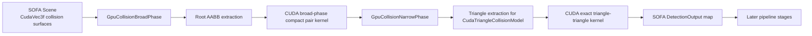

# GPU Collision Detection Pipeline
## SOFA v25.12 + WSL + SofaGpuCollision

Arfin's GPU collision detection presentation

- Platform: WSL2 + SOFA v25.12 + SofaCUDA
- Plugin: `SofaGpuCollision`
- Scope: collision detection pipeline only
- Response/constraint solve: intentionally left as a later phase

---

# Problem Statement

## Goal

Move the collision detection pipeline to GPU as completely as possible while minimizing PCIe transfer overhead.

## Why this matters

- Surgical simulation becomes collision-heavy very quickly
- CPU broad phase and CPU narrow phase become bottlenecks
- CPU/GPU mirroring adds latency and synchronization cost
- Dense contact scenes are exactly where GPU parallelism should pay off

## Target outcome

- GPU broad phase
- GPU narrow phase
- GPU exact triangle contact generation
- Compact data movement
- Deterministic benchmark and validation scenes

---

# Final Detection Pipeline



## Key design decision

We stopped treating GPU narrow phase as only a prefilter.

The plugin now computes exact triangle-triangle contact hits on the GPU for the `CudaTriangleCollisionModel` path and publishes those contacts directly into SOFA's narrow-phase output structures.

---

# Codebase Map

## Core plugin files

- `SofaGpuCollision/src/SofaGpuCollision/GpuCollisionBroadPhase.cpp`
- `SofaGpuCollision/src/SofaGpuCollision/GpuCollisionNarrowPhase.cpp`
- `SofaGpuCollision/src/SofaGpuCollision/GpuCollisionBackend.h`
- `SofaGpuCollision/src/SofaGpuCollision/cuda/GpuCollisionBackend.cu`
- `SofaGpuCollision/src/SofaGpuCollision/GpuPipelineProfiling.cpp`
- `SofaGpuCollision/src/SofaGpuCollision/GpuPipelineBenchmarkController.cpp`

## Validation scenes

- `test_gpu_phase5_overlap_validation.py`
- `test_gpu_tissue_phase45_validation.py`
- `test_gpu_dense_phase45_validation.py`

## Build integration

- `SofaGpuCollision/CMakeLists.txt`

---

# Scene Setup Strategy

## Validation scenes use direct GPU collision surfaces

- `MechanicalObject(template='CudaVec3f')`
- `MeshTopology(triangles=...)`
- `TriangleCollisionModel`
- `GpuCollisionBroadPhase`
- `GpuCollisionNarrowPhase`
- `GpuPipelineBenchmarkController`

## Why this matters

This isolates the collision pipeline:

- no CPU collision mirror for validation
- no kinematic complexity
- guaranteed overlap patterns
- clear GPU broad/narrow metrics

## Example

```python
root.addObject('GpuCollisionBroadPhase', enableGPU=True, allowCPUFallback=True)
root.addObject('GpuCollisionNarrowPhase', enableGPU=True, allowCPUFallback=True, minGPUPairCount=1)
root.addObject('LocalMinDistance', alarmDistance=0.20, contactDistance=0.05, angleCone=0.0)
```

---

# Broad Phase: CPU-Side Preparation

## Responsibility

`GpuCollisionBroadPhase` gathers collision models from SOFA and prepares GPU-friendly root AABBs.

## Two extraction modes

1. Direct triangle AABB from `TriangleCollisionModel`
2. Fallback root box from `CubeCollisionModel` bounding tree

## Why this is important

- direct triangle AABB is more robust for GPU triangle surfaces
- cube fallback keeps the plugin compatible with legacy paths

## Key code

```cpp
bool tryExtractRootAabb(
    sofa::core::CollisionModel* collisionModel,
    backend::AxisAlignedBoundingBox& outBox)
{
    auto* triangleModel = dynamic_cast<TriangleCollisionModel*>(
        collisionModel == nullptr ? nullptr : collisionModel->getLast());

    if (triangleModel != nullptr && !triangleModel->empty())
    {
        const auto& positions = triangleModel->getX();
        const auto& triangles = triangleModel->getTriangles();
        ...
        outBox.minX = minX;
        outBox.maxX = maxX;
        ...
        return true;
    }

    auto* cubeModel = dynamic_cast<CubeCollisionModel*>(
        collisionModel == nullptr ? nullptr : collisionModel->getFirst());
    ...
}
```

---

# Broad Phase: CUDA Compact Pair Generation

## GPU kernel idea

Each thread checks one AABB pair.

If they overlap:

- append a compact `(i, j)` pair
- avoid copying a dense boolean matrix back to host

## Key benefit

This replaced the old "dense overlap matrix" style and dramatically reduced D2H broad-phase traffic.

## Kernel

```cpp
__global__ void broadPhaseCompactKernel(
    const DeviceAabb* aabbs,
    const std::uint32_t count,
    DeviceIndexPair* pairs,
    std::uint32_t* pairCount)
{
    const std::uint32_t i = blockIdx.y * blockDim.y + threadIdx.y;
    const std::uint32_t j = blockIdx.x * blockDim.x + threadIdx.x;

    if (i >= count || j >= count || i >= j) return;

    const auto a = aabbs[i];
    const auto b = aabbs[j];

    const bool overlaps =
        overlapsOnAxis(a.minX, a.maxX, b.minX, b.maxX) &&
        overlapsOnAxis(a.minY, a.maxY, b.minY, b.maxY) &&
        overlapsOnAxis(a.minZ, a.maxZ, b.minZ, b.maxZ);

    if (overlaps)
    {
        const std::uint32_t outputIndex = atomicAdd(pairCount, 1u);
        pairs[outputIndex] = DeviceIndexPair { i, j };
    }
}
```

---

# Broad Phase: Integration Back Into SOFA

## Plugin-side flow

1. collect GPU-eligible models
2. compute AABBs
3. send AABBs to CUDA
4. get compact candidate pair list back
5. check SOFA intersector compatibility
6. append `cmPairs`

## Integration point

```cpp
if (gpuSucceeded)
{
    for (const auto& pair : gpuPairs)
    {
        const auto entryIndexA = gpuEntryIndices[pair.first];
        const auto entryIndexB = gpuEntryIndices[pair.second];
        const auto& a = entries[entryIndexA];
        const auto& b = entries[entryIndexB];
        appendPotentialPair(a.firstCollisionModel, a.lastCollisionModel,
                            b.firstCollisionModel, b.lastCollisionModel);
    }
}
```

## Result

Broad phase is GPU-driven but still respects SOFA pipeline semantics.

---

# Narrow Phase: Evolution

## Old state

- GPU tree overlap prefilter
- then fallback to `BVHNarrowPhase`
- final exact contact still CPU-owned

## New state

- direct `CudaTriangleCollisionModel` path
- exact triangle-triangle contact tested in CUDA
- `DetectionOutput` objects published directly
- `BVHNarrowPhase` only remains as fallback for unsupported model types

## Why this is the real milestone

This is the step that removed the remaining CPU intersector dependency for GPU triangle validation scenes.

---

# Narrow Phase: Triangle Extraction

## Plugin responsibility

`GpuCollisionNarrowPhase` extracts triangle primitives from `CudaTriangleCollisionModel`:

- vertex positions
- triangle indices
- packed flat triangle buffer for CUDA

## Key code

```cpp
bool tryExtractCudaTriangles(
    sofa::core::CollisionModel* collisionModel,
    CudaTriangleCollisionModel*& outModel,
    std::vector<backend::TrianglePrimitive>& outTriangles)
{
    outModel = dynamic_cast<CudaTriangleCollisionModel*>(
        collisionModel == nullptr ? nullptr : collisionModel->getLast());
    if (outModel == nullptr || outModel->empty()) return false;

    const auto& positions = outModel->getX();
    const auto& triangles = outModel->getTriangles();

    for (std::uint32_t triangleIndex = 0; triangleIndex < triangles.size(); ++triangleIndex)
    {
        const auto& triangle = triangles[triangleIndex];
        ...
        outTriangles.push_back(backend::TrianglePrimitive { ..., triangleIndex });
    }

    return true;
}
```

---

# Exact GPU Contact Kernel

## Contact algorithm

The CUDA exact-contact path uses triangle-triangle SAT style testing:

- triangle normal axis test
- opposing triangle normal axis test
- edge-edge cross product axes
- choose smallest penetration axis
- produce a conservative exact contact record

## Key implementation

```cpp
__device__ bool exactTriangleIntersection(
    const DeviceTriangle& first,
    const DeviceTriangle& second,
    DeviceExactContact& outContact)
{
    const float3 firstNormal = cross3(firstEdges[0], sub3(first.p2, first.p0));
    const float3 secondNormal = cross3(secondEdges[0], sub3(second.p2, second.p0));

    if (!testSeparatingAxis(first, second, firstNormal, bestOverlap, bestAxis)) return false;
    if (!testSeparatingAxis(first, second, secondNormal, bestOverlap, bestAxis)) return false;

    for (int i = 0; i < 3; ++i)
        for (int j = 0; j < 3; ++j)
            if (!testSeparatingAxis(first, second, cross3(firstEdges[i], secondEdges[j]), bestOverlap, bestAxis))
                return false;

    outContact.signedDistance = -bestOverlap;
    ...
    return true;
}
```

---

# Exact GPU Contact Kernel Launch

## GPU launch pattern

- 2D grid over triangle pairs
- compact contact append with atomic counter
- transfer back only the exact contacts that were found

## Kernel launch

```cpp
exactTriangleContactKernel<<<gridSize, blockSize>>>(
    deviceFirstTriangles,
    static_cast<std::uint32_t>(hostFirstTriangles.size()),
    deviceSecondTriangles,
    static_cast<std::uint32_t>(hostSecondTriangles.size()),
    deviceContacts,
    deviceContactCount);
```

## Why this matters

We are no longer asking SOFA's CPU intersectors to compute triangle-triangle contact for the validation path.

---

# Publishing GPU Contacts Into SOFA

## Critical integration step

This is what turned "GPU candidate generation" into "GPU collision detection":

- allocate or reuse `DetectionOutputVector`
- create `CollisionElementIterator` for both triangles
- fill `DetectionOutput`
- write directly into narrow-phase output map

## Key code

```cpp
void publishCudaTriangleContacts(
    sofa::core::collision::NarrowPhaseDetection* narrowPhase,
    CudaTriangleCollisionModel* firstModel,
    CudaTriangleCollisionModel* secondModel,
    const std::vector<backend::ExactContact>& contacts)
{
    auto*& outputsBase = narrowPhase->getDetectionOutputs(firstModel, secondModel);
    if (outputsBase == nullptr)
        outputsBase = new CudaTriangleOutputVector();

    auto* outputs = static_cast<CudaTriangleOutputVector*>(outputsBase);
    outputs->clear();

    for (const auto& contact : contacts)
    {
        sofa::core::collision::DetectionOutput output;
        output.elem = std::make_pair(
            sofa::core::CollisionElementIterator(firstModel, contact.firstTriangleIndex),
            sofa::core::CollisionElementIterator(secondModel, contact.secondTriangleIndex));
        output.point[0] = sofa::type::Vec3(contact.pointOnFirst.x, contact.pointOnFirst.y, contact.pointOnFirst.z);
        output.point[1] = sofa::type::Vec3(contact.pointOnSecond.x, contact.pointOnSecond.y, contact.pointOnSecond.z);
        output.normal = sofa::type::Vec3(contact.normal.x, contact.normal.y, contact.normal.z);
        output.value = static_cast<double>(contact.signedDistance);
        outputs->push_back(output);
    }
}
```

---

# Fallback Strategy

## Why fallback still exists

The plugin must remain usable for:

- non-CUDA collision models
- non-triangle collision models
- older SOFA scene paths

## Current behavior

- `CudaTriangleCollisionModel` pairs: exact GPU contact path
- everything else: legacy narrow-phase prefilter plus `BVHNarrowPhase` fallback

## This is intentional

It keeps the plugin incremental and safe while we push the GPU path deeper.

---

# Profiling and Benchmarking

## Instrumentation

`GpuPipelineBenchmarkController` and `GpuPipelineProfiling` collect:

- total step time
- broad wall time
- broad kernel time
- narrow wall time
- narrow kernel time
- host-to-device bytes
- device-to-host bytes
- device allocation bytes
- pair and candidate counts

## Why this matters

The whole project goal is not just "GPU usage", it is:

- performance
- transfer minimization
- observability

---

# Validation Scene 1: Guaranteed Overlap

## Scene

`test_gpu_phase5_overlap_validation.py`

- 2 overlapping GPU triangle surfaces
- no response by default
- clean detection-only validation

## Latest verified results

- `avg_broad_output_pair_count=1`
- `avg_narrow_output_pair_count=1`
- `avg_narrow_output_candidate_count=4`
- `avg_step_seconds=0.002211938`
- `avg_fps=452.09`

## Interpretation

This is the clean proof that:

- GPU broad phase is active
- exact GPU narrow phase is active
- CPU intersector dependency is gone for this path

---

# Validation Scene 2: Dense Overlap Grid

## Scene

`test_gpu_dense_phase45_validation.py`

- 1 large tissue-like GPU surface
- 4 x 4 overlapping tool surface grid
- detection-only mode

## Latest verified results

- `avg_broad_output_pair_count=16`
- `avg_narrow_output_pair_count=16`
- `avg_narrow_output_candidate_count=64`
- `avg_step_seconds=0.008512329`
- `avg_fps=117.48`

## Interpretation

The exact GPU path is not just working on a toy pair. It works on the denser validation workload too.

---

# Transfer Accounting

## Small overlap validation

- `avg_host_to_device_bytes=208`
- `avg_device_to_host_bytes=208`
- `avg_device_allocation_bytes=416`

## Dense validation

- `avg_host_to_device_bytes=2968`
- `avg_device_to_host_bytes=3268`
- `avg_device_allocation_bytes=7196`

## What these numbers tell us

- compact broad-phase output is working
- exact-contact output is compact
- transfers are still present because triangle data is currently flattened on host each step

## Next optimization target

Keep more triangle/contact buffers resident across steps.

---

# CMake and WSL Integration

## Build challenges solved

The plugin now builds cleanly in WSL with:

- CUDA runtime
- SofaCUDA headers
- Sofa.GL include root
- Sofa.Component.Mass include root

## Practical note

We intentionally avoided a fragile `find_package(SofaCUDA)` dependency chain because the installed `SofaCUDAConfig.cmake` wanted extra GUI/Qt package resolution in WSL.

Instead, the build uses:

- direct SofaCUDA include path
- direct SofaCUDA library path
- targeted include roots for the legacy header chain

---

# Current Scope Boundary

## Completed

- GPU broad phase
- GPU exact narrow phase for `CudaTriangleCollisionModel`
- direct SOFA `DetectionOutput` publishing
- validation scenes and profiling

## Not completed in this phase

- GPU collision response
- GPU friction contact constraints
- full GPU support for every SOFA collision model family
- persistent device-resident triangle/contact buffers

## Important distinction

Collision detection is complete for the plugin's GPU triangle path.

Collision response remains a separate later phase by design.

---

# Strengths of the Current Design

## Engineering strengths

- integrates with SOFA instead of bypassing it
- preserves fallback path for unsupported cases
- measurable PCIe accounting
- deterministic validation scenes
- exact contact generation, not only prefiltering

## Simulation strengths

- compatible with direct GPU triangle surfaces
- can scale from single overlap to dense overlap grid
- contact outputs are visible to the rest of SOFA through standard structures

---

# Main Remaining Technical Risks

## Risk 1: host flattening overhead

Triangle extraction currently happens on the host each step.

## Risk 2: exact-contact simplification

Current exact-contact generation is conservative and practical, but not yet an industrial-strength robust contact manifold generator.

## Risk 3: broader model support

The exact path is strongest for `CudaTriangleCollisionModel` pairs. Other collision model combinations still fall back.

## Risk 4: response gap

GPU collision response is not done yet, so end-to-end GPU contact handling is not complete.

---

# Recommended Next Steps

## Short term

1. Extend exact GPU contact path into the denser surgical benchmark scenes
2. Reuse triangle buffers across steps
3. Reuse exact-contact buffers across steps
4. Add richer contact manifold generation

## Medium term

1. reduce host-side triangle flattening
2. support additional collision model pair types
3. keep more metadata resident on device

## Long term

1. GPU response and constraint solve
2. GPU friction/contact manager integration
3. near-zero hot-path PCIe traffic

---

# Takeaway

## The collision detection pipeline now has a true GPU end-to-end path for GPU triangle models

That is the core milestone.

We moved from:

- GPU prefilter + CPU exact contact

to:

- GPU broad phase
- GPU exact triangle contact generation
- direct SOFA collision outputs

## Final message

The detection side is now real, measurable, and validated.

The next frontier is not "prove GPU detection works."

It is "make it cheaper, broader, and closer to full GPU residency for the whole surgical simulation."
