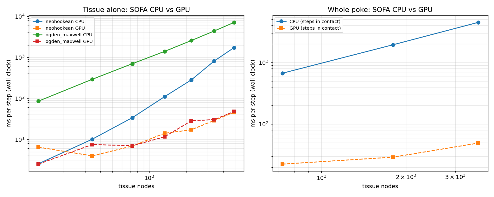

# GPU SOFA

GPU collision detection and GPU contact response (penalty forces, and constraints with
friction) for [SOFA](https://www.sofa-framework.org/), built as a SOFA plugin called
`SofaGpuCollision`, for surgical simulation on a laptop GPU.

This README is the single source of truth for the project: what it does, how it works,
how to build and run it, what has been measured, and what is still broken.

Last updated: 2026-09-25.

---

## Contents

1. [What this project is](#1-what-this-project-is)
2. [Status at a glance](#2-status-at-a-glance)
3. [Quick start](#3-quick-start)
4. [Repository layout](#4-repository-layout)
5. [The two copies: Windows and WSL](#5-the-two-copies-windows-and-wsl)
6. [Setup and build](#6-setup-and-build)
7. [How it works](#7-how-it-works)
8. [The 12 execution modes](#8-the-12-execution-modes)
9. [Settings reference](#9-settings-reference)
10. [Test scenes](#10-test-scenes)
11. [Scripts](#11-scripts)
12. [The standalone test program](#12-the-standalone-test-program)
13. [Reading the results](#13-reading-the-results)
14. [Current results](#14-current-results)
15. [Correctness checks](#15-correctness-checks)
16. [Known problems and limits](#16-known-problems-and-limits)
17. [What's next](#17-whats-next)
18. [Rules that still apply](#18-rules-that-still-apply)
19. [Glossary](#19-glossary)
20. [Where to find more](#20-where-to-find-more)

---

## 1. What this project is

SOFA is an open-source physics engine for medical simulation. Every frame it does three jobs:

1. **Collision detection**: find where objects touch, for example a blade and tissue.
2. **Contact response**: turn those contacts into forces.
3. **Solving**: move every point of every object according to all the forces.

SOFA's own collision detection runs on the CPU. It is slow for the dense meshes that
surgical scenes use (tens of thousands of triangles). This project moves collision
detection to the GPU, and then the rest of the frame: contact response, and in the
tissue-poke test the tissue itself, so that a whole step runs on the GPU.

**The goal** is a realistic surgical simulation where the whole frame runs on the GPU
and no large data is copied between the GPU and the CPU each frame. Copies are slow,
and every copy makes the CPU wait for the GPU.

**The target machine** is a laptop with an **NVIDIA GeForce GTX 1650 Ti** (4 GB of memory,
16 streaming multiprocessors), running Linux inside WSL2 on Windows. Speed-ups that work on
big desktop GPUs often don't work on this chip, so nothing becomes a default until it has
been measured here.

## 2. Status at a glance

| Area | State | Details |
|---|---|---|
| Whole poke on the GPU | ✅ Works | In the GPU poke scene the tissue (viscoelastic Ogden material, consistent mass, fixed base, implicit step with a direct solve), collision detection and constraint contact with friction all run on the GPU (`GpuTissueSolver`, [7.9](#79-the-gpu-tissue)). A whole poke gives SOFA's CPU scene's forces to 0.3%, in **28 ms per step against 1,907 ms** (68 times faster), and no GPU state is copied to or from the CPU during a step. Only the probe (a 6-DOF rigid body) stays on the CPU. |
| Validation against SOFA | ✅ | Seven physics tests with known answers, each on SOFA's CPU components and on the GPU ([10.4](#104-validation-tests-known-answers-sofas-cpu-against-the-gpu)): materials, confined compression, beam bending, friction on an incline, plate compression, grasping, cutting. The GPU matches SOFA stage by stage (forces to 1e-13) and whole runs to nanometres, and both give the exact answers where one exists ([14.5](#145-validation-tests)). |
| GPU tissue materials | ✅ | SOFA's five core hyperelastic materials (NeoHookean, stable NeoHookean, St Venant-Kirchhoff, Mooney-Rivlin, Ogden), SofaViscoElastic's Ogden and a Maxwell (viscous) branch; fixed and partly fixed DOFs, loads. |
| Band factorisation | ✅ | The tissue matrix is renumbered to a narrow band and stored as blocks: 17 MB instead of 117 MB for the poke, and bigger meshes fit ([7.9](#79-the-gpu-tissue)). |
| Several tools, grasping | ✅ Works | One constraint solve for the tissue against any number of rigid bodies. Two jaws and a pedestal lift or drop a block exactly as Coulomb's law says, on SOFA's CPU and on the GPU alike ([14.5](#145-validation-tests)). |
| Cutting | ✅ Works | Element removal: `TetrahedronCutter` removes the tetrahedra a blade passes through, and the GPU tissue follows ([7.11](#711-cutting)); a cut beam matches SOFA's run to 1.3 nm. |
| Bugs found in SOFA | ⚠️ 4 | SofaViscoElastic's Ogden computes no eigenvectors (its stress is wrong once deformed; 42% less peak force in the poke); SOFA's core Ogden is wrong where two stretches coincide; SofaCUDA's GPU `RigidMapping` gives a wrong torque; runSofa leaves the camera it makes for a scene without one at the origin. Fixes for the core Ogden and the torque are in `patches/`; the poke scenes carry their own camera ([16](#16-known-problems-and-limits)). |
| GPU collision detection | ✅ Works | 6 ways to find candidate triangle pairs, 12 execution modes in total. All of them give exactly the same contacts. |
| Fastest mode | ✅ | Way 6 ("big-cell fused") with its default table build: **0.290 ms** of GPU time per frame on the 14,368-triangle scene, about 5× faster than the component's default mode. |
| No per-frame copies in collision | ✅ | Mesh positions are read in place on the GPU and contacts stay on the GPU. The collision code copies 0 bytes each way per frame. |
| Whole-scene speed (collision only) | ✅ | 1,450 frames per second on the 14,368-triangle scene, 81 on the 200,018-triangle scene (way 6). |
| GPU contact forces (penalty) | ✅ Works | Penalty contact that knows inside from outside, so a point that crosses a surface is pushed back out. It passes all 6 of its self-checks, Gates 1 to 2d ([section 15](#15-correctness-checks)), and in the tissue-poke test it matches SOFA's CPU constraint contact to within about 6%. |
| GPU constraint contact with friction | ✅ Works | `GpuContactConstraintSolver`: no overlap, Coulomb friction, exact compliance, the whole constraint step on the GPU ([7.8](#78-gpu-constraint-contact-no-overlap-with-friction)). On identical contacts it matches SOFA's CPU pipeline at every stage, with the same number of solver sweeps in every step. On the poke's biggest problems (about 1,700 rows) SOFA's CPU pipeline takes about 10 s per step; the GPU, with the tissue on the GPU, 16 ms on average and under 30 ms at most. |
| Tissue-poke test (realistic) | ✅ Works | A probe pokes a liver-like block 8 mm deep, holds 1 s and pulls out. The CPU scene and the GPU scene run the whole poke, and their forces agree within 0.3%. See [10.3](#103-surgical-simulation-tests-tissue-poke) and [14.4](#144-tissue-poke). |
| Watching in SOFA's window | ✅ Works | Both poke scenes run in `runSofa`'s window under WSLg, drawn on the GTX 1650 Ti through D3D12; the GPU poke at about 24 steps per second ([10.3](#103-surgical-simulation-tests-tissue-poke)). The scenes place the camera themselves: the one runSofa 25.12 makes stays inside the tissue ([16](#16-known-problems-and-limits)). |
| Old physics scene | ✅ Works | In `gpu_resident_fem_contact.py` the blade is now a rigid body: it lands on the tissue and rests there, and its energy doesn't grow (Gate 3). |
| Whole frame on the GPU, old physics scene | ✅ Works | Nothing is copied between the CPU and the GPU in any frame after the first (SofaCUDA's copy trace and the residency checker, Gate 5). The two per-frame copies were SOFA's bounding boxes; `GpuCollisionPipeline` and `computeBoundingBox=false` remove them. |

## 3. Quick start

Open a WSL shell from Windows:

```bash
wsl -d wsl-gpu-proj
```

Inside WSL, copy the code in and build it. Run this after every change you make on Windows:

```bash
cp /mnt/c/Users/arfin/Desktop/GPU*SOFA/scripts/sync_and_build_wsl.sh ~/_sb.sh && bash ~/_sb.sh
```

Run a quick collision test (small scene, 20 frames):

```bash
cd /home/arfin/gpu-sofa && bash scripts/run_fbp_smoke_test_wsl.sh
```

Compare all 12 execution modes on the 14,368-triangle scene (a few minutes):

```bash
bash scripts/run_mode_comparison_ab_wsl.sh
```

Run the tissue poke, SOFA's CPU scene and the all-GPU scene one after the other (about
5 minutes; [10.3](#103-surgical-simulation-tests-tissue-poke)):

```bash
bash scripts/run_tissue_poke_wsl.sh both
```

Run the validation tests: seven physics tests on SOFA's CPU components and on the GPU,
compared with each other and with known answers (about 15 minutes;
[10.4](#104-validation-tests-known-answers-sofas-cpu-against-the-gpu)):

```bash
bash scripts/run_validation_suite_wsl.sh
```

Results are written under `/home/arfin/gpu-sofa/output/benchmark_logs/`.
[Section 13](#13-reading-the-results) explains how to read them.

---

## 4. Repository layout

```text
GPU SOFA/
├── README.md                     this file, the source of truth
├── IDEAS.md                      idea log: every speed-up idea and its measured verdict
├── patches/                      fixes for two bugs found in SOFA (SofaCUDA's RigidMapping torque, the core Ogden's eigenvectors)
├── .gitignore                    what git skips
├── .gitattributes                keeps .sh and .py files on LF line endings (needed in WSL)
├── SofaGpuCollision/             the plugin: all C++ and CUDA code
│   ├── CMakeLists.txt            build recipe for the plugin and the test program
│   └── src/
│       ├── SofaGpuCollision/     the SOFA components (28 files)
│       │   └── cuda/             the GPU code (13 files)
│       └── tools/                the two test programs
├── testscenes/
│   ├── collisiondetectiontests/  the 7 collision test scenes and their shared helper
│   ├── surgicalsimulationtests/  the tissue-poke scenes (CPU and GPU) and their shared setup
│   └── validationtests/          physics tests with known answers, each on SOFA's CPU components and on the GPU
├── scripts/                      36 scripts: build, run, compare, profile, summarise
├── reports/                      measured results: current reports + dated archive folders
├── tutorial/                     a beginner course, chapters 00-18
├── explanation/                  the fastest algorithm, explained from start to finish
├── findings/                     notes from the work on the fused GPU kernel
├── output/                       run results (ignored by git, except its README)
└── labsofa-git/                  your lab's SOFA source code; a separate git repo (ignored)
```

**What git tracks:** everything above except `output/` (only `output/README.md` is tracked),
`labsofa-git/`, Python caches (`__pycache__/`) and local build folders. Claude Code's
local settings file, `.claude/settings.local.json`, is also skipped, by your global git
ignore file.

**`labsofa-git/`** is a clone of your lab's SOFA fork (`git.iitd.ac.in`, `COE-neuro/sofa`,
branch `cuda`). The build does not use it; it uses the SOFA install inside WSL.

**GitHub:** <https://github.com/arfinzz/gpusofa>. Work happens on `main`.
`experiment/hash-prefixsum-broadphase` is kept equal to `main`.

### 4.1 The plugin files (`SofaGpuCollision/src/SofaGpuCollision/`)

| File | What it does |
|---|---|
| `config.h`, `init.cpp` | Plugin setup. Registers the plugin with SOFA when it is loaded. |
| `GpuCollisionBroadPhase.h/.cpp` | SOFA component. Decides which pairs of *objects* need checking. |
| `GpuCollisionNarrowPhase.h/.cpp` | SOFA component and **the main one**. Reads mesh positions straight from GPU memory, runs one of the 6 ways and the distance math, and keeps the contacts on the GPU. Almost every setting lives here. |
| `GpuCollisionBackend.h` | The list of everything the GPU code offers to the C++ side: settings, statistics and functions. No CUDA types cross this line. |
| `GpuCollisionBackendStub.cpp` | Empty versions of the GPU functions, used when building without CUDA. The plugin still compiles and falls back to the CPU. |
| `CudaContactPenaltyForceField.h/.cpp` | SOFA component. Turns GPU contacts into push-apart forces, on the GPU. |
| `GpuContactConstraintSolver.h/.cpp` | SOFA component. Constraint contact with friction on the GPU, between one deformable body and one or more rigid bodies: takes the place of SOFA's constraint solver, and can run SOFA's own CPU pipeline alongside for comparison ([7.8](#78-gpu-constraint-contact-no-overlap-with-friction)). |
| `GpuTissueSolver.h/.cpp` | SOFA component. The whole tissue step on the GPU: SOFA's hyperelastic materials (Ogden, NeoHookean, Mooney-Rivlin, St Venant-Kirchhoff, stable NeoHookean) and viscoelastic branches, consistent mass, fixed and partly fixed DOFs, loads, implicit Euler with a direct solve. An ODE solver on a `CudaVec3f` tissue; can run SOFA's own CPU components alongside for comparison ([7.9](#79-the-gpu-tissue)). |
| `GpuRigidMapping.h/.cpp` | SOFA component. A rigid body's surface on the GPU, with the correct torque that SofaCUDA's `RigidMapping` gets wrong ([9.11](#911-gpurigidmapping)). |
| `TetrahedronCutter.h/.cpp` | SOFA component. Cutting by element removal: a blade moving in a plane removes the tetrahedra it has passed through, on CPU and GPU tissues alike ([7.11](#711-cutting)). |
| `GpuCollisionPipeline.h/.cpp` | SOFA component. SOFA's `CollisionPipeline` without the per-frame CPU bounding boxes of GPU surfaces, which copy them to the CPU every frame. |
| `GpuResidencyChecker.h/.cpp` | SOFA component. Checks each frame whether positions, velocities or forces were copied to the CPU, and names which. |
| `GpuPipelineBenchmarkController.h/.cpp` | SOFA component. Writes the per-frame timing CSV and the summary file. |
| `GpuPipelineProfiling.h/.cpp` | The timing records that the benchmark controller writes out. |
| `GpuKinematicRigidController.h/.cpp` | SOFA component. Moves a rigid tool pose along a fixed path (settle, go down, sweep sideways, lift). No current scene uses it. |

### 4.2 The GPU files (`SofaGpuCollision/src/SofaGpuCollision/cuda/`)

All the GPU code compiles as **one unit**: `GpuCollisionBackend.cu` only includes the
files below, in this order. One unit means kernels can call each other without special
linking steps.

| File | Size | What it contains |
|---|---:|---|
| `GpuCollisionBackend.cu` | 2 KB | Includes the twelve files below, in order. |
| `detail/BackendCommon.cuh` | 21 KB | Shared basics: GPU data types, vector math, memory, copy and timing helpers, CUDA-graph replay, and the one-workspace-per-collision-pair store ([7.8](#78-gpu-constraint-contact-no-overlap-with-friction)). |
| `detail/DenseGrid.cuh` | 123 KB | Ways 1 and 2 (a fixed 3D grid), plus grid math that every way reuses. |
| `detail/BroadPhaseLegacy.cuh` | 24 KB | Older code: a tree-based object broad phase, a brute-force contact kernel, and the "is CUDA working?" check. |
| `detail/FbpKernels.cuh` | 60 KB | The exact distance math between triangles, the vertex-triangle kernels, and the list that tells the contact response where each pair's contacts are. |
| `detail/HashGrid.cuh` | 62 KB | Way 3: optimised spatial hash. |
| `detail/SimpleHash.cuh` | 22 KB | Way 4: simple one-pass spatial hash. |
| `detail/SortedGrid.cuh` | 48 KB | Way 5: sorted grid. |
| `detail/BigCellGrid.cuh` | 95 KB | Way 6, the fastest: big cells, and one kernel that finds pairs and does the distance math together. |
| `detail/ContactForces.cuh` | 52 KB | GPU contact forces, plus a self-check against a CPU calculation. |
| `detail/ContactConstraints.cuh` | 111 KB | GPU constraint contact: contact selection, constraint rows for every rigid body, the compliance (cuSOLVER and cuBLAS), the Gauss-Seidel solver with friction, and the correction. |
| `detail/TissueSolver.cuh` | 84 KB | The GPU tissue: the materials and their stiffness, the mass, loads, the implicit system, its band Cholesky (after a bandwidth-reducing renumbering) or dense Cholesky, LU when it is not positive definite, and refinement in double precision. |
| `detail/RigidMapping.cuh` | 7 KB | `GpuRigidMapping`'s kernels: positions and velocities from a rigid pose, and the surface forces summed into a force and a torque. |

`SofaGpuCollision/src/tools/` holds the two test programs ([section 12](#12-the-standalone-test-program)):
`DenseGridBackendBench.cpp` (collision and contact forces, without SOFA) and
`ConstraintChecks.cpp` (the GPU constraint solver and compliance against SOFA's CPU code).

---

## 5. The two copies: Windows and WSL

| Copy | Path | Used for | Git? |
|---|---|---|---|
| Windows | `C:\Users\arfin\Desktop\GPU SOFA` | editing | yes, the only copy with git |
| WSL (distro `wsl-gpu-proj`) | `/home/arfin/gpu-sofa` | building and running | no, a plain copy |
| The Windows copy, seen from WSL | `/mnt/c/Users/arfin/Desktop/GPU SOFA` | the sync reads from here | — |

Why two copies: the CUDA compiler, the Nsight profilers and SOFA are all installed inside
WSL, and building on `/mnt/c/...` is much slower than on WSL's own disk.

**The rules:**

1. **Edit only on Windows.** The next sync overwrites the WSL copy, and it has no git,
   so changes made only there are lost.
2. **Build and run only in WSL.**
3. **Sync after every change**, with the command in [Quick start](#3-quick-start).

**What the sync copies** (`scripts/sync_and_build_wsl.sh`, one way, Windows to WSL):

| Copied | Not copied |
|---|---|
| `SofaGpuCollision/src/` | the docs (`README.md`, `reports/`, `tutorial/`, ...) |
| `SofaGpuCollision/CMakeLists.txt` | `output/` |
| `testscenes/` | anything else |
| `scripts/` | |

- **The sync never deletes.** If you delete or move a file on Windows, the old copy stays
  in WSL until you remove it yourself.
- **After copying, it builds** ([section 6.3](#63-build)).
- **It prints four "sync markers"**: counts that must be above zero, proving the new code
  arrived.

**Only in WSL:**

- `SofaGpuCollision/build-profile/`: the real build. It holds `libSofaGpuCollision.so` and
  the test program.
- `output/`: every run writes its results here.
- `/home/arfin/_sb.sh`, `_cfg.log`, `_build.log`: the copy of the sync script and the last
  build's logs.

**Line endings.** Scripts must have Linux line endings (LF). With Windows line endings
(CRLF), bash fails with errors like `syntax error near unexpected token $'do\r'`. The
repo's `.gitattributes` keeps every `.sh` and `.py` file on LF, on Windows too.

**Running WSL commands from Windows safely.** A one-line command sent through `wsl.exe`
from PowerShell can lose its quotes. Once, a `grep` lost its file name, waited forever for
input that never came, and hung for almost two hours. Three rules prevent this:

1. Put anything with quotes, pipes or `$(...)` in a `.sh` file, and run the file. Don't
   send it as one line.
2. Give anything that could wait for input an empty input: `... < /dev/null`.
3. To look for stuck processes, list everything and remove what you expect, instead of
   searching for the names you expect:
   `ps -eo pid,etime,stat,args --no-headers | grep -vE '\[|/init|plan9'`

**The SOFA window (GUI) in WSL.** OpenGL in WSL falls back to slow software drawing unless
`GALLIUM_DRIVER=d3d12` is set. It is set in `~/.bashrc` and passed from Windows through
`WSLENV`. Check with `glxinfo -B`: it should report `D3D12 (NVIDIA GeForce GTX 1650 Ti)`.
CUDA is not affected by this.

---

## 6. Setup and build

### 6.1 The machine

| Part | Version |
|---|---|
| GPU | NVIDIA GeForce GTX 1650 Ti laptop GPU: Turing, compute capability 7.5, 16 SMs, 4 GB |
| Windows driver | 616.92 |
| WSL distro | `wsl-gpu-proj`: Ubuntu 24.04.4 LTS, kernel 6.6.87.2-microsoft-standard-WSL2 |
| SOFA | v25.12, installed at `/opt/sofa/install/v25.12`, with the SofaCUDA and SofaPython3 plugins |
| CUDA compiler | nvcc 12.0 (`/usr/bin/nvcc`) |
| C++ compiler | gcc 13.3.0 |
| CMake | 3.28.3 |
| Python | 3.12.3 |

Check that the GPU works inside WSL:

```bash
nvidia-smi --query-gpu=name,driver_version,temperature.gpu,clocks.gr --format=csv
```

### 6.2 Where SOFA lives

The build and every script use the SOFA install at `/opt/sofa/install/v25.12`. Set
`SOFA_ROOT` to use a different one. The SOFA source is in `/opt/sofa/src`, and its build
folder is `/opt/sofa/build`.

### 6.3 Build

`sync_and_build_wsl.sh` copies the code and then runs:

```bash
cmake -S /home/arfin/gpu-sofa/SofaGpuCollision -B /home/arfin/gpu-sofa/SofaGpuCollision/build-profile \
      -DCMAKE_PREFIX_PATH=/opt/sofa/install/v25.12 -DCMAKE_BUILD_TYPE=Release \
      -DCMAKE_CUDA_ARCHITECTURES=75 -DSOFAGPUCOLLISION_ENABLE_CUDA=ON
cmake --build /home/arfin/gpu-sofa/SofaGpuCollision/build-profile -j"$(nproc)"
```

(`SOFA_GPU_BUILD_TYPE` and `SOFA_GPU_CUDA_ARCH` override the two settings.)

The configure and build output go to `~/_cfg.log` and `~/_build.log`. The build makes three
files in `build-profile/`:

- `libSofaGpuCollision.so`: the plugin that SOFA loads. It links cuBLAS and cuSOLVER (for
  the constraint compliance) and SOFA's Lagrangian constraint libraries and Eigen (for the
  CPU comparison).
- `SofaGpuCollisionDenseGridBackendBench`: the standalone test program.
- `SofaGpuCollisionConstraintChecks`: the constraint checks.

**Without CUDA** (`SOFAGPUCOLLISION_ENABLE_CUDA=OFF`, which is CMake's default for this
project): the plugin builds with empty GPU functions. Every GPU path reports "not
available", and the collision components fall back to SOFA's CPU code. The contact force
field, the constraint solver and the residency checker are left out, because they need
SofaCUDA.

**Check that new files really got built.** A build can succeed and still leave out a new
source file; that happens if `CMakeLists.txt` wasn't synced. After adding a component,
check that its name is inside the plugin:

```bash
nm -DC /home/arfin/gpu-sofa/SofaGpuCollision/build-profile/libSofaGpuCollision.so | grep -c YourComponentName
```

**The build settings.** Since 2026-09-25 the build is optimised (`Release`: `-O3` for the
CPU code) and the GPU code is compiled for the GTX 1650 Ti itself (compute capability 7.5,
`sm_75`). `CMakeLists.txt` uses the same defaults for a fresh build folder. Before that, CPU
code had no optimisation and GPU code was compiled for 5.2 (`sm_52`, nvcc 12.0's default),
which the driver translated for the 7.5 GPU when the plugin loaded.

Measured back to back (same session), the switch changed **no result** (the constraint
checks give the same numbers to the last digit; the poke's forces agree within run-to-run
noise) and **no GPU-bound time**: way 6's kernel 0.308 → 0.295 ms, the all-GPU poke 48.7 →
49.0 ms per step, all within noise. The driver was already running translated 7.5 code, and
SOFA itself was already optimised. Only the plugin's own CPU code got faster: the checks'
double-precision reference solve went from 4,562 to 148 ms. Numbers in this README from
before 2026-09-25 were measured with the old settings.

### 6.4 Loading the plugin in SOFA

The scripts do this for you. To do it by hand:

```bash
SOFA_ROOT=/opt/sofa/install/v25.12
PLP="$(find "$SOFA_ROOT/plugins" -type d -name lib -printf '%p:')"
export SOFA_PLUGIN_PATH="$SOFA_ROOT/lib:$SOFA_ROOT/plugins:${PLP%:}"
export LD_LIBRARY_PATH="/home/arfin/gpu-sofa/SofaGpuCollision/build-profile:$SOFA_ROOT/lib:$PLP"
"$SOFA_ROOT/bin/runSofa" -g batch -n 100 -l SofaPython3 -l SofaCUDA \
    -l /home/arfin/gpu-sofa/SofaGpuCollision/build-profile/libSofaGpuCollision.so \
    /home/arfin/gpu-sofa/testscenes/collisiondetectiontests/hash_prefixsum_large.py
```

`-g batch -n 100` runs 100 frames with no window. Leave out `-g batch` to open the SOFA
window.

### 6.5 Troubleshooting

| Problem | Cause and fix |
|---|---|
| `Plugin not found: SofaGpuCollision` | SOFA can't find the `.so`. Pass it with `-l /path/to/libSofaGpuCollision.so`, or set `SOFA_GPU_COLLISION_LIB` for the scripts. |
| New code doesn't seem to run | You didn't sync, or the build left a file out. Sync again and check the sync markers and `nm` ([6.3](#63-build)). |
| `no CUDA-capable device is detected`, although `nvidia-smi` works | The loader found the wrong `libcuda.so.1`: Ubuntu's `libnvidia-compute-535` package puts a native driver library in `/lib/x86_64-linux-gnu/`, which can't reach the GPU under WSL. Put `/usr/lib/wsl/lib` first in `LD_LIBRARY_PATH`; every script in `scripts/` does. (Removing that package would also fix it; it was left installed.) |
| Configure fails with "requires the installed SofaCUDA headers and library" | `CMAKE_PREFIX_PATH` doesn't point at a SOFA install that has SofaCUDA. Check `/opt/sofa/install/v25.12/plugins/SofaCUDA/lib/`. |
| `RegisterObject is deprecated` warnings | Harmless; they come from SOFA v25.12. |
| `syntax error near unexpected token $'do\r'` | The script has Windows line endings. `.gitattributes` prevents this for files checked out after it was added; re-checkout the file on Windows and sync again. |
| The frame rate is far lower than usual | The laptop GPU is hot or at a low clock. Check `nvidia-smi --query-gpu=temperature.gpu,clocks.gr --format=csv`. If the clock is under about 1 GHz, let it cool down and run again. |
| An `overflow` value above 0 | A buffer was too small, so some data was dropped and the results are incomplete. Raise `maxTissueTrianglesPerCell`, `maxToolTrianglesPerCell`, `maxCandidatePairs` or `proximityMaxContacts`, or use a finer grid. |
| CUDA out of memory | The GPU has 4 GB. Lower `maxCandidatePairs` or `proximityMaxContacts`. |
| Nsight Systems shows no GPU timeline | nsys can't record GPU timelines under WSL2 on this machine. Use Nsight Compute (`ncu`) and the CUDA-event timings instead. |
| Nsight Compute can't find a shared library | Put `LD_LIBRARY_PATH=...` in the same command that starts `ncu`. |
| A warning that CUB's sort returned unsorted data | Expected now and then on this WSL2 setup. Way 5 checks the sort on the first frame and switches to its own counting sort for the rest of the run. |

---

## 7. How it works

### 7.1 One frame, and where the plugin fits

The scenes use SOFA's `DefaultAnimationLoop`. Each frame runs these steps:

```text
1. Collision detection
   a. Broad phase   GpuCollisionBroadPhase    which pairs of OBJECTS might touch?
   b. Narrow phase  GpuCollisionNarrowPhase   which TRIANGLES touch, and where exactly?
        - find candidate triangle pairs (one of the 6 ways)
        - exact distance math on each pair -> contacts, kept on the GPU
2. Contact response     nothing extra here; the contacts are used in step 3
3. Solve the motion     the ODE solver asks every force field for its forces:
        - tissue elasticity (FEM), on the GPU
        - CudaContactPenaltyForceField reads the GPU contacts -> push-apart forces, on the GPU
```

The collision-only test scenes have no solver, so step 3 never happens: the contacts are
computed and then thrown away. That is enough to measure collision speed and correctness.

With constraint contact (the GPU poke scene's default) the order is SOFA's
`FreeMotionAnimationLoop` instead: each body's free motion first, then collision detection
on the GPU, then `GpuContactConstraintSolver` works out the contact forces on the GPU and
corrects both bodies ([7.8](#78-gpu-constraint-contact-no-overlap-with-friction)).

### 7.2 The broad phase

`GpuCollisionBroadPhase` lists the pairs of collision objects that should be checked.
Surgical scenes have only a few objects (the tissue and a tool), so by default it simply
lists every pair. Its optional GPU box test (`useObjectAabbCulling`) is off, because with
so few objects it costs more than it saves. An object with `selfCollision=True` is also
paired with itself.

### 7.3 Getting the mesh to the GPU without copying

This is what makes the collision part of the frame copy-free:

- **Positions are read in place.** The scenes use `MechanicalObject` with
  `template='CudaVec3f'`, which keeps positions in GPU memory. The narrow phase asks for the
  GPU address of the positions (`deviceRead()`) and passes it straight to the GPU code.
  Nothing is copied.
- **The triangle list is cached.** The list of triangles (3 vertex numbers each) is built
  once on the CPU and uploaded to the GPU once. It is only uploaded again if the mesh
  topology changes.
- **Each surface has an id**: the address of its collision model. The GPU code uses the id
  to know which cached triangle list belongs to which surface.

Result: in steady state the collision code copies **0 bytes** each way per frame.

**The rule that keeps it that way:** SOFA's usual helpers for reading and writing state
(`ReadAccessor` and `WriteAccessor`) copy the *whole* vector to the CPU and mark the GPU copy
as out of date. Code that should stay on the GPU must use `deviceRead()` and
`deviceWrite()` only.

### 7.4 Finding candidate pairs: the six ways

Checking every tissue triangle against every tool triangle would be far too slow. Instead,
space is divided into small **cells**. Each triangle's box is enlarged by the contact
distance and placed in every cell it touches. Two triangles that share a cell become a
**candidate pair**. A pair can share several cells, so every way must also make sure each
pair is checked only once.

The six ways do this differently. All six give exactly the same contacts; only the speed
differs.

| Way | Name | How it works, simply | Turn it on with |
|:---:|---|---|---|
| 1 | Dense grid, all cells | A fixed 3D array of cells. Pair generation visits every cell, even empty ones. A hash table on the GPU removes duplicate pairs. | `useToolActiveCellGeneration=False` |
| 2 | Dense grid, tool cells only | The same grid, but pair generation only visits cells that hold both tool and tissue. Those cells are listed while the tool is being inserted. **This is the component's default.** | *(default)* |
| 3 | Optimised spatial hash | Only occupied cells take up space, in a hash table. Three passes (mark, compact, fill) pack the cells into tight buckets; only buckets with both tool and tissue make pairs. 11 kernels. | `useHashPrefixSumGeneration=True` |
| 4 | Simple spatial hash | Also only occupied cells, but each triangle goes straight into its hash bucket in one pass. 7 kernels. | `useSimpleHashGeneration=True` |
| 5 | Sorted grid | Writes one (cell, triangle) record for every cell a triangle touches, sorts the records by cell, and then reads each cell's triangles as one continuous run. Uses the home-cell rule (below) instead of a duplicate table. | `useSortedGridGeneration=True` |
| 6 | Big-cell fused | Groups 2×2×2 small cells into one big cell. For each big cell that holds both tool and tissue, one GPU block copies that cell's tool triangles into fast on-chip (shared) memory. It then checks every tissue triangle against them with the home-cell rule and does the distance math straight away. No pair list is written and no second kernel is needed. **Fastest everywhere.** | `useBigCellFusedGeneration=True` |

**The home-cell rule (ways 5 and 6).** A pair is emitted by only one cell: the cell that
contains the lower corner of the region where the two triangles' boxes overlap. That gives
each pair exactly once, without any table. And if the two boxes don't overlap at all, no
cell emits the pair, so the rule also drops pairs that can't possibly touch. On the
80k-triangle benchmark this cuts the candidate pairs from 322,560 to 43,584, with the same
contacts.

**If several ways are turned on**, the winner is: way 6, then 3, then 4, then 5, then 1–2.

**Way 6 in more detail:**

- The big-cell edge is `bigCellFactor` small cells long (default 2). A value of 4 is slower,
  because too few big cells are left to keep the GPU busy.
- A big cell's tool triangles are loaded in chunks of `bigCellToolTile` (default 256).
  Bigger cells simply loop over several chunks.
- Each big cell's triangle list is built in three steps: count, prefix sum, fill. There are
  four ways to build it ([section 8](#8-the-12-execution-modes)). The default is fastest:
  each GPU block first builds a small hash table in shared memory, then merges it into the
  global list.
- The list holds one entry per (triangle, small cell) it overlaps, so a large triangle over
  small cells needs many. The buffer starts at 16 entries per triangle; the count step's
  total (4 bytes) is read back every frame, and when it did not fit, the buffer grows with
  50% headroom and the frame runs again. Before this, the extra entries were silently
  dropped, and a block on a floor of 5 cm triangles over 5 mm cells lost more than half of
  its contacts and sank through the floor.

**Ways 3 to 6 replay their kernels as a CUDA graph.** The sequence of kernels is recorded
once and replayed every frame, which removes most of the CPU cost of launching kernels.
Each graph can be turned off with an environment switch ([section 9.10](#910-environment-switches-read-by-the-plugin)).

### 7.5 The exact distance math

For every candidate pair of triangles, the GPU runs 15 small tests: each of the 6 corners
against the other triangle's face (vertex-face), and each of the 3×3 pairs of edges
(edge-edge). It keeps the closest pair of features. If that distance is at most
`contactDistance`, it writes a **contact**:

| Field | Meaning |
|---|---|
| `firstPrimitiveIndex`, `secondPrimitiveIndex` | which triangle (or vertex) on each side |
| `featureKind` | `VF`: a vertex of the first against a face of the second. `FV`: the reverse. `EE`: edge against edge. |
| `firstFeatureLocalIndex`, `secondFeatureLocalIndex` | which corner or edge (0-2) of each triangle |
| `firstBarycentrics`, `secondBarycentrics` | how the contact point splits between the triangle's 3 corners; used to spread a force onto the corners |
| `pointOnFirst`, `pointOnSecond` | the two closest points |
| `normal` | the unit direction from `pointOnFirst` to `pointOnSecond` |
| `signedDistance` | the distance between the two points. Despite the name it is **never negative**: the code does not know which side of a surface a point is on ([section 16](#16-known-problems-and-limits)). |

A cheap box test skips pairs that are clearly too far apart before the 15 tests run. The
math is shared by all six ways, which is why they all give identical contacts. In the code
this is called **feature-based proximity** (`useFeatureBasedProximity`).

**Other kinds of contact:**

- **Vertex-triangle** (`useVertexTriangleProximity=True`, together with feature-based
  proximity). One side is a set of points. This is used for:
  - self-collision: a mesh's vertices against its own triangles, skipping each triangle's
    own three corners;
  - a point-cloud tool (`CudaPointCollisionModel`) against a triangle mesh.

  These paths always use the dense grid.
- **Exact intersection**, the component default when `useFeatureBasedProximity=False`.
  This is an older yes/no test of whether two triangles cross. It gives no barycentric
  weights, so it can't drive forces. All the test scenes use proximity instead; this path
  remains for older scenes.

### 7.6 Keeping the CPU out of the frame

Every time the CPU reads something back from the GPU, it must wait for the GPU to finish.
So by default **nothing is read back**:

- The narrow phase queues the GPU work and returns straight away. The GPU finishes while the
  CPU starts on the next frame.
- The contact counts stay on the GPU too. That is why `avg_narrow_kernel_ms` reads 0 in fast
  runs: the code doesn't wait just to time itself.
- For **checking** runs, set `proximityReadContactCounter=True`. The counts (total, VF, FV,
  EE and overflow) are then read back in one batch every frame, which costs one wait per
  frame. `proximityCounterReadbackInterval=N` reads them only every Nth frame.
- `copyContactsToHost=True` copies all contacts into SOFA's normal CPU contact list, so
  that SOFA's own CPU contact response can use them. It is slow, and the test scenes don't
  use it. **Its default is True**, so a GPU-only scene must set it to `False`.

### 7.7 GPU contact forces

`CudaContactPenaltyForceField` turns the contacts into forces without leaving the GPU.

- For each contact: `depth = contactDistance - separation`, and
  `force = max(0, stiffness × depth - damping × approach speed)`.
- **Which side is which.** The collision math gives a distance that is never negative, and a
  direction from one closest point to the other. That direction flips once a point crosses
  the other surface, so on its own it would push the point further through. With
  `useSurfaceNormals` (on by default) each triangle's outward normal is used as a side
  reference:
  - if the contact direction agrees with it, the surfaces are on their correct sides and
    nothing changes;
  - if it disagrees, they overlap, so the direction is flipped and the separation becomes
    negative, making the push grow with depth;
  - if there is no usable direction (touching or crossing), the reference itself is used.

  This needs both meshes wound so their normals point **out** of the object.
- The force is spread onto the 3 corners of each triangle using the contact's barycentric
  weights. It pushes one side, and the opposite amount goes onto the other side. The GPU
  adds these straight into SOFA's force vectors.
- For the implicit solver it also supplies the contact stiffness, `−stiffness × n nᵀ` on
  the relative motion, which is the same sign convention as SOFA's own
  `PenalityContactForceField`. This makes contact part of the implicit solve and adds
  stiffness to it.
- **How it finds the contacts:** each time the narrow phase computes contacts for a pair of
  surfaces, it records where they are in GPU memory (up to 16 surface pairs). The force
  field looks its pair up by the two surface ids, in either order. It finds the ids once
  at start-up, from the `CudaTriangleCollisionModel` at or below each body's node.
- **Only this frame's contacts count.** The narrow phase numbers its collision passes. If
  a pair was not computed in the current pass, because the broad phase dropped it when
  the two bodies' boxes stopped overlapping, the force field applies nothing. Without this,
  the pair's buffer would still hold its last contacts, and two bodies that had just moved
  apart would keep being pushed.

To use it:

1. Use `DefaultAnimationLoop`, so collision runs before the solve.
2. Put **one** ODE solver over both bodies. An interaction force field can't join two
   bodies that are solved separately.
3. Give it the same `contactDistance` as the narrow phase.
4. On the narrow phase, set `copyContactsToHost=False` and keep
   `proximityKeepContactsOnDevice=True`.
5. Wind both meshes with outward normals (or set `useSurfaceNormals=False`).
6. Pick `stiffness` for the **total**. It is per contact, and a tool tip pressing into
   tissue makes hundreds of contacts (vertex-face, face-vertex and edge-edge), so their
   stiffnesses add up. Aim for a total of about 100 times the tissue's own stiffness under
   the tool. Much more makes the implicit solve badly conditioned: the poke test blew up at
   first touch with 200 N/m per contact (about 40,000 N/m in total) and runs well with 10.

Its potential energy is reported as 0, because computing it would need a GPU read-back.
Its limits are listed in [section 16](#16-known-problems-and-limits): it lets objects
overlap a little and has no friction.

### 7.8 GPU constraint contact (no overlap, with friction)

`GpuContactConstraintSolver` is the second GPU contact, and the accurate one. It treats each
contact as a hard rule (the two surfaces may not come closer than the contact distance)
with Coulomb friction, and works out the contact forces as Lagrange multipliers, the way
SOFA's own constraint contact does. It takes the place of SOFA's constraint solver in a
`FreeMotionAnimationLoop`, for **one deformable body touching one or more rigid bodies**
(a probe; two grasper jaws and a table).

**One step, in SOFA's order:**

1. **Free motion.** Each body's own implicit solver moves it as if there were no contact.
   With `GpuTissueSolver` the tissue's free motion runs on the GPU too
   ([7.9](#79-the-gpu-tissue)).
2. **Collision.** The GPU narrow phase finds the contacts up to the alarm distance, on the
   positions at the start of the step, and keeps them on the GPU.
3. **Rows** (GPU). It keeps one vertex-face contact per vertex (the face closest to it, on
   either body) and drops edge-edge contacts, which describe the same surfaces again and
   only make the problem bigger. It sorts the kept contacts by their features, so their
   order doesn't depend on the order the narrow phase found them in. Each contact gets a
   normal row and two tangent rows, with SOFA's tangent directions. The deformable body gets
   −u spread over its triangle's corners, and the rigid body gets [u ; r × u]. DOFs held by a
   projective constraint (a fixed bottom, for example) are left out, as SOFA does. The
   free violation, how far each row would be violated after the free motion, uses SOFA's
   formula, including its tangential correction back to the moment of impact.
4. **Compliance** (GPU). W = dt·(J1 A1⁻¹ J1ᵀ + J2 A2⁻¹ J2ᵀ): how far each contact moves per
   unit of force on any other. A is each body's own implicit system matrix, read from its
   direct linear solver after the free motion: exactly what SOFA's
   `LinearSolverConstraintCorrection` uses. With a CPU tissue its matrix is copied up and
   factorised on the GPU as a dense Cholesky (cuSOLVER, single precision); with
   `GpuTissueSolver` the free motion's own factor (band or dense Cholesky, or LU,
   [7.9](#79-the-gpu-tissue)) is used as it is, with no copy and no second factorisation.
   Only the block of A1⁻¹ on the touched vertices is formed: one triangular solve with the
   factor (dense with cuBLAS, or band) on the touched DOFs' unit columns, then one matrix
   product (cuBLAS); after an LU step, full solves. Each rigid body's 6×6 is inverted on
   the CPU.
5. **Solve** (GPU). SOFA's block Gauss-Seidel with its friction cone: the same update per
   contact, the same error measure, the same tolerance scaling and stopping rule. It runs in
   one GPU block. Single precision by default; `exactArithmetic` switches to SOFA's own
   double-precision arithmetic, which reproduces SOFA to machine precision.
6. **Correction** (GPU). dv = A⁻¹ Jᵀ λ for both bodies, then x = x_free + dt·dv and
   v = v_free + dv, as `LinearSolverConstraintCorrection` does.

**Why the exact compliance, rebuilt every step:** the tissue stiffens under load (Ogden), so
a compliance worked out once at rest would be wrong in exactly the moments that matter.

**Several rigid bodies** (`additionalRigidStates`, `additionalRigidSurfaces`,
`additionalRigidLinearSolvers`, `additionalRigidOdeSolvers`: one entry per extra body, in the
same order). Every body's contacts with the tissue go into one problem and are solved
together, as SOFA's constraint solver does with several bodies in contact: the rows of
all bodies, one W (the tissue's part couples every contact; each rigid body adds its own
6×6 compliance only between its own contacts), one Gauss-Seidel, and a correction for
each body. A tissue vertex pinched between two jaws keeps a contact with each. Contacts
between two rigid bodies are not computed: put the rigid bodies' collision models in one
collision `group`, which SOFA's broad phase (and so the GPU's) honours. The force and
torque on each extra body are in `additionalRigidContactForces`.

**One set of contacts per pair of surfaces.** The narrow phase finds each pair's contacts in
turn, and the contact response reads them all after the collision pass. So each pair of
surfaces keeps its own GPU workspace (contacts, counters, triangle list, CUDA graph). Until
2026-09-25 all pairs shared one, and in a scene with three tools every tool read the last
pair's contacts through its own triangle list: wrong contacts, and an illegal memory
access. Scenes with one tool were not affected.

**What crosses between the CPU and the GPU per step** (poke test, 1,800 nodes), with a CPU
tissue: the tissue's free positions (21.6 KB) and its matrix values (0.84 MB) go up; the
tissue's correction (21.6 KB) and a few numbers come down. With `GpuTissueSolver` none of
these: the free positions are read in place, the factor is shared, and the correction is
applied to the tissue on the GPU. What is left is a few numbers each way (the probe's
6-DOF correction and the contact counts).

**Checking it against SOFA's CPU code.** Two switches run SOFA's own CPU pipeline on exactly
the contacts the GPU found:

- `compareWithCpu`: every step (or every `compareEvery`-th), SOFA builds the rows and
  violations with its own `UnilateralLagrangianConstraint`, computes W with each body's
  linear solver (`addJMInvJt`, as `LinearSolverConstraintCorrection` does), solves with its
  `BlockGaussSeidelConstraintSolver`, and the correction is computed in double precision.
  SOFA's solver also runs on the GPU's own W and violations, which tells a solver
  difference apart from a compliance difference. The differences at every stage and both
  sides' times go to a CSV file.
- `response="cpu"`: that CPU pipeline moves the bodies instead of the GPU's, while the GPU
  pipeline still runs alongside. Two runs of one scene, `response="gpu"` and
  `response="cpu"`, then differ only in who computed the contact response.

The results are in [14.4](#144-tissue-poke) and [section 15](#15-correctness-checks).

To use it:

1. Use `FreeMotionAnimationLoop`, and point its `constraintSolver` at this component.
2. Give each body its own `EulerImplicitSolver` and a `SparseLDLSolver` (template
   `CompressedRowSparseMatrixMat3x3d` for the deformable body, `CompressedRowSparseMatrixd`
   for the rigid one). Link the component to all four solvers. Or, for a tissue on the GPU,
   give the tissue a `GpuTissueSolver` and link only that (`deformableGpuSolver`), instead of
   the tissue's state, ODE solver and linear solver ([7.9](#79-the-gpu-tissue)).
3. Give the deformable body a `CudaVec3f` collision surface with the body's own vertex
   numbering (`IdentityMapping`), and the rigid body a `CudaVec3f` surface through
   `RigidMapping`. Wind both with outward normals.
4. On the narrow phase: `copyContactsToHost=False`, `proximityKeepContactsOnDevice=True`, and
   a `contactDistance` equal to the **alarm** distance, so contacts are found before they
   are needed. The component's own `contactDistance` is the gap it keeps (0.5 mm in the
   poke test).
5. No `LinearSolverConstraintCorrection` and no SOFA contact response are needed; the
   component does both jobs.

`tissue_poke_gpu.py` (`_build_constraint_scene`) is a working example with one rigid body,
`testscenes/validationtests/grasp_lift.py` with three.

### 7.9 The GPU tissue

`GpuTissueSolver` runs the tissue's whole step on the GPU. It is an ODE solver for a node
whose `MechanicalObject` is `CudaVec3f`, with tetrahedra, and it takes the place, stage for
stage, of these CPU components of SOFA:

| SOFA's CPU component | Its job | On the GPU |
|---|---|---|
| `TetrahedronHyperelasticityFEMForceField` with `NeoHookean`, `StableNeoHookean`, `StVenantKirchhoff`, `MooneyRivlin` or `Ogden` | SOFA's core hyperelastic materials | one thread per tetrahedron: deformation, stress, nodal forces and the stiffness of the tetrahedron's 6 edges, in double precision, with SOFA's formulas |
| `TetrahedronViscoHyperelasticityFEMForceField` with `SLSOgdenFirstOrder` | SofaViscoElastic's Ogden, with its own relaxing branch | the same thread |
| `TetrahedronViscoelasticityFEMForceField` with `MaxwellFirstOrder` | a relaxing (viscous) branch in parallel | the same thread |
| `MeshMatrixMass` | consistent (not lumped) mass from the density | vertex masses ρV/10 and edge masses ρV/20 per tetrahedron; gravity on the lumped mass, as SOFA does |
| `FixedProjectiveConstraint`, `PartialFixedProjectiveConstraint` | held DOFs | fixed vertices read once from the node's own `CudaVec3f` constraint; partly held ones from `partialFixedIndices` and `partialFixedMasks` (SofaCUDA has no GPU `PartialFixedProjectiveConstraint`) |
| `ConstantForceField` | loads | the node's own `CudaVec3f` `ConstantForceField`s, through SOFA's `addForce`, read again whenever their data change |
| `EulerImplicitSolver` | one implicit Euler step | the same right-hand side and matrix |
| `SparseLDLSolver` | exact solve | a band Cholesky after renumbering (or a dense one), in single precision, plus one refinement step in double precision; LU when the matrix is not positive definite |

**One step:**

1. **Material.** For each tetrahedron: the deformation gradient, the Ogden stress, the
   relaxing branches' stresses (each advances its viscous strain once per step, like SOFA's),
   the nodal forces, and the stiffness block of each of its 6 edges.
2. **Gather.** Each vertex adds up its tetrahedra's forces and its gravity, and each edge its
   tetrahedra's blocks, always in the same order. There are no atomic additions, so a step
   gives the same bits every time.
3. **System.** b = h (f + h K v), with K v computed edge by edge like SOFA's `addDForce`, and
   A = M − h² K (Rayleigh damping is supported, as in `EulerImplicitSolver`). Fixed DOFs are
   taken out the way SOFA's linear system does it: their rows and columns are cleared, the
   diagonal is set to 1 and b to 0. A is built block by block in double precision and copied
   into a dense single-precision matrix.
4. **Solve.** A Cholesky factorisation, a solve, then one refinement step: the residual
   b − A dv in double precision and a second solve for the correction. That brings dv from
   single-precision to double-precision accuracy.
   - **Band Cholesky** (the default whenever it pays). At start-up the DOFs are renumbered
     once with reverse Cuthill-McKee, so that every nonzero of A lies within a band around
     the diagonal (half-bandwidth b). Cut into blocks w ≥ b wide (b rounded up to a
     multiple of `bandPanel`), A is then block tridiagonal, and only its diagonal blocks
     D_k and the blocks S_k below them are stored: 2·n·w floats instead of n². The block
     Cholesky works through them in order (cuSOLVER's Cholesky of D_k, cuBLAS's triangular
     solve for S_k and its update of D_k+1), about 2.3·n·w² operations instead of n³/3,
     all on whole w × w blocks. A solve is one triangular solve and one matrix product per
     block. It is used when 3b < n (`factorization="auto"`); `"dense"` and `"band"` force
     either.
   - **Dense Cholesky** (cuSOLVER) otherwise, on the whole n × n matrix.
   - **LU with pivoting** for a step whose matrix is not positive definite (a strongly
     compressed state, where the geometric stiffness outweighs M/h²): single-precision
     Cholesky would stop there, and SOFA's `SparseLDLSolver` doesn't (LDLᵀ takes pivots of
     either sign). It works on a dense copy of A, which the band mode allocates for the
     first such step (so a mesh too big for n² floats can't take one). `luFallbackSteps`
     counts such steps.
5. **Update.** v_free = v + dv and x_free = x + h v_free, straight into the tissue's GPU state.

The constraint contact then uses the same Cholesky factor for the compliance and the
correction ([7.8](#78-gpu-constraint-contact-no-overlap-with-friction)), and writes the
corrected positions and velocities into the tissue's GPU state. The tissue is never copied
to the CPU during a step.

**What else had to change to keep it on the GPU:**

- **Monitoring without a copy.** The poke logger needs the surface height under the probe
  and the most squashed tetrahedron. The solver computes both on the GPU after the
  correction (outputs `monitorPosition` and `minVolumeRatio`), so 32 bytes come back
  instead of the whole tissue.
- **No per-frame bounding boxes.** SOFA's `CollisionPipeline` rebuilds each collision
  surface's bounding box on the CPU every frame, which copies a GPU surface to the CPU.
  `GpuCollisionPipeline` builds it only once for GPU triangle surfaces, and the broad phase
  (`testGpuModelBoxes=false`) then skips the box test for pairs of GPU surfaces; the
  narrow phase's grid decides instead. The animation loop's own bounding box
  (`computeBoundingBox`, used only for drawing) is turned off.
- **Drawing.** SofaCUDA's `CudaVisualModel` draws the GPU surface. It reads the surface only
  when the window is drawn, never in a batch run. (A visual mapping to an `OglModel` would
  be applied, and copy the tissue, after every step.)
- **No force mapping on the surfaces.** In constraint mode nothing acts on the collision
  surfaces through forces, so their mappings get `mapForces=false`. Otherwise SOFA's probe
  solver maps the probe surface's (zero) forces up to the probe twice per step, and SofaCUDA
  reads the GPU's partial sums back each time (about 100 bytes, and a wait for the GPU).
  `FreeMotionAnimationLoop` still propagates positions, velocities and corrections to the
  surfaces; it ignores that flag when it propagates.

With all of this, SofaCUDA's copy trace shows no copy of any GPU state, in either direction,
in any step after the first ([14.4](#144-tissue-poke)).

**Checking it against SOFA's CPU components.** With `compareWithCpu`, the solver builds a
hidden copy of the CPU set-up above from SOFA's own components (outside the scene graph),
gives it the GPU's state at the start of every step, runs SOFA's free motion, and writes the
differences (forces, matrix, dv, x_free and v_free) and both sides' times to a CSV file. The
same copy supplies the tissue's linear solver when the constraint contact compares itself
with SOFA's CPU pipeline. The results are in [section 15](#15-correctness-checks).

**SOFA's Ogden, as it really runs.** The Ogden stress needs C^(α/2−1): C's eigenvalues raised
to a power, put back along C's eigenvectors. SofaViscoElastic's `SLSOgdenFirstOrder` asks Eigen
for them with `SelfAdjointEigenSolver(C, true)`. In Eigen 3 the second argument is a set of
option flags, and `true` (= 1) does not contain the flag that asks for eigenvectors
(`ComputeEigenvectors`, 0x80). So Eigen computes only the eigenvalues, and `eigenvectors()`
returns its work matrix instead: C's lower triangle divided by its largest entry. The
eigenvalues are right, the directions are not. The result is right only at rest (C = I).
Anywhere else it is wrong even for small strains, and the error depends on how the tissue is
turned in space (part of it puts the smallest stretch on the x axis and the largest on the z
axis, whatever their real directions). SOFA's core `Ogden` material replaced the same call on
17/11/2025 ("incorrect eigenvector computation for 3x3 matrices"); SofaViscoElastic v25.12
still has it, in `SLSOgdenFirstOrder` and `SLSOgdenSecondOrder`.

**SOFA's core Ogden has a problem of its own where stretches coincide.** Its replacement
takes the eigenvectors from Eigen's general (non-symmetric) `EigenSolver` and builds
C^(α/2−1) as V D Vᵀ, which assumes the eigenvectors are orthonormal. Where two principal
stretches are equal, or differ only by rounding, the general solver's eigenvectors are not
orthogonal, and V D Vᵀ is wrong by up to 100% (measured with Eigen on such states: 97% in
uniaxial strain, 96% in an axisymmetric state, 186% at rest with noise of 1e-16; exact to
1e-14 when the stretches are distinct). This happens at rest, in uniaxial states (the
confined compression test) and under a round probe on its axis. The GPU computes C's
eigenvectors with a symmetric method, so it has the material as written: in the confined
compression test SOFA's forces differ from it by up to 4.6e-4 (relative) in the few steps
where two stretches coincided to rounding, while NeoHookean in the same test agrees to
1e-13. `patches/SOFA-Ogden-orthonormal-eigenvectors.patch` is the fix (Eigen's
`SelfAdjointEigenSolver` with `Eigen::ComputeEigenvectors`).

`ogdenEigenvectors` chooses what the GPU does for SofaViscoElastic's Ogden (`ogdenParameters`):

- `sofa` (the default): the same pairing as SOFA's, for the stress and the stiffness, so the
  GPU scene and the CPU scene have the same material and can be compared directly.
- `exact`: C's true eigenvectors, the Ogden material as written. In the poke this gives 42%
  more peak force ([14.4](#144-tissue-poke)).

How it was found: at rest the GPU and SOFA agreed, but one step after the tissue started to
move their forces differed by 19 to 30% on identical positions. A separate NumPy version
of the formulas agreed with the GPU to 1e-14 and not with SOFA. Rebuilding Eigen's work
matrix in NumPy then matched SOFA's forces to 1e-14.

**Size.** With the band factorisation, memory grows with 2·n·w and the work with n·w², where
the bandwidth b ≤ w grows with the mesh's cross-section (about the number of DOFs in one
layer of the renumbered mesh). The dense one needs n² floats: 117 MB for the poke's 5,400
DOFs, and about 10,000 nodes would fill the 4 GB GPU. How the time grows with the mesh is measured
in [14.6](#146-time-per-step-as-the-scene-grows).

To use it:

1. A `MechanicalObject` with template `CudaVec3f` and a tetrahedral topology in the same node
   (`TetrahedronSetTopologyContainer`).
2. Fully held vertices with `FixedProjectiveConstraint`, template `CudaVec3f`; partly held ones
   in `partialFixedIndices` and `partialFixedMasks`. Loads: `ConstantForceField`s (`CudaVec3f`)
   in the same node.
3. `GpuTissueSolver` with the material: `hyperelasticMaterial` and `hyperelasticParameters`
   (as `TetrahedronHyperelasticityFEMForceField`'s `materialName` and `ParameterSet`) and/or
   `ogdenParameters` (as `SLSOgdenFirstOrder`'s: μ1 α1 G1 τ k0), with `maxwellParameters`
   (as `MaxwellFirstOrder`'s: G1 τ λ, or empty); `massDensity`, and `restPositions` in
   double precision (the `CudaVec3f` state holds only single precision).
4. Its collision surface: a `CudaVec3f` child node with `IdentityMapping`
   (template `CudaVec3f,CudaVec3f`).
5. With the GPU constraint contact: link its `deformableGpuSolver` to the tissue solver, use
   `GpuCollisionPipeline`, set the broad phase's `testGpuModelBoxes=false` and the
   animation loop's `computeBoundingBox=false`.

`tissue_poke_gpu.py` (`_add_gpu_tissue_body`) is a working example.

### 7.10 The residency checker

`GpuResidencyChecker` checks whether any GPU state was copied to the CPU. A SOFA GPU vector
keeps two flags: "the CPU copy is up to date" and "the GPU copy is up to date". When CPU
code reads the vector, the data is copied and the CPU flag becomes true.

At the **start and the end** of every frame, the checker looks at the CPU flag of every
`CudaVec3f` position, velocity and force vector. If one is true, something copied it, so
the checker names the object, the vector and when it happened (`frame-begin` or
`frame-end`).

**What it can't see:** a read that is followed by a GPU write before either check, because
the GPU write resets the flag. Catching that would need hooks inside SofaCUDA's copy
functions.

### 7.11 Cutting

Cutting removes the tetrahedra a blade has passed through (element removal), the way
SOFA's own cutting examples do, and the GPU tissue follows.

1. **The blade** (`TetrahedronCutter`, [9.12](#912-tetrahedroncutter)): a straight edge moving
   in a plane. Before each step it removes every tetrahedron whose centroid the edge has
   passed and which lies within `kerf` of the plane. It takes the centroids in the rest
   configuration, so a CPU scene and a GPU scene with the same mesh remove exactly the same
   tetrahedra in the same steps. It is a CPU component: it only edits the topology, through
   SOFA's `TetrahedronSetTopologyModifier`.
2. **SOFA's components follow the change** as they always do: on the CPU, `MeshMatrixMass` and
   the material's force field update their per-element data; a boundary surface built with
   `Tetra2TriangleTopologicalMapping` gains the faces the cut exposes.
3. **`GpuTissueSolver` follows it too.** Before the next step it sees fewer tetrahedra,
   rebuilds its element arrays and gather lists for the remaining ones (with the edges
   numbered as at creation, so the matrix pattern and the band renumbering stay valid; an
   edge no tetrahedron uses any more just adds nothing), recomputes the mass as
   `MeshMatrixMass` does for the remaining tetrahedra, and moves each tetrahedron's viscous
   state to its new position (SOFA moves the last tetrahedron into each hole). (A vertex
   that loses all its tetrahedra but stays in the state has no mass and no stiffness; it is
   held in place.)
4. **Collision** sees the new surface: the GPU narrow phase re-reads a surface's triangle
   list when its size changes.

SOFA removes a vertex that no tetrahedron uses any more (and renumbers the rest), which the
GPU tissue refuses: cut whole layers of cells (a kerf of one cell), so that every vertex
keeps a tetrahedron. The validation test `cutting.py` cuts a slot one cell wide into a
loaded beam; SOFA's CPU run and the GPU run agree to 1.3 nm ([14.5](#145-validation-tests)).

---

## 8. The 12 execution modes

A **mode** is one way plus its switch settings. These are all the combinations in the code.
The names are the ones the comparison script prints.

| # | Mode name | Way | What is different | Environment switches (for the scenes that read them) |
|---:|---|:---:|---|---|
| 1 | `dense_plain` | 1 | pair generation over all grid cells | `SOFA_USE_TOOL_ACTIVE_CELL_GENERATION=0` |
| 2 | `dense_active` | 2 | pair generation over tool cells only (component default) | *(none)* |
| 3 | `hash_opt` | 3 | optimised hash, 11 kernels | `SOFA_USE_HASH_PREFIXSUM_GENERATION=1` |
| 4 | `simple_hash` | 4 | one-pass hash, 7 kernels | `SOFA_USE_SIMPLE_HASH_GENERATION=1` |
| 5 | `sorted_grid` | 5 | counting sort + home-cell rule | `SOFA_USE_SORTED_GRID_GENERATION=1` |
| 6 | `sorted_cub` | 5 | CUB's radix sort instead of the counting sort | + `SOFA_SORTED_GRID_CUB_SORT=1` |
| 7 | `sorted_pairhash` | 5 | a pair hash table instead of the home-cell rule | + `SOFA_SORTED_GRID_PAIRHASH_DEDUP=1` |
| 8 | `sorted_cub_pairhash` | 5 | both of the above | + both |
| 9 | `bigcell_direct` | 6 | table built with direct atomic adds in global memory | `SOFA_USE_BIGCELL_FUSED_GENERATION=1 SOFA_BIGCELL_SHARED_BUILD=0` |
| 10 | `bigcell_sharedhash` | 6 | table built with a hash table in shared memory, then merged. **Way-6 default, fastest overall.** | `SOFA_USE_BIGCELL_FUSED_GENERATION=1` |
| 11 | `bigcell_sharedsort` | 6 | table built with a sort in shared memory | + `SOFA_BIGCELL_SHARED_BUILD=2` |
| 12 | `bigcell_globalhash` | 6 | the table is a hash table in global memory | + `SOFA_BIGCELL_HASH_BUILD=1` (add `SOFA_BIGCELL_HASH_SLOTS=2048` so nothing is dropped) |

**A fair comparison** runs mode A, then mode B, on the same scene, one right after the
other, and changes nothing else. Both must produce the identical contact set, or the
comparison doesn't count. `run_mode_comparison_ab_wsl.sh` does exactly this for all 12.

---

## 9. Settings reference

These are the settings (SOFA "Data fields") of each component, with their defaults from the
code. Set them in the scene, for example
`root.addObject('GpuCollisionNarrowPhase', useBigCellFusedGeneration=True, ...)`.

### 9.1 `GpuCollisionNarrowPhase`

**Main switches**

| Setting | Default | What it does |
|---|---|---|
| `enableGPU` | true | Use the GPU. |
| `allowCPUFallback` | true | If the GPU path can't run, hand the pair to SOFA's CPU narrow phase. |
| `logBackendStatus` | true | Print once whether CUDA is available. |
| `minGPUPairCount` | 8 | Only for the older tree-based path: the smallest number of pairs worth sending to the GPU. The test scenes set 1. |

**How the mesh gets in**

| Setting | Default | What it does |
|---|---|---|
| `useIndexedDenseGridInput` | true | Pass positions and the triangle list separately, with no per-triangle repacking. Needed for the zero-copy path. |
| `useDirectDevicePositions` | true | Read positions in place from GPU memory. |
| `cacheTriangleTopology` | true | Build and upload the triangle list only once. |
| `validateTriangleTopologyCache` | false | Re-check the triangle list every frame. Only needed if the mesh changes without changing size. |
| `usePinnedHostStaging` | true | Use faster "pinned" CPU memory when positions do have to be uploaded (only off the zero-copy path). |

**Output and read-back**

| Setting | Default | What it does |
|---|---|---|
| `copyContactsToHost` | **true** | Copy the contacts into SOFA's CPU contact list. Set **false** to keep everything on the GPU. |
| `proximityKeepContactsOnDevice` | true | Keep proximity contacts on the GPU. Forced to false when `copyContactsToHost` is true. |
| `proximityReadContactCounter` | false | Read the contact counts back every frame (for checking; costs one wait per frame). |
| `proximityCounterReadbackInterval` | 0 | Read the counts only every Nth frame. 0 = off. |
| `readCountersWhenContactsStayOnDevice` | false | Exact-intersection path only: read its counters back. |
| `computeDeviceContactsWhenContactsStayOnDevice` | false | Exact-intersection path only: compute contact records even when they stay on the GPU. |
| `detailedProfiling` | false | Time every stage with CUDA events. Adds waits and turns off CUDA graphs; use only for profiling. |

**Kind of contact**

| Setting | Default | What it does |
|---|---|---|
| `useFeatureBasedProximity` | false | Use the closest-feature distance math ([7.5](#75-the-exact-distance-math)). All test scenes turn it on. When false, the older yes/no intersection test runs. |
| `useVertexTriangleProximity` | false | Send self-collision and point-cloud-against-mesh pairs to the vertex-triangle math. Needs `useFeatureBasedProximity`. |
| `proximityComputeBarycentrics` | true | Store the barycentric weights in each contact. Needed for forces. |
| `proximityAllVertexContacts` | true | Way 6: every vertex-face pair of two triangles within the contact distance becomes a contact (plus their closest edge-edge pair when that is the closest), as SOFA's point-triangle proximity tests every vertex. false: only the closest feature of each triangle pair; when two flat faces touch, the six vertex-face distances tie and most vertices got no contact (a block resting on large floor triangles sank through). |
| `proximityMaxContacts` | 1,000,000 | Size of the GPU contact buffer. |
| `contactDistance` | 0.03 | Two surfaces closer than this count as touching. It also enlarges every triangle's box. |

**Choosing the way** ([7.4](#74-finding-candidate-pairs-the-six-ways)). Ways 3 to 6 need
`useFeatureBasedProximity=True`.

| Setting | Default | What it does |
|---|---|---|
| `useToolActiveCellGeneration` | true | Way 2 instead of way 1. |
| `useHashPrefixSumGeneration` | false | Way 3. |
| `useSimpleHashGeneration` | false | Way 4. |
| `useSortedGridGeneration` | false | Way 5. |
| `useBigCellFusedGeneration` | false | Way 6 (fastest). |

**Tuning a way**

| Setting | Default | What it does |
|---|---|---|
| `hashTableSize` | 0 | Ways 3-4: number of hash table slots. 0 = automatic (about 4 per triangle, rounded up to a power of two). |
| `sortedGridUseCubSort` | false | Way 5: use CUB's radix sort instead of the built-in counting sort (slower). |
| `sortedGridUsePairHashDedup` | false | Way 5: use a pair hash table instead of the home-cell rule (slower). |
| `bigCellFactor` | 2 | Way 6: big-cell edge, in small cells (1, 2 or 4). |
| `bigCellToolTile` | 256 | Way 6: how many tool triangles are loaded into shared memory at a time (1-256). |
| `bigCellSharedBuild` | 1 | Way 6 table build: 0 = direct atomic adds in global memory, 1 = hash table in shared memory then merge (fastest), 2 = sort in shared memory. |
| `bigCellUseHashBuild` | false | Way 6: build the table as a hash table in global memory instead (much slower). |
| `bigCellHashSlots` | 1024 | Only with `bigCellUseHashBuild`: slots per big cell and side (a power of two, 64-4096). |
| `bigCellProfileInternals` | false | Profiling only: time the steps inside the way-6 kernel. Changes its speed and turns off CUDA graphs. |

**Grid and sizes**

| Setting | Default | What it does |
|---|---|---|
| `gridMinX`, `gridMinY`, `gridMinZ` | −8, −2, −8 | Lower corner of the grid, in scene units. The grid must contain the meshes. |
| `gridMaxX`, `gridMaxY`, `gridMaxZ` | 8, 4, 8 | Upper corner of the grid. |
| `gridResolutionX`, `...Y`, `...Z` | 64, 24, 64 | Number of cells along each axis. |
| `maxTissueTrianglesPerCell` | 64 | Ways 1-4: most tissue triangles one cell can hold. Extra ones are dropped and counted as overflow. |
| `maxToolTrianglesPerCell` | 32 | The same for the tool side (or for the points, in vertex-triangle mode). |
| `maxCandidatePairs` | 1,000,000 | Size of the candidate pair list and of its duplicate table. |

**Leave these at their defaults**

| Setting | Default | Why |
|---|---|---|
| `useDenseGrid` | true | The grid is the only supported path. |
| `deduplicatePairs`, `useGpuHashDedupe` | true, true | Remove duplicate pairs, on the GPU. |
| `canonicalPairEmission` | false | An older duplicate-avoidance scheme; not supported with the zero-copy input. |
| `compactActiveCells` | false | An older experiment; slower. |
| `batchTriangleInsert` | false | An older experiment; slower, and it can't be combined with way 2. |

### 9.2 `GpuCollisionBroadPhase`

| Setting | Default | What it does |
|---|---|---|
| `enableGPU` | true | Use the GPU path; otherwise use SOFA's brute-force broad phase. |
| `allowCPUFallback` | true | Fall back to the CPU if the GPU isn't available. |
| `logBackendStatus` | true | Print once whether CUDA is available. |
| `logBoxesOnce` | false | Print the first frame's object boxes (for debugging). |
| `useObjectAabbCulling` | false | Test object boxes on the GPU before the narrow phase. Keep it off in scenes with only a few objects. |
| `testGpuModelBoxes` | true | Test whether two surfaces' boxes overlap before pairing them. False: pairs of two GPU surfaces skip the test (their boxes are not updated each frame under `GpuCollisionPipeline`); the narrow phase decides. |

### 9.3 `CudaContactPenaltyForceField`

| Setting | Default | What it does |
|---|---|---|
| `object1`, `object2` | — | The two bodies' `MechanicalObject`s, for example `@Tissue/dofs` and `@Blade/dofs`. |
| `stiffness` | 1000 | Force per unit of depth, **per contact**; the total grows with the number of contacts ([7.7](#77-gpu-contact-forces), step 6). Stiffer contact needs a smaller time step. |
| `damping` | 0 | Damping along the normal, against the approach speed. Used only when `useDamping` is true. |
| `useDamping` | false | Turn damping on. It reads the velocities at each contact. |
| `contactDistance` | 0.03 | Where the force starts. Must equal the narrow phase's `contactDistance`. |
| `useSurfaceNormals` | true | Use each triangle's outward normal to tell which side a point is on, so a point that has crossed the other surface is pushed back out, harder the deeper it is ([7.7](#77-gpu-contact-forces)). Needs outward-wound meshes. False = the older law, which pushes a crossed point further through. |
| `reportStats` | false | Read the contact counts back each frame and print them when they change. Costs one wait per frame, and needs `printLog=True`. |
| `firstSurfaceId`, `secondSurfaceId` | 0 | Override the surface ids. 0 = find them automatically. |

### 9.4 `GpuContactConstraintSolver`

How it works and how to set up a scene: [7.8](#78-gpu-constraint-contact-no-overlap-with-friction).

| Setting | Default | What it does |
|---|---|---|
| `deformableState`, `deformableSurface`, `deformableLinearSolver`, `deformableOdeSolver` | — | Body 1 on the CPU: its `Vec3d` MechanicalObject, its `CudaVec3f` collision surface (same vertex numbering), its direct linear solver and its ODE solver. |
| `deformableGpuSolver` | — | Body 1 on the GPU: its `GpuTissueSolver`, instead of `deformableState`, `deformableLinearSolver` and `deformableOdeSolver` (`deformableSurface` is still needed). The free positions, the factor and the correction then stay on the GPU. |
| `rigidState`, `rigidSurface`, `rigidLinearSolver`, `rigidOdeSolver` | — | Body 2: its `Rigid3d` MechanicalObject (one rigid body, free, on a spring, or held by `FixedProjectiveConstraint`), its `CudaVec3f` surface (`GpuRigidMapping`), its direct linear solver and its ODE solver. All required. |
| `additionalRigidStates`, `additionalRigidSurfaces`, `additionalRigidLinearSolvers`, `additionalRigidOdeSolvers` | empty | More rigid bodies, one entry per body in each list, in the same order; set up like body 2. All bodies' contacts are solved together ([7.8](#78-gpu-constraint-contact-no-overlap-with-friction)). Not with `compareWithCpu` or `response="cpu"`. |
| `friction` | 0 | Coulomb friction μ. 0 = frictionless, one row per contact instead of three. |
| `contactDistance` | 0 | The gap kept between the surfaces (SOFA's contact distance). The narrow phase must find contacts at least this far out; give it the alarm distance. |
| `tolerance`, `maxIterations` | 0.001, 1000 | Gauss-Seidel stopping rule, as in SOFA's constraint solvers. The poke test uses 1e-7 and 1000, like its CPU scene. |
| `scaleTolerance`, `allVerified`, `sor` | true, false, 1 | As in SOFA: tolerance × number of rows; stop only when every contact is within tolerance; over-relaxation. |
| `contactFilter` | `vertexFace` | `vertexFace`: one vertex-face contact per vertex (its closest face; the copies of it found through each triangle around the vertex count once), no edge-edge. `all`: every contact the narrow phase found (a bigger, redundant problem). |
| `vertexConeFilter`, `vertexConeTolerance` | true, 0.05 | Keep a vertex-face contact only if its direction leaves its vertex's own surface: within the cone of the faces around that vertex (cosine margin 0.05, about 18° around a flat surface's normal). SOFA's `LocalMinDistance` filters its point contacts the same way. Without it, a floor vertex just ahead of a sliding block made an oblique contact with the block's front edge, and the constraint stopped the block. |
| `dumpContactsFile` | empty | With `compareWithCpu`: append every compared step's contacts (vertices, weights, points, normal, gap, normal force) to this CSV. For diagnostics. |
| `exactArithmetic` | false | Run the Gauss-Seidel in double precision with SOFA's exact arithmetic. Slower; for checking. |
| `response` | `gpu` | `cpu` = SOFA's CPU pipeline moves the bodies, on the GPU's contacts. For checking; slow. |
| `compareWithCpu`, `compareEvery`, `compareFile` | false, 1, `gpu_constraint_compare.csv` | Run SOFA's CPU pipeline alongside every N-th contact step and write the stage-by-stage differences and both sides' times. Slow. |
| `measureTimes` | false | Time each GPU stage with CUDA events. |

Outputs (read-only): `currentContacts`, `currentConstraints` (rows), `currentIterations`
(Gauss-Seidel sweeps), `currentError`, `normalImpulse` (sum of the normal multipliers, in
N·s), `rigidContactForce` (force and torque on the rigid body, J2ᵀλ/dt),
`additionalRigidContactForces` (the same for each additional body),
`stepGpuMilliseconds` and `stageMilliseconds` (rows, factorisation, compliance, solve,
correction; with `measureTimes`).

### 9.5 `GpuTissueSolver`

How it works and how to set up a scene: [7.9](#79-the-gpu-tissue).

| Setting | Default | What it does |
|---|---|---|
| `hyperelasticMaterial`, `hyperelasticParameters` | empty | A SOFA core material, as `TetrahedronHyperelasticityFEMForceField`'s `materialName` and `ParameterSet`: `Ogden` (μ1 α1 k0), `NeoHookean`, `StableNeoHookean`, `StVenantKirchhoff` (μ λ), `MooneyRivlin` (c1 c2 k0). Stress and stiffness as SOFA computes them. |
| `ogdenTangent` | `robust` | Core `Ogden`'s stiffness. `robust`: the divided differences between principal stretches computed without cancellation. `sofa`: SOFA's plain quotient, which loses its accuracy when two stretches differ only by rounding. The two agree whenever the stretches are distinct. |
| `ogdenParameters` | empty | SofaViscoElastic's `SLSOgdenFirstOrder` `ParameterSet`: μ1 α1 G1 τ k0 (5 values; G1 = 0 for no relaxing branch of its own). |
| `maxwellParameters` | empty | `MaxwellFirstOrder`'s `ParameterSet`: G1 τ λ. Empty: no Maxwell branch. |
| `ogdenEigenvectors` | `sofa` | For `ogdenParameters`. `sofa`: C^p built as SofaViscoElastic v25.12 builds it (without eigenvectors), so the results match SOFA's CPU components. `exact`: the true eigenvectors, the Ogden material as written. |
| `partialFixedIndices`, `partialFixedMasks` | empty | Vertices with some directions held (1 = x, 2 = y, 4 = z, sums for several), as `PartialFixedProjectiveConstraint` (which has no GPU version). Fully held vertices: a `FixedProjectiveConstraint` (`CudaVec3f`) in the node. |
| `massDensity` | 1 | Density (kg/m³), for `MeshMatrixMass`'s consistent mass. |
| `rayleighStiffness`, `rayleighMass` | 0, 0 | Rayleigh damping, as in `EulerImplicitSolver`. |
| `refinementSteps` | 1 | Refinement steps in double precision after the single-precision solve. |
| `factorization` | `auto` | The system matrix's factorisation ([7.9](#79-the-gpu-tissue)): `band` (band Cholesky after a reverse Cuthill-McKee renumbering), `dense` (dense Cholesky), or `auto` (band when the half-bandwidth is under a third of the DOFs). |
| `bandPanel` | 128 | Band factorisation: the block width is the bandwidth rounded up to a multiple of this. |
| `restPositions` | the state's | Rest positions in double precision (a `CudaVec3f` state stores single precision). |
| `topology` | the node's | The tetrahedral topology. |
| `monitorVertex` | −1 | A vertex whose position is reported in `monitorPosition` after each step, together with `minVolumeRatio`. −1: off. |
| `measureTimes` | false | Time each GPU stage with CUDA events. |
| `compareWithCpu`, `compareEvery`, `compareFile` | false, 1, `gpu_tissue_compare.csv` | Run SOFA's own CPU components on the same state every step, and write the differences every N-th step. Slow (about 250 ms per step here). |

At least one of `hyperelasticMaterial` and `ogdenParameters` is needed; both together act
in parallel, like two force fields on one mesh. Loads: `ConstantForceField`s (`CudaVec3f`)
in the tissue's node; SOFA's own `addForce` gives their nodal forces, read again whenever
their data change (a controller may ramp a load). Any other force field or mass in the
node is refused: the solver computes the material, the mass and gravity itself.

When the system matrix is not positive definite (a strongly compressed state, where the
geometric stiffness outweighs M/h²), single-precision Cholesky stops; the step is then
solved with LU with pivoting instead (dense), and the contact uses that factor for the
step. SOFA's `SparseLDLSolver` gets through such steps too (LDLᵀ takes pivots of either
sign).

Outputs (read-only): `minVolumeRatio` (the smallest volume / rest volume over the
tetrahedra), `monitorPosition`, `stepGpuMilliseconds` and `stageMilliseconds` (material,
assembly, factorisation, solve; with `measureTimes`), `luFallbackSteps` (steps solved
with LU), `bandwidth` (the band factorisation's half-bandwidth in DOFs; 0 = dense).

### 9.6 `GpuCollisionPipeline`

SOFA's `CollisionPipeline` with one change: a GPU triangle surface's bounding tree is built
once, not every frame (each rebuild copies the surface to the CPU). Pair it with the broad
phase's `testGpuModelBoxes=false`.

| Setting | Default | What it does |
|---|---|---|
| `skipGpuBoundingTrees` | true | Build a GPU triangle surface's bounding tree only once. False: SOFA's behaviour. |

The rest is `CollisionPipeline`'s own settings.

### 9.7 `GpuResidencyChecker`

| Setting | Default | What it does |
|---|---|---|
| `checkPosition`, `checkVelocity`, `checkForce` | true | Which vectors to check. |
| `startFrame` | 3 | Skip the first frames, since start-up legitimately uses the CPU. |
| `reportInterval` | 0 | Print a clean/violation tally every N frames. 0 = only report the first violation. Needs `printLog=True` to show. |
| `failFast` | false | Report the first violation as an error instead of a warning. |

### 9.8 `GpuPipelineBenchmarkController`

| Setting | Default | What it does |
|---|---|---|
| `label` | `gpu_benchmark` | File name prefix. Writes `<label>_timings.csv` and `<label>_summary.txt`. |
| `outputDir` | `output/benchmark_logs` | Folder for those files. The scenes pass the log folder ([section 10](#10-test-scenes)). |
| `warmupSteps` | 50 | Frames left out of the averages (the scenes use 10). |
| `flushInterval` | 50 | Write the CSV to disk every N frames. |
| `logInterval` | 200 | Print progress every N frames. |
| `printProgress` | true | Print progress lines. |
| `pipelinePhase`, `notes`, `tissueSolver`, `tissueForceField`, `collisionStateTemplate`, `collisionMapping`, `visualMapping` | empty or `unspecified` | Free-text labels copied into the summary file. |
| `simVertexCount`, `simElementCount`, `collisionVertexCount`, `collisionElementCount`, `visualVertexCount`, `visualElementCount` | 0 | Scene sizes copied into the summary file. |

### 9.9 `GpuKinematicRigidController`

Needs a `MechanicalObject` with template `Rigid3d` in the same node.

| Setting | Default | What it does |
|---|---|---|
| `startPosition` | `0 3 0 0 0 0 1` | Starting pose: x y z, then a rotation quaternion. |
| `settleSteps` | 100 | Frames to wait before moving. |
| `descendSteps`, `totalDown` | 350, 2.6 | Frames spent moving down, and how far. |
| `sweepSteps`, `totalSweepX`, `sweepSign` | 700, 2.5, 1.0 | Frames spent sweeping along x, how far, and in which direction. |
| `liftSteps`, `totalLift` | 200, 2.0 | Frames spent lifting out, and how far. |

### 9.10 Environment switches read by the plugin

| Variable | Default | What it does |
|---|---|---|
| `SOFA_HASH_CUDA_GRAPH` | 1 | Way 3: replay the kernels as a CUDA graph. 0 = launch them one by one. |
| `SOFA_SIMPLE_HASH_CUDA_GRAPH` | 1 | The same for way 4. |
| `SOFA_SORTED_GRID_CUDA_GRAPH` | 1 | The same for way 5. |
| `SOFA_BIGCELL_CUDA_GRAPH` | 1 | The same for way 6. |
| `SOFA_SORTED_GRID_VERIFY` | 0 | Way 5: check the sort's output on the GPU every frame (diagnostic). |

The scenes also read many environment variables and turn them into settings; see
[section 10.2](#102-environment-variables-read-by-the-scenes).

### 9.11 `GpuRigidMapping`

A rigid body's surface on the GPU: `Rigid3d` pose → `CudaVec3f` points, in place of
SofaCUDA's `RigidMapping<Rigid3d,CudaVec3f>`. SofaCUDA's version maps surface forces to a
**wrong torque** in SOFA v25.12 ([16](#16-known-problems-and-limits)), so any body whose
surface receives forces (penalty contact, a force field on the surface) turns the wrong
way; a blade that should have come to rest spun up and shot through the tissue.

The points are the surface state's initial positions, in the body's frame. Positions and
velocities are mapped on the GPU; forces are summed on the GPU (in double) into a force and
a torque about the body's centre, which come back as 48 bytes. Constraint rows (SOFA's CPU
constraint solvers) are mapped on the CPU, as `RigidMapping` maps them.

| Setting | Default | What it does |
|---|---|---|
| `index` | 0 | Which rigid DOF of the input state. |
| `mapForces` | true | SOFA's mapping switch. False when nothing acts on the surface through forces (constraint contact), so SOFA's force visitors skip it. |

Checked on a free rigid box pushed at one corner of its surface: after one implicit step
its angular velocity is (1.132075, 0, 1.024527) rad/s, the exact value
(1.1320755, 0, 1.0245265) and SOFA's CPU `RigidMapping`'s. SofaCUDA's GPU mapping gives
(0, 1.973, 0): the torque of the wrong forces about the wrong axis.

### 9.12 `TetrahedronCutter`

Cutting by element removal ([7.11](#711-cutting)). Put it in the tissue's node, next to a
`TetrahedronSetTopologyContainer` and a `TetrahedronSetTopologyModifier`; it works on the CPU
and GPU tissues alike.

| Setting | Default | What it does |
|---|---|---|
| `restPositions` | — | The mesh's rest positions; the tetrahedra's centroids are taken there. Required. |
| `planePoint`, `planeNormal` | (0, 0, 0), (1, 0, 0) | The blade's plane. |
| `cutDirection` | (0, −1, 0) | The direction the edge moves in (projected into the plane). |
| `kerf` | 0 | Half-width of the removed slab around the plane. |
| `edgeStart`, `edgeStop`, `speed`, `startTime` | 0, 0, 0, 0 | The edge's position along `cutDirection` from `planePoint`: `edgeStart + speed (t − startTime)` after `startTime`, until `edgeStop`. |
| `widthMin`, `widthMax` | unbounded | The blade's extent along its edge (`planeNormal` × `cutDirection`), from `planePoint`. |
| `topology` | the node's | The tetrahedral topology to cut. |

Outputs: `removedCount` (tetrahedra removed so far), `removedLastStep`.

---

## 10. Test scenes

There are three groups:

- **Collision tests**, in `testscenes/collisiondetectiontests/` ([10.1](#101-the-scenes) and
  [10.2](#102-environment-variables-read-by-the-scenes)). They import their geometry from
  `dense_collision_benchmark_common.py` in the same folder. The geometry is generated by
  code with no randomness, so every run of a scene sees exactly the same mesh. That's what
  makes "identical contacts in every mode" a real check.
- **Surgical simulation tests**, in `testscenes/surgicalsimulationtests/`
  ([10.3](#103-surgical-simulation-tests-tissue-poke)): a realistic tissue poke, in a CPU
  version and a GPU version.
- **Validation tests**, in `testscenes/validationtests/`
  ([10.4](#104-validation-tests-known-answers-sofas-cpu-against-the-gpu)): seven physics tests
  (six with known answers), each run on SOFA's CPU components and on the GPU.

### 10.1 The scenes

| Scene | What is in it | Size | Physics? | Expected contacts | Script |
|---|---|---|:---:|---|---|
| `one_tissue_one_blade.py` | Flat tissue sheet (81×81 grid, 8×8 units) and a small box blade (12 triangles) overlapping it | 12,812 triangles | no | 56, all edge-edge (with proximity on) | `run_fbp_smoke_test_wsl.sh` |
| `hash_prefixsum_large.py` | The same sheet and a finer blade (1,568 triangles) lying in it. **The main scene for comparing modes.** | 14,368 triangles | no | 2,354 (1,119 VF / 428 FV / 807 EE) | `run_mode_comparison_ab_wsl.sh` |
| `large_tissue_blade.py` | Big sheet (181×181 grid, 12×12 units) and a big blade (14,720 triangles) | 79,520 triangles | no | 8,018 (5,397 VF / 880 FV / 1,741 EE, with proximity on) | `run_fbp_large_tissue_wsl.sh` |
| `collision_xlarge_200k.py` | Huge sheet (316×316 grid) and the 1,568-triangle blade | 200,018 triangles | no | 12,178 (3,615 VF / 4,774 FV / 3,789 EE) | the suite (`xlarge_*` legs) |
| `self_collision_vertex_triangle.py` | Two stacked sheets 0.05 apart, in one object with `selfCollision=True` | 512 vertices, 900 triangles | no | 2,700, all vertex-face | `run_vertex_triangle_smoke_wsl.sh` |
| `cross_model_vertex_triangle.py` | A sheet (41×41 grid) and 64 floating points (`CudaPointCollisionModel`) 0.04 above it | 3,200 triangles + 64 points | no | 254, all vertex-face | `run_cross_model_vt_smoke_wsl.sh` |
| `gpu_resident_fem_contact.py` | A soft tetrahedral block (21×4×21 nodes, 7,200 tetrahedra, sides clamped) and a rigid box blade that falls onto it, with GPU contact forces and the residency checker | 1,764 nodes + a rigid blade (8 surface points) | **yes** | changes over time | `run_gpu_resident_scene_wsl.sh` |

- **No physics** means: no solver, no mass, no force field, zero gravity. The meshes stand
  still and the contacts are computed and then thrown away.
- **The physics scene** uses one implicit Euler solver with a conjugate-gradient linear
  solver over both bodies, time step 0.005 s, gravity −9.81.
  - Tissue: corotational linear FEM (`TetrahedronFEMForceField`, method `large`), Young's
    modulus 3000, Poisson ratio 0.4, total mass 1.0 (`UniformMass`).
  - Blade: a `Rigid3d` body of mass 0.05 (the box's inertia), dropped from a height of 0.6;
    its surface is mapped on the GPU with `GpuRigidMapping`, which also sums the contact
    forces into a force and a torque.
  - Collision: way 6, with `contactDistance` 0.03 and penalty stiffness 2000, under
    `GpuCollisionPipeline` (no per-frame bounding boxes).
- **Where results go:** each scene writes to `$SOFA_BENCHMARK_LOG_DIR`. If that isn't set,
  it writes to the repo's `output/benchmark_logs/`. The scripts always set a timestamped
  folder.

### 10.2 Environment variables read by the scenes

Scenes turn these into settings on the components. Not every scene reads every variable.

**Run control (all scenes)**

| Variable | Default | What it does |
|---|---|---|
| `SOFA_BENCHMARK_LOG_DIR` | repo `output/benchmark_logs` | Folder for the CSV and summary files. |
| `SOFA_BENCHMARK_LABEL_SUFFIX` | empty | Text added to the end of the output file names. |
| `SOFA_LARGE_WARMUP_STEPS` | 10 | Frames left out of the averages. |
| `SOFA_GPU_DETAILED_PROFILING` | 0 | Sets `detailedProfiling`. |

**Choosing and tuning the way** (read by `hash_prefixsum_large.py` and
`collision_xlarge_200k.py`; the physics scene reads the four switches for ways 3 to 6)

| Variable | Default | Sets |
|---|---|---|
| `SOFA_USE_TOOL_ACTIVE_CELL_GENERATION` | 1 | `useToolActiveCellGeneration` (also read by the sheet and large scenes) |
| `SOFA_USE_HASH_PREFIXSUM_GENERATION` | 0 | `useHashPrefixSumGeneration` |
| `SOFA_USE_SIMPLE_HASH_GENERATION` | 0 | `useSimpleHashGeneration` |
| `SOFA_USE_SORTED_GRID_GENERATION` | 0 | `useSortedGridGeneration` |
| `SOFA_USE_BIGCELL_FUSED_GENERATION` | 0 (1 in the physics scene) | `useBigCellFusedGeneration` |
| `SOFA_SORTED_GRID_CUB_SORT` | 0 | `sortedGridUseCubSort` |
| `SOFA_SORTED_GRID_PAIRHASH_DEDUP` | 0 | `sortedGridUsePairHashDedup` |
| `SOFA_BIGCELL_FACTOR` | 2 | `bigCellFactor` |
| `SOFA_BIGCELL_TOOL_TILE` | 256 | `bigCellToolTile` |
| `SOFA_BIGCELL_SHARED_BUILD` | 1 | `bigCellSharedBuild` |
| `SOFA_BIGCELL_HASH_BUILD` | 0 | `bigCellUseHashBuild` |
| `SOFA_BIGCELL_HASH_SLOTS` | 1024 | `bigCellHashSlots` |
| `SOFA_BIGCELL_PROFILE_INTERNALS` | 0 | `bigCellProfileInternals` |
| `SOFA_HASH_TABLE_SIZE` | 0 | `hashTableSize` |

**Contact kind and output** (read by the sheet, large and vertex-triangle scenes; the other
scenes set these in code)

| Variable | Default | Sets |
|---|---|---|
| `SOFA_USE_FEATURE_BASED_PROXIMITY` | 0 in the sheet and large scenes, 1 in the vertex-triangle scenes | `useFeatureBasedProximity` |
| `SOFA_USE_VERTEX_TRIANGLE_PROXIMITY` | 0 in the sheet scene, 1 in the vertex-triangle scenes | `useVertexTriangleProximity` |
| `SOFA_PROXIMITY_READ_CONTACT_COUNTER` | 0 in the sheet and large scenes, 1 in the others | `proximityReadContactCounter` |
| `SOFA_PROXIMITY_KEEP_CONTACTS_ON_DEVICE` | 1 | `proximityKeepContactsOnDevice` |
| `SOFA_PROXIMITY_COMPUTE_BARYCENTRICS` | 1 | `proximityComputeBarycentrics` |
| `SOFA_PROXIMITY_MAX_CONTACTS` | 1,000,000 (2,000,000 in the large scene) | `proximityMaxContacts` |
| `SOFA_COPY_CONTACTS_TO_HOST` | 0 | `copyContactsToHost` |
| `SOFA_READ_COUNTERS_WHEN_CONTACTS_STAY_ON_DEVICE` | 0 | `readCountersWhenContactsStayOnDevice` |
| `SOFA_COMPUTE_DEVICE_CONTACTS_WHEN_CONTACTS_STAY_ON_DEVICE` | 0 | `computeDeviceContactsWhenContactsStayOnDevice` |
| `SOFA_USE_INDEXED_DENSE_GRID_INPUT` | 1 | `useIndexedDenseGridInput` |
| `SOFA_USE_DIRECT_DEVICE_POSITIONS` | 1 | `useDirectDevicePositions` |
| `SOFA_USE_PINNED_HOST_STAGING` | 1 | `usePinnedHostStaging` |
| `SOFA_DEDUPLICATE_PAIRS`, `SOFA_USE_GPU_HASH_DEDUPE` | 1, 1 | `deduplicatePairs`, `useGpuHashDedupe` |
| `SOFA_CANONICAL_PAIR_EMISSION`, `SOFA_COMPACT_ACTIVE_CELLS`, `SOFA_BATCH_TRIANGLE_INSERT` | 0, 0, 0 | leave off ([9.1](#91-gpucollisionnarrowphase)) |

**Scene sizes**

| Scene | Variables (defaults) |
|---|---|
| `hash_prefixsum_large.py` | `SOFA_HASH_TISSUE_NX`/`NZ` (81), `SOFA_HASH_BLADE_SEGMENTS_X`/`Y`/`Z` (30, 8, 4) |
| `large_tissue_blade.py` | `SOFA_LARGE_TISSUE_NX`/`NZ` (181), `SOFA_LARGE_BLADE_SEGMENTS_X`/`Y`/`Z` (128, 24, 4), `SOFA_GRID_RESOLUTION_X`/`Y`/`Z` (96, 8, 96), `SOFA_MAX_TISSUE_TRIANGLES_PER_CELL` and `SOFA_MAX_TOOL_TRIANGLES_PER_CELL` (192), `SOFA_MAX_CANDIDATE_PAIRS` (8,000,000) |
| `collision_xlarge_200k.py` | `SOFA_XLARGE_TISSUE_NX`/`NZ` (316), `SOFA_XLARGE_BLADE_SEGMENTS_X`/`Y`/`Z` (30, 8, 4), `SOFA_XLARGE_GRID_RESOLUTION_X`/`Y`/`Z` (128, 8, 128), `SOFA_XLARGE_MAX_TRIANGLES_PER_CELL` (256) |

**The physics scene (`gpu_resident_fem_contact.py`)**

| Variable | Default | What it does |
|---|---|---|
| `SOFA_TISSUE_NX`, `SOFA_TISSUE_NY`, `SOFA_TISSUE_NZ` | 21, 4, 21 | Tissue nodes along each axis. |
| `SOFA_TISSUE_YOUNG`, `SOFA_TISSUE_POISSON` | 3000, 0.4 | Tissue stiffness and compressibility. |
| `SOFA_TISSUE_TOTAL_MASS` | 1.0 | Tissue mass. |
| `SOFA_BLADE_MASS` | 0.05 | Blade mass. |
| `SOFA_BLADE_DROP_HEIGHT` | 0.6 | Blade start height. 0.30 starts it already in contact with the tissue. |
| `SOFA_CONTACT_STIFFNESS` | 2000 | Penalty stiffness. |
| `SOFA_CONTACT_DAMPING` | 0 | Penalty damping (turned on when above 0). |
| `SOFA_CONTACT_DISTANCE` | 0.03 | Contact distance, for both the narrow phase and the force field. |
| `SOFA_CONTACT_REPORT_STATS` | 0 | Print the contact count whenever it changes. |
| `SOFA_RESIDENCY_START_FRAME` | 5 | First frame the residency checker looks at. |
| `SOFA_RESIDENCY_FAIL_FAST` | 0 | Report a copy as an error instead of a warning. |
| `SOFA_DIAG_NO_COLLISION`, `SOFA_DIAG_NO_FEM`, `SOFA_DIAG_NO_GEOMALGO`, `SOFA_DIAG_NO_BENCH` | 0 | Diagnostics: leave out the collision pipeline, the FEM, the tetrahedron geometry helper or the benchmark controller. Used to find what copies data to the CPU. |

### 10.3 Surgical simulation tests (tissue poke)

One realistic test: a probe pokes a block of tissue once. Two scenes run the same poke, so
their results can be compared directly.

| File | What it is |
|---|---|
| `tissue_poke_cpu.py` | Everything on the CPU, with the most accurate contact SOFA has: constraints with friction. This is the reference. |
| `tissue_poke_gpu.py` | The GPU wherever a GPU component exists: by default the tissue, collision detection and the contact response (constraints with friction) all on the GPU; only the probe's rigid body stays on the CPU. If a GPU piece is missing, it falls back to the CPU for that piece, or to the CPU scene's setup. |
| `poke_common.py` | Everything the two share: the mesh, material, probe, motion, and the logger that writes the results. |

**What happens** (SI units throughout: metres, kilograms, seconds, pascals):

- A 6 × 6 × 3 cm block of liver-like tissue rests on a table (its bottom is fixed), under gravity.
- A rigid probe, 5 mm across with a round tip, starts 5 mm above the tissue.
- 0 to 1 s: the tissue settles under its own weight.
- 1 to 3.6 s: the probe moves down at 5 mm/s, until its tip is 8 mm below the original surface.
- 3.6 to 4.6 s: it holds still. The tissue relaxes, so the force drops.
- 4.6 to 7.2 s: it pulls back out at 5 mm/s.
- 7.2 to 8.2 s: rest. The tissue recovers.

That is 820 steps of 0.01 s.

**What makes it realistic:**

| Piece | Choice | Why |
|---|---|---|
| Tissue material | Viscoelastic Ogden: SOFA's core Ogden (`TetrahedronHyperelasticityFEMForceField`), μ1 = 2 kPa and α1 = 6: long-term shear modulus 1 kPa, stiffening strongly under large stretch; plus SofaViscoElastic's Maxwell branch in parallel: G1 = 1 kPa that relaxes with time constant 0.58 s. Bulk modulus 20 kPa, so nearly incompressible. | Real liver stiffens as it is stretched, and relaxes under a held load. The values are in the range published for liver. |
| Mass | From density, 1,060 kg/m³ (`MeshMatrixMass`) | Correct mass even on an uneven mesh. |
| Mesh | 1,800 nodes, 8,232 tetrahedra: 2 mm elements in a 12 mm-wide zone under the probe (and 6 mm down), growing by 1.5 times per element to about 10 mm at the edges | Fine where the tissue deforms, cheap elsewhere. |
| Probe motion | A rigid body (0.1 kg) pulled along its path by a stiff spring (2,000 N/m), like a haptic device holding a tool | The spring's stretch gives the force directly: force = spring stiffness × (probe position − target position). |
| Contact, CPU scene | Constraints (no overlap) with friction μ = 0.1, and direct solvers on both bodies, so the constraint solver uses their exact compliance | The most accurate contact SOFA has. |
| Contact, GPU scene | By default the GPU constraint contact ([7.8](#78-gpu-constraint-contact-no-overlap-with-friction)): the same contact model as the CPU scene (no overlap, μ = 0.1, exact compliance), solved on the GPU. `SOFA_POKE_GPU_CONTACT=penalty` switches to the GPU penalty contact ([7.7](#77-gpu-contact-forces)): 10 N/m per contact, no friction. | The same physics as the CPU scene, so the two can be compared directly. |

Both use a contact distance of 0.5 mm.

**How the material is built** (`SOFA_POKE_MATERIAL`, the same in both scenes):

- `core` (the default): SOFA's core `Ogden` (`TetrahedronHyperelasticityFEMForceField`) for
  the long-term spring, whose stress and stiffness follow the Ogden law exactly (except
  where two stretches coincide, [7.9](#79-the-gpu-tissue)), plus SofaViscoElastic's
  `MaxwellFirstOrder` branch (`TetrahedronViscoelasticityFEMForceField`, [G1, τ, 0]) in
  parallel. This is the material as written.
- `split`: SofaViscoElastic's `SLSOgdenFirstOrder` with G1 = 0 for the long-term spring,
  plus the same Maxwell branch. The earlier default; its Ogden has the eigenvector bug
  described below.
- `single`: the one-piece `SLSOgdenFirstOrder`, to reproduce the blow-up below.

**Why the relaxing branch is a separate component.** SofaViscoElastic's one-piece
`SLSOgdenFirstOrder` has its relaxing branch in the stress, but the stiffness matrix it gives
the solver leaves that branch out, and every viscoelastic material in that plugin does the
same. So the solver sees the tissue at about half its real stiffness right after
loading. It overshoots every step, the solution rings from one step to the next, and an
element under the probe turns inside out: the CPU poke blew up 2.5 mm in.
`poke_common.add_tissue_material()` therefore gives the relaxing branch its own component
on the same mesh (the plugin's `MaxwellFirstOrder` element with [G1, τ, 0], whose stiffness
matrix is its instant stiffness G1), next to the long-term Ogden spring, so that the
stiffness matrix covers both. SOFA's core Ogden is slow on the CPU (it rebuilds a 6×6
tensor 18 times per tetrahedron per step): the CPU poke takes about 1.9 s per step with it.

**SofaViscoElastic's Ogden is not quite the Ogden material.** Its stress uses C's
eigenvalues with the wrong directions whenever the tissue is deformed, because its call to
Eigen asks for no eigenvectors ([7.9](#79-the-gpu-tissue)). In `split` and `single` mode
both scenes use it as it is, so they can be compared; `SOFA_POKE_OGDEN=exact` gives the
GPU scene the material as written. That is why the default is now `core`: with SOFA's
core Ogden, the poke gives 42% more peak force than with SofaViscoElastic's
([14.4](#144-tissue-poke)).

**Where the GPU scene runs each piece.** It checks at load time and prints a `placement`
line.

| Piece | Where, by default | How |
|---|---|---|
| Tissue: material, mass, fixed base, implicit step | GPU | `GpuTissueSolver` on a `CudaVec3f` tissue ([7.9](#79-the-gpu-tissue)). `SOFA_POKE_GPU_TISSUE=cpu` puts it back on the CPU (SofaViscoElastic, `MeshMatrixMass`, `EulerImplicitSolver` and `SparseLDLSolver`, as in the CPU scene). |
| Tissue collision surface | GPU | A `CudaVec3f` copy of the tissue with `IdentityMapping` (from the GPU tissue, or from the CPU tissue). |
| Collision detection | GPU | Way 6, contacts kept on the GPU; with the GPU tissue, `GpuCollisionPipeline` (no per-frame bounding boxes). |
| Contact response | GPU | `GpuContactConstraintSolver` (constraint mode, the default) or `CudaContactPenaltyForceField` (penalty mode). |
| Probe collision surface | GPU | Mapped from the rigid probe with `GpuRigidMapping` ([9.11](#911-gpurigidmapping)), computed on the GPU from the probe's pose. |
| Probe body | CPU | A 6-DOF rigid body (7 numbers) on a spring, with its own implicit solver. Moving it to the GPU would save nothing: its whole state is smaller than one GPU launch's arguments. |

**Solvers.** In constraint mode the GPU scene is built like the CPU scene: a
`FreeMotionAnimationLoop`, and each body with its own implicit solver and direct solver.
With the GPU tissue, the tissue's are `GpuTissueSolver`, which hands its factor to the GPU
constraint solver; nothing of the tissue is copied between the CPU and the GPU during a
step. With `SOFA_POKE_GPU_TISSUE=cpu`, the tissue lives on the CPU, and each step copies its
free positions and matrix values to the GPU (21.6 KB and 0.84 MB) and its correction back
(21.6 KB).

In penalty mode everything is in one implicit solver with a conjugate-gradient linear
solver (up to 400 iterations), because the penalty contact doesn't assemble a matrix that a
direct solver could use. Every frame copies the tissue's positions to the GPU and the
contact forces back (about 22 KB each way), and every conjugate-gradient iteration does the
same with the small position changes and force changes.

**The fallback.** If SofaCUDA, this plugin, or any of the GPU components is missing,
`tissue_poke_gpu.py` builds the CPU scene's setup instead, and says so in its `placement`
line. It does not fall back to SOFA's CPU penalty contact. That contact can't tell inside
from outside, and when it was tried, the probe went straight through the tissue at first
touch.

**Output**, per scene, in the log folder:

- `tissue_poke_<cpu|gpu>.csv`: one row per step, with the columns `time, phase,
  target_tip_y, probe_tip_y, surface_center_y, indentation, gap, force_x, force_y,
  force_z, min_volume_ratio, wall_ms`.
  - `indentation`: how far the probe tip is below the settled surface (the surface
    height at t = 1 s).
  - `gap`: the probe tip's height minus the height of the tissue node right under it.
  - `force_*`: the tissue's push on the probe; positive y pushes the probe up.
  - `min_volume_ratio`: the most squashed tetrahedron's volume over its rest volume. Below
    0 means an element turned inside out.
- `tissue_poke_<cpu|gpu>_summary.txt`: when contact starts, the peak force and its depth,
  the force at the start and end of the hold, how much it relaxed, the closest gap, the
  smallest volume ratio, where the surface ends up compared with its settled height, the
  final force, and the average wall time per step.
- `tissue_poke_<cpu|gpu>_constraints.csv`: one row per step from the constraint solver.
  CPU scene: SOFA's solver's contacts, rows, iterations and error. GPU scene (constraint
  mode): contacts, rows, Gauss-Seidel sweeps and error, the GPU time per stage (with
  `SOFA_POKE_MEASURE_TIMES=1`), the contact force on the probe, and with the GPU tissue its
  GPU time per stage (`tissue_*_ms`).
- `tissue_poke_gpu_compare.csv` (with `SOFA_POKE_COMPARE=1` or `SOFA_POKE_RESPONSE=cpu`):
  one row per compared step, with the differences between the GPU and SOFA's CPU pipeline
  at every stage and both sides' times ([7.8](#78-gpu-constraint-contact-no-overlap-with-friction)).
- `tissue_poke_gpu_tissue_compare.csv` (GPU tissue, with `SOFA_POKE_COMPARE_TISSUE=1`, or
  either switch above): one row per compared step, with the differences between the GPU
  tissue step and SOFA's CPU tissue components (forces, matrix, dv, free positions and
  velocities) and both sides' times ([7.9](#79-the-gpu-tissue)).
- `tissue_poke_<cpu|gpu>.log`: SOFA's messages.

**Run** it inside WSL, from `/home/arfin/gpu-sofa`:

```bash
bash scripts/run_tissue_poke_wsl.sh both
```

`cpu` or `gpu` instead of `both` runs one scene. A second argument sets the number of steps
(the default is the whole poke, 820).

To run the GPU scene with SOFA's CPU pipeline computing the contact response on the GPU's
contacts (the like-for-like check; about 12 s per contact step), and to compare every step:

```bash
SOFA_POKE_RESPONSE=cpu bash scripts/run_tissue_poke_wsl.sh gpu
```

To check the GPU tissue and the GPU contact against SOFA's CPU components along a whole poke
(the tissue every 10th step, the contact every 10th contact step; about 15 minutes):

```bash
SOFA_POKE_COMPARE=1 SOFA_POKE_COMPARE_EVERY=10 bash scripts/run_tissue_poke_wsl.sh gpu
```

To **watch** a poke in SOFA's window, run the following, then press Animate (or add `-a`
to start at once):

```bash
bash scripts/run_tissue_poke_wsl.sh view-cpu
```

`view-gpu` shows the GPU scene. Extra arguments go to `runSofa`, and the mode sets
`GALLIUM_DRIVER=d3d12` so that WSLg draws on the GPU. The scene still writes its CSV while
you watch. In the window the GPU poke runs at about 24 steps per second (41 ms per step,
against 28 ms without the window; drawing through WSLg takes the rest), the CPU poke at
about 2 seconds per step. Both scenes place SOFA's camera themselves
(`poke_common.add_camera`), 11 cm from the probe's spot and 27° above the tissue top: the
camera runSofa 25.12 makes on its own stays at the origin, inside the tissue
([16](#16-known-problems-and-limits)). Reset View does not bring the scene's camera back
after you move it; Save View once, and Reset View returns to the saved view.

**Environment variables** (all optional; `SOFA_BENCHMARK_LOG_DIR` and
`SOFA_BENCHMARK_LABEL_SUFFIX` work as in the other scenes):

| Variable | Default | What it does |
|---|---|---|
| `SOFA_POKE_DT` | 0.01 | Time step (s). |
| `SOFA_POKE_FINE_STEP`, `SOFA_POKE_FINE_HALF`, `SOFA_POKE_GROWTH` | 0.002, 0.006, 1.5 | Mesh: element size under the probe, half-width of the fine zone, growth factor outside it. |
| `SOFA_POKE_DEPTH`, `SOFA_POKE_SPEED` | 0.008, 0.005 | How deep (m) and how fast (m/s) the probe goes. |
| `SOFA_POKE_COUPLING_STIFFNESS` | 2000 | The probe's spring (N/m). |
| `SOFA_POKE_CONTACT_DISTANCE` | 0.0005 | Contact distance (m). The alarm distance is 3 times it. |
| `SOFA_POKE_FRICTION` | 0.1 | Friction μ of the constraint contact (both scenes). |
| `SOFA_POKE_MATERIAL` | `core` | `split` = SofaViscoElastic's `SLSOgdenFirstOrder` (G1 = 0) + Maxwell; `single` = the one-piece `SLSOgdenFirstOrder`, to reproduce the blow-up. |
| `SOFA_POKE_FORCE_CPU` | 0 | GPU scene: use the CPU fallback even when the GPU plugins load. |
| `SOFA_POKE_GPU_CONTACT` | `constraint` | GPU scene: `penalty` = the GPU penalty contact instead of the GPU constraint contact. |
| `SOFA_POKE_RESPONSE` | `gpu` | GPU constraint mode: `cpu` = SOFA's CPU pipeline computes the contact response on the GPU's contacts (slow; also turns the comparison on). |
| `SOFA_POKE_COMPARE`, `SOFA_POKE_COMPARE_EVERY` | 0, 1 | GPU constraint mode: run SOFA's CPU pipeline alongside, every N-th contact step, and write `tissue_poke_gpu_compare.csv`. Slow. With the GPU tissue it also turns on the tissue comparison (next row), and N applies to it too. |
| `SOFA_POKE_GPU_TISSUE` | `gpu` | GPU constraint mode: `cpu` = the tissue on the CPU, as in the CPU scene. |
| `SOFA_POKE_COMPARE_TISSUE` | 0 | GPU tissue: run SOFA's CPU tissue components alongside every step and write `tissue_poke_gpu_tissue_compare.csv`. About 250 ms per step. |
| `SOFA_POKE_OGDEN` | `sofa` | GPU tissue, `split` and `single`: `exact` = the Ogden material as written, instead of SofaViscoElastic's as it runs ([7.9](#79-the-gpu-tissue)). |
| `SOFA_POKE_OGDEN_TANGENT` | `robust` | GPU tissue, `core`: `GpuTissueSolver`'s `ogdenTangent` (`sofa` = SOFA's formula for the stiffness). |
| `SOFA_POKE_FACTORIZATION` | `auto` | GPU tissue: `GpuTissueSolver`'s `factorization` (`band`, `dense`). |
| `SOFA_POKE_VISUAL` | 1 | 0 = no visual models. |
| `SOFA_POKE_MEASURE_TIMES` | 0 | GPU constraint mode: time each GPU stage of the contact and of the GPU tissue (into `tissue_poke_gpu_constraints.csv`). |
| `SOFA_POKE_PENALTY_STIFFNESS` | 10 | GPU penalty mode: stiffness per contact (N/m). |
| `SOFA_POKE_SIDE_AWARE` | 1 | GPU penalty mode: 0 = the old contact law that can't tell inside from outside. |
| `SOFA_POKE_GPU_WAY` | `bigcell` | GPU scene: any other value uses the dense grid instead of way 6. |
| `SOFA_CONTACT_REPORT_STATS` | 0 | GPU penalty mode: print the contact count whenever it changes (one read-back per frame). |
| `SOFA_POKE_TRACE` | 0 | Print one line per step: time, tip, surface, force and the smallest volume ratio. |

The results are in [14.4](#144-tissue-poke).

### 10.4 Validation tests (known answers, SOFA's CPU against the GPU)

Seven physics tests in `testscenes/validationtests/`. Each one builds the same set-up twice
from `validation_common.py`, chosen by `SOFA_VALIDATION_SIDE`:

- `cpu`: SOFA's own, widely used CPU components. This is the reference.
- `gpu`: this plugin's GPU components.

The two runs are compared with each other and with an answer known from theory, which
doesn't depend on any code.

| Piece | `cpu` (SOFA) | `gpu` (this plugin) |
|---|---|---|
| Tissue | `MechanicalObject` (`Vec3d`) with tetrahedra, `MeshMatrixMass`, the material's force fields, `EulerImplicitSolver` + `SparseLDLSolver`, `FixedProjectiveConstraint` / `PartialFixedProjectiveConstraint`, `ConstantForceField` loads | `GpuTissueSolver` on a `CudaVec3f` tissue: the same material, density, held DOFs (`partialFixedIndices`) and loads (`ConstantForceField`, `CudaVec3f`) |
| Contact | `FreeMotionAnimationLoop`, SOFA's collision pipeline (`BruteForceBroadPhase`, `BVHNarrowPhase`, `LocalMinDistance`), `FrictionContactConstraint`, `BlockGaussSeidelConstraintSolver`, `LinearSolverConstraintCorrection` | `GpuCollisionPipeline`, the GPU broad and narrow phase (way 6), `GpuContactConstraintSolver` |
| Rigid bodies | `Rigid3d`, `UniformMass`, `EulerImplicitSolver` + `SparseLDLSolver`, held by a spring (`RestShapeSpringsForceField`) or fixed | the same SOFA components; the surface on the GPU through `GpuRigidMapping` |

Both sides use a contact distance of 0.5 mm (alarm 1.5 mm), a Gauss-Seidel tolerance of
1e-7 and at most 1,000 sweeps. SOFA's CPU side uses point-triangle contacts (no line
models), like the GPU's vertex-face contacts ([16](#16-known-problems-and-limits) explains why).

**Materials** (`SOFA_VALIDATION_MATERIAL`), all with density 1,060 kg/m³:

| Name | SOFA component and parameters |
|---|---|
| `neohookean`, `stable_neohookean`, `stvk` | `TetrahedronHyperelasticityFEMForceField` with `NeoHookean`, `StableNeoHookean`, `StVenantKirchhoff`: shear modulus 1 kPa, λ = 9 kPa (Poisson's ratio 0.45) |
| `mooney_rivlin` | the same with `MooneyRivlin`: c1 = 300 Pa, c2 = 200 Pa, bulk modulus 9.67 kPa |
| `ogden` | the same with `Ogden`: μ1 = 2 kPa, α1 = 6, k0 = 20 kPa (the poke's long-term spring) |
| `ogden_maxwell` | `ogden` plus SofaViscoElastic's `MaxwellFirstOrder` branch (`TetrahedronViscoelasticityFEMForceField`): G1 = 1 kPa, τ = 0.58 s. The poke's tissue. |
| `sls_ogden_sofa` | SofaViscoElastic's `SLSOgdenFirstOrder` (G1 = 0) + Maxwell, as it runs in SOFA v25.12, eigenvector bug included ([7.9](#79-the-gpu-tissue)) |

**The tests:**

| Scene | Set-up | Known answer |
|---|---|---|
| `material_check.py` | A 2 cm cube, base fixed, under a strong tilted gravity (shear and compression at once), swinging to rest over 0.6 s. Every material. | None; it checks CPU against GPU, whole run and stage by stage (with `compare`: forces, system matrix, velocity change and free motion from the same state). |
| `confined_compression.py` | A 2 cm cube in a frictionless rigid box (the sides and bottom may only slide), pressed down by a uniform pressure ramped up over 1 s, 10% compression (StVK: 5%, see [16](#16-known-problems-and-limits)). `SOFA_VALIDATION_LOAD=creep`: a small pressure held from t = 0. | The deformation is the same everywhere, F = diag(1, s, 1), which linear tetrahedra represent exactly, so the stretch must equal the one the material law gives for that pressure (solved from the law). Creep: the standard linear solid's curve. |
| `beam_bending.py` | A 10 × 2 × 2 cm cantilever, clamped at one end, a shear load on the other; `SOFA_VALIDATION_DIVISIONS` cells across the thickness (5 times as many along it). `SOFA_VALIDATION_LOAD=large`: 30% of the length. | Small load: Timoshenko beam theory, d = PL³/(3EI) + PL/(kGA). Linear tetrahedra are too stiff in bending (locking), so the ratio approaches 1 only as the mesh is refined. |
| `incline_friction.py` | A 2 × 1 × 2 cm block on a fixed floor tilted by `SOFA_VALIDATION_ANGLE` (0, 10, 25 degrees), friction μ = 0.3. | Coulomb: sticks when tan(angle) ≤ μ; otherwise its centre slides x = a t(t + dt)/2 with a = g (sin − μ cos) (implicit Euler's version of a t²/2). |
| `plate_compression.py` | A 2 cm cube on a frictionless base, pressed 15% by a rigid plate on a spring, through frictionless contact. | The uniform uniaxial-stress state: the plate force is A0 · |P_yy(s)| from the material law. It checks the contact response as a force. |
| `grasp_lift.py` | Two rigid jaws on springs squeeze a 2 cm block standing on a narrow pedestal, then lift 4 mm; three rigid bodies in one GPU constraint solve. Time step 0.005 s. `SOFA_VALIDATION_FRICTION` sets μ. | Coulomb: the jaws carry the block when 2 μ N ≥ m g (N: each jaw's squeezing force while lifting); otherwise it slips out. |
| `cutting.py` | The cantilever of `beam_bending.py`, settled under its tip load; then a blade cuts a slot one cell wide into its top half near the clamp (`TetrahedronCutter`, 48 tetrahedra), and the beam settles again. | None; CPU against GPU along the whole run, and the same tetrahedra and surface triangles on both sides. |

**Run** (inside WSL, from `/home/arfin/gpu-sofa`):

```bash
bash scripts/run_validation_wsl.sh confined_compression.py 300 both
```

The third argument is `cpu`, `gpu`, `both` or `compare` (the GPU side with the
stage-by-stage comparison). The scene reads its settings from the environment, for example
`SOFA_VALIDATION_MATERIAL=ogden`. The whole set, then the summary table:

```bash
bash scripts/run_validation_suite_wsl.sh
```

```bash
python3 scripts/compare_validation.py <log folder>
```

**Settings read by the tests:**

| Variable | Default | What it does |
|---|---|---|
| `SOFA_VALIDATION_SIDE` | `gpu` | `cpu` or `gpu` (set by the run script). |
| `SOFA_VALIDATION_MATERIAL` | `ogden_maxwell` | The material, from the table above. |
| `SOFA_VALIDATION_COMPARE`, `SOFA_VALIDATION_COMPARE_EVERY` | 0, 1 | GPU: run SOFA's CPU components on the same state every step, and write the stage-by-stage differences every N-th step. |
| `SOFA_VALIDATION_DIVISIONS` | per test | Mesh cells along the cube's edge (the beam's thickness). |
| `SOFA_VALIDATION_LOAD` | per test | `large` / `creep` (confined compression), `small` / `large` (beam). |
| `SOFA_VALIDATION_RAMP` | 1 | Confined compression: seconds over which the pressure is ramped up (0 = at once). |
| `SOFA_VALIDATION_JITTER` | 0 | Confined compression: move the inner nodes by up to this fraction of a cell (the exact answer still holds). |
| `SOFA_VALIDATION_ANGLE`, `SOFA_VALIDATION_FRICTION` | 25, 0.3 (grasp: 0.5) | Incline angle in degrees, and the friction coefficient. |
| `SOFA_VALIDATION_FLOOR_CELLS` | 1 | Incline: split the floor's top face into n × n cells. |
| `SOFA_VALIDATION_SQUEEZE` | 0.002 | Grasp: how far each jaw's target goes into the block (m). |
| `SOFA_VALIDATION_CPU_MODELS` | `point_triangle` | CPU contact models: `point_line_triangle` adds SOFA's line models. |
| `SOFA_VALIDATION_CPU_INTERSECTION` | `LocalMinDistance` | CPU: `MinProximityIntersection` or `NewProximityIntersection` instead. |
| `SOFA_VALIDATION_OGDEN_TANGENT`, `SOFA_VALIDATION_FACTORIZATION`, `SOFA_VALIDATION_BAND_PANEL` | `robust`, `auto`, 128 | GPU: `GpuTissueSolver`'s `ogdenTangent`, `factorization` and `bandPanel`. |
| `SOFA_VALIDATION_MEASURE_TIMES`, `SOFA_VALIDATION_LOG_POSITIONS` | 0, 1 | Time the GPU stages; 0 = don't read positions back each step (timing runs). |
| `SOFA_VALIDATION_DUMP_CONTACTS` | 0 | GPU with compare: write every compared step's contacts to a CSV. |
| `SOFA_VALIDATION_RUN_TAG` | empty | Run script: added to the log file names, to keep runs of one scene apart. |

**Output** (in the log folder): one CSV per run with the watched quantities per step
(`<test>_<material>_<side>.csv`), a one-line `_summary.txt` with the checked value and the
known answer, and with `compare` the stage-by-stage CSV (`..._gpu_tissue_compare.csv`,
and `..._contact_compare.csv` for the contact tests). `compare_validation.py` prints the
largest CPU-against-GPU difference of every run, the stage-by-stage differences, both
sides' time per step, and each test's result against its known answer.

The results are in [14.5](#145-validation-tests).

---

## 11. Scripts

All scripts are run inside WSL from `/home/arfin/gpu-sofa`, for example
`bash scripts/run_fbp_smoke_test_wsl.sh`. Each one writes to a new timestamped folder under
`output/benchmark_logs/` unless you set `SOFA_BENCHMARK_LOG_DIR`.

| Script | What it does |
|---|---|
| **Build** | |
| `sync_and_build_wsl.sh` | Copies the code from Windows into WSL, then configures and builds. Always run this first. |
| **Run one scene** | |
| `run_gpu_resident_scene_wsl.sh [frames]` | Runs the physics scene (default 60 frames) and prints the residency result. |
| `run_tissue_poke_wsl.sh [cpu\|gpu\|both] [frames]` | Runs the tissue-poke scenes ([10.3](#103-surgical-simulation-tests-tissue-poke)) and prints where each piece ran, any errors, and the summaries. Default: both scenes, the whole poke (820 steps). `view-cpu` or `view-gpu` opens the scene in SOFA's window instead. |
| `run_validation_wsl.sh <scene.py> <steps> [cpu\|gpu\|both\|compare]` | Runs one validation test ([10.4](#104-validation-tests-known-answers-sofas-cpu-against-the-gpu)) on SOFA's CPU components, on the GPU, or both; `compare` = the GPU with the stage-by-stage comparison. Prints any errors. |
| `run_fbp_smoke_test_wsl.sh` | Small sheet scene with proximity on, 20 frames. Fast path by default; add `SOFA_PROXIMITY_READ_CONTACT_COUNTER=1` to see contact counts. |
| `run_fbp_large_tissue_wsl.sh` | The same for the 79,520-triangle scene. |
| `run_vertex_triangle_smoke_wsl.sh` | Runs the self-collision scene, with counts. |
| `run_cross_model_vt_smoke_wsl.sh` | Runs the point-cloud scene, with counts. |
| **Check correctness** | |
| `run_bigcell_parity_wsl.sh` | Runs every way-6 variant in the standalone program. All must find the same contacts as the reference. |
| `run_sorted_grid_parity_wsl.sh` | The same for the four way-5 variants. |
| `run_fused_winner_validation_wsl.sh` | Final check of the winning way-6 setup: the parity run plus repeated timing rounds. |
| `run_validation_suite_wsl.sh [log folder]` | Every validation test on both sides (materials, confined compression, beam at four mesh sizes, incline, plate, grasp), the stage-by-stage comparisons, then the summary. About an hour. |
| `plot_validation.py <log folder> [png]` | Python (with matplotlib): the validation runs as curves, SOFA's CPU against the GPU against the known answer (grasp, cutting, incline, confined compression). |
| `compare_validation.py <log folder>` | Python: the validation summary. For each run the largest CPU-against-GPU difference and both sides' time per step, the stage-by-stage differences, and each test against its known answer. |
| **Compare speed** | |
| `run_mode_comparison_ab_wsl.sh` | The 12 execution modes on the 14,368-triangle scene, back to back, 160 frames each. Prints a table ranked by kernel time. |
| `run_full_benchmark_suite_wsl.sh` | Every scene: 16 runs, fast and checking versions. `SOFA_SUITE_ONLY='<regex>'` runs only the matching runs. |
| `run_report_bench_wsl.sh` | Warms the GPU, then runs the suite, the comparison, a distance-kernel profile and the parity checks into one folder. |
| `run_small_warm_ab_wsl.sh` | Small scene, after a warm-up run that is thrown away. Use it for a fair small-scene frame rate. |
| `run_hash_prefixsum_large_ab_wsl.sh` | Way 2 against way 3 on the 14,368-triangle scene. |
| `run_branch_comparison_ab_wsl.sh` | Way 2 against way 3 with a small and a large tool. |
| `run_tiny_ab_wsl.sh` | Way 2 against way 3 on a tiny scene, where the grid should win. |
| `scaling_study_wsl.sh [tissue\|poke\|both]` | SOFA's CPU against the GPU, time per step as the scene grows: the tissue alone (`material_check.py`, 4 to 16 cells per edge, two materials) and the whole poke at three mesh sizes. `SCALING_*` variables change the sizes. |
| `summarize_scaling.py <log folder>` | Python: the scaling study's tables (`scaling_tissue.csv`, `scaling_poke.csv`) and plot (`scaling.png`). |
| **Profile (Nsight)** | |
| `run_ncu_bigcell_wsl.sh` | Per-kernel GPU metrics for way 6 at 14k, 80k and 200k triangles. |
| `run_bigcell_detailed_profile_wsl.sh` | Detailed way-6 profile: production timing, per-stage timing, and timings inside the kernel. |
| `run_profile_5way_wsl.sh` | Per-kernel profile of each way, in the standalone program. |
| `run_profile_deep_wsl.sh` | Which kernel takes the most time, and why the distance kernel stalls. |
| `run_ncu_fbp_metrics_wsl.sh` | GPU metrics for the separate distance kernel. |
| `run_nsight_fbp_profile_wsl.sh` | Profiles the distance kernels in three scenes. |
| `run_nsight_collision_profile_wsl_gpu_proj.sh` | Nsight Systems and Nsight Compute on the small scene. |
| `run_gpu_kernel_profile_wsl.sh` | Runs the large scene, then breaks the time down per stage. |
| `run_backend_dense_grid_benchmark_wsl_gpu_proj.sh` | The standalone program under Nsight Systems. |
| **Summarise results** | |
| `summarize_full_suite.sh <run folder>` | One line per suite run: frame rate, times, contacts, overflow. |
| `peek_fbp_summary.sh <folder>` | Prints the key lines of every summary file in a folder. |
| `extract_fbp_kernel_metrics.sh` | Pulls the distance-kernel rows out of Nsight Compute exports. |
| `analyze_benchmark_compute_only.py` | Python: reads the timing CSVs and breaks the time down per stage. |

**Variables the scripts read:**

| Variable | Default | What it does |
|---|---|---|
| `SOFA_ROOT` | `/opt/sofa/install/v25.12` | The SOFA install to use. |
| `SOFA_GPU_COLLISION_BUILD_DIR` | `SofaGpuCollision/build-profile` | Where the build is. |
| `SOFA_GPU_COLLISION_LIB` | `<build>/libSofaGpuCollision.so` | The plugin to load. |
| `SOFA_BENCHMARK_LOG_DIR` | a new timestamped folder | Where results go. |
| `SOFA_BENCHMARK_STEPS` | 20 (quick tests), 60 (physics), 160 (comparison and suite) | Frames per run. |
| `SOFA_SUITE_ONLY` | empty | Suite only: a regex that picks which runs to do. |
| `SOFA_NSYS_STEPS`, `SOFA_NSYS_FULL_STEPS`, `SOFA_NCU_STEPS`, `SOFA_NCU_LAUNCH_COUNT`, `SOFA_PROFILE_ROOT`, `SOFA_BACKEND_PROFILE_ROOT` | per script | Frame counts and output folders for the Nsight scripts. |

---

## 12. The standalone test program

`SofaGpuCollisionDenseGridBackendBench` calls the GPU code directly, **without SOFA**. It
builds its own geometry (by default a 181×181 sheet and a 14,720-triangle blade: 79,520
triangles), runs each way, checks that they all find the same contacts, and times them. It
also runs the contact-force checks (Gates 1, 1b and 2, [section 15](#15-correctness-checks)).

```bash
cd /home/arfin/gpu-sofa
SOFA_ROOT=/opt/sofa/install/v25.12
PLP="$(find "$SOFA_ROOT/plugins" -type d -name lib -printf '%p:')"
LD_LIBRARY_PATH="SofaGpuCollision/build-profile:$SOFA_ROOT/lib:$PLP" \
    SofaGpuCollision/build-profile/SofaGpuCollisionDenseGridBackendBench
```

It writes `output/benchmark_logs/backend_dense_grid_benchmark.csv` (relative to where you
start it), with more CSVs next to it for the other runs. For the contact-force checks it
prints `GATE1`, `GATE1b` and `GATE2` lines for each contact law and stiffness, then one
`contactside` line for Gates 2b, 2c and 2d, and ends with `CONTACT_FORCE_GATES=PASS` or
`FAIL`. To run only those checks, set the other `SOFA_BACKEND_BENCH_RUN_*` switches to 0.

Its time includes uploading positions from the CPU, reading back counts and downloading all
contacts each call, because it is built for checking. So its **wall time is not the SOFA
frame time**; compare its GPU kernel times instead.

| Variable | Default | What it does |
|---|---|---|
| `SOFA_BACKEND_BENCH_STEPS`, `SOFA_BACKEND_BENCH_WARMUP` | 30, 5 | Measured calls, and warm-up calls left out. |
| `SOFA_BACKEND_BENCH_CSV` | `output/benchmark_logs/backend_dense_grid_benchmark.csv` | Output CSV path. |
| `SOFA_BACKEND_BENCH_RUN_FBP`, `..._RUN_VT`, `..._RUN_HASH`, `..._RUN_SIMPLE_HASH`, `..._RUN_SORTED_GRID`, `..._RUN_BIGCELL`, `..._RUN_CONTACT_FORCES` | all 1 | Which runs to do: distance math on the dense grid, vertex-triangle, ways 3, 4, 5 and 6, and the contact-force checks. |
| `SOFA_BACKEND_BENCH_FBP_MAX_CONTACTS`, `..._VT_MAX_CONTACTS` | 1,000,000 | Contact buffer sizes. |
| `SOFA_BACKEND_BENCH_HASH_TABLE_SIZE`, `..._HASH_MAX_PROBE` | 0 (automatic), 64 | Ways 3-4 hash table size and probe limit. |
| `SOFA_BACKEND_BENCH_SORTED_CUB`, `..._SORTED_PAIRHASH` | 0, 0 | Way 5 variants. |
| `SOFA_BACKEND_BENCH_BIGCELL_FACTOR`, `..._BIGCELL_TILE`, `..._BIGCELL_SHARED_BUILD`, `..._BIGCELL_HASH_BUILD`, `..._BIGCELL_HASH_SLOTS`, `..._BIGCELL_PROFILE_INTERNALS` | 2, 256, 1, 0, 1024, 0 | Way 6 settings. |
| `SOFA_LARGE_TISSUE_NX` | 181 | Sheet grid size (316 gives 198,450 sheet triangles). |
| `SOFA_LARGE_BLADE_SEGMENTS_X`, `_Y`, `_Z` | 128, 24, 4 | Blade subdivision (30, 8, 4 gives the 1,568-triangle blade). |
| `SOFA_BACKEND_TISSUE_SIZE` | 12 | Sheet width. |
| `SOFA_BACKEND_BLADE_LENGTH`, `_HEIGHT`, `_THICKNESS` | 5.5, 0.8, 0.16 | Blade size. |
| `SOFA_GRID_MIN_X/Y/Z`, `SOFA_GRID_MAX_X/Y/Z` | −6.5, −0.7, −6.5 / 6.5, 0.7, 6.5 | Grid bounds. |
| `SOFA_GRID_RESOLUTION_X/Y/Z` | 96, 8, 96 | Grid cells. |
| `SOFA_CONTACT_DISTANCE` | 0.03 | Contact distance. |
| `SOFA_MAX_TISSUE_TRIANGLES_PER_CELL`, `SOFA_MAX_TOOL_TRIANGLES_PER_CELL`, `SOFA_MAX_CANDIDATE_PAIRS` | 192, 192, 8,000,000 | Sizes. |
| `SOFA_GPU_DETAILED_PROFILING` | **1** | Per-stage timing; on by default here. |
| `SOFA_DEDUPLICATE_PAIRS`, `SOFA_USE_GPU_HASH_DEDUPE`, `SOFA_USE_PINNED_HOST_STAGING`, `SOFA_COPY_CONTACTS_TO_HOST`, `SOFA_CANONICAL_PAIR_EMISSION`, `SOFA_VALIDATE_DEDUPE_ON_HOST` | 1, 1, 1, 0, 0, 0 | Same meaning as the component settings. The last one re-checks the duplicate removal on the CPU. |

**The constraint checks** (`SofaGpuCollisionConstraintChecks`) test the GPU constraint
solver's two numerical parts against SOFA's CPU code, on identical inputs, without a scene:

- **C1**: the GPU Gauss-Seidel with friction against SOFA's own
  `BlockGaussSeidelConstraintSolver` (its `GenericConstraintProblem`), on random
  contact-like problems: frictionless, μ = 0.1 and 0.8, a redundant set, and 400, 800 and
  1,600 contacts (the last, 4,800 rows, keeps the multipliers in global memory). In exact
  mode it must match SOFA to machine precision with the same number of sweeps; in the
  default single-precision mode, to single precision.
- **C2**: the GPU dense Cholesky compliance against a double-precision LDLᵀ (Eigen) on an
  FEM-like matrix of the poke's size (5,400 unknowns).

```bash
cd /home/arfin/gpu-sofa
SOFA_ROOT=/opt/sofa/install/v25.12
PLP="$(find "$SOFA_ROOT/plugins" -type d -name lib -printf '%p:')"
LD_LIBRARY_PATH="/usr/lib/wsl/lib:SofaGpuCollision/build-profile:$SOFA_ROOT/lib:$PLP" \
    SofaGpuCollision/build-profile/SofaGpuCollisionConstraintChecks
```

It prints one line per case and ends with `CONSTRAINT_CHECKS=PASS` or `FAIL`. `--cadence`
also times the factorisation back to back and with 300 ms pauses (see
[section 16](#16-known-problems-and-limits) on GPU clocks).

---

## 13. Reading the results

### 13.1 The output files

Each SOFA run writes two files into its log folder:

- `<label>_timings.csv`: one row per frame, with about 50 columns.
- `<label>_summary.txt`: averages over the measured frames, as `avg_<name>=<value>` lines,
  plus the scene description.

`bash scripts/peek_fbp_summary.sh <folder>` prints the most useful lines.

### 13.2 The values that matter

**Correctness: these must match between modes on the same scene.**

| Value | Meaning |
|---|---|
| `avg_narrow_output_contact_count` | Contacts found. Only filled in when counter read-back is on. |
| `avg_narrow_vf_contact_count`, `..._fv_...`, `..._ee_...` | The same, split by kind. |
| `avg_narrow_unique_candidate_count` | Candidate pairs after duplicates are removed. It is lower for the home-cell ways (5 and 6), which also drop pairs that can't touch; the contacts are unaffected. |
| `avg_narrow_overflow_count` | Items dropped because a buffer was full. **Must be 0**, or the run doesn't count. |

**Speed**

| Value | Meaning | How much to trust it |
|---|---|---|
| `avg_narrow_kernel_ms` | GPU time of the collision work per frame, measured with CUDA events. 0 when read-back is off. | **The best number for ranking methods.** |
| `avg_narrow_wall_ms` | CPU time spent in the narrow phase, including waiting. | Includes CPU noise. |
| `avg_fps`, `avg_step_seconds` | Whole-scene frame rate and frame time. | The real end-to-end number, but noisy: the laptop's heat and clocks move it a lot. |
| `avg_host_to_device_bytes`, `avg_device_to_host_bytes` | Bytes copied each way per frame by the collision code. | Should be 0 on the fast path. |
| `avg_kernel_launch_count` | Kernel launches per frame. | Exact. |

Nsight Compute numbers (`ncu`) are for comparing kernels with each other. Nsight locks the
clocks and replays each kernel, so its absolute times read high.

### 13.3 How to read a comparison

1. **Check that every run's contact count matches.** If they don't, it's a bug, not a
   benchmark.
2. **Check that overflow is 0** everywhere.
3. **Rank by kernel time.** Treat differences under 5% as noise unless they repeat.
4. **Watch the first run.** The first run in a fresh process can read slow, because the GPU
   starts at a low clock and has to ramp up. Only runs done back to back in one session are
   a fair comparison.

---

## 14. Current results

All numbers are from the GTX 1650 Ti laptop, with the build settings in [6.3](#63-build).

### 14.1 GPU time per frame for each mode

Kernel time in milliseconds. "SOFA 14k" is the 14,368-triangle scene (12 runs back to back,
160 frames each). The two bench columns come from the standalone program: "80k" is 79,520
triangles, and "213k" is a 316×316 sheet with the 14,720-triangle blade (213,170 triangles).

| Mode | SOFA 14k | bench 80k | bench 213k |
|---|---:|---:|---:|
| **bigcell_sharedhash** | **0.290** | **0.564** | **0.806** |
| bigcell_direct | 0.316 | 0.587 | 1.077 |
| simple_hash | 0.335 | 2.22 | 4.73 |
| sorted_grid | 0.346 | 0.747 | 1.097 |
| hash_opt | 0.352 | 2.11 | 4.71 |
| sorted_cub | 0.484 | 1.289 | 2.775 |
| sorted_pairhash | 0.515 | 2.256 | 5.125 |
| sorted_cub_pairhash | 0.669 | 2.924 | 6.763 |
| bigcell_sharedsort | 0.759 | 1.558 | 3.388 |
| bigcell_globalhash | 1.092 | 2.800 | 6.985 |
| dense_active | 1.505 | about 2.6 | 4.50 |
| dense_plain | 1.658 | — | — |

Every mode found identical contacts on every input: 2,354 on the SOFA 14k scene, 8,018 on
the 80k bench and 17,040 on the 213k bench, with no overflow anywhere.

### 14.2 Whole-scene speed (way 6, collision only)

Measured with CUDA graphs on, counter read-back off and contacts kept on the GPU: 150
frames after 10 warm-up frames.

| Scene | Triangles | Time per frame | Frames per second | Bytes copied per frame |
|---|---:|---:|---:|---:|
| `hash_prefixsum_large.py` | 14,368 | 0.690 ms | 1,450 | 0 each way |
| `collision_xlarge_200k.py` | 200,018 | 12.30 ms | 81 | 0 each way |

The 200k frame time is mostly **not** collision work. The way-6 kernel itself takes about
0.35 ms there; the rest is SOFA's own per-frame work (bounding boxes, walking the scene
graph and so on).

The whole way-6 GPU pipeline, timed on its own in the standalone program: **0.19 ms** at 14k,
**0.54 ms** at 80k and **0.80 ms** at 200k.

### 14.3 What limits each mode

| Mode | Where the time goes |
|---|---|
| `dense_plain`, `dense_active` | Pair generation, about 1.25 ms: every pair waits on the duplicate hash table in global memory. |
| `hash_opt`, `simple_hash` | The same pair generation, plus clearing the table (about 0.38 ms). |
| `sorted_grid` | Its prefix sum runs in one GPU block (about 0.41 ms) while the other 15 SMs wait. |
| `sorted_cub` | CUB's general sort machinery costs more than the built-in counting sort. |
| `sorted_pairhash` (and `+cub`) | Brings back the duplicate table, so it pays what ways 1-4 pay. |
| `bigcell_direct` | The fused kernel (about 0.52 ms at 80k); it needs 122 registers per thread. |
| **`bigcell_sharedhash`** | The same fused kernel, a bit faster (about 0.47 ms), because the shared-memory build lays the triangles out better. |
| `bigcell_sharedsort` | The sort in shared memory is pure computation and costs about 0.8 ms. |
| `bigcell_globalhash` | Clearing a large table in global memory every frame, plus slow probing: about 1.9 ms. |

### 14.4 Tissue poke

**The default material** (SOFA's core Ogden with SofaViscoElastic's Maxwell branch: the
material as written, [10.3](#103-surgical-simulation-tests-tissue-poke)), the whole poke
(820 steps). SOFA's CPU scene ran on 2026-09-24 (its side has not changed since), the GPU
scene on 2026-09-25 with the final build (band factorisation, several-body contact code).

| Result | Everything on the GPU | SOFA's CPU scene |
|---|---:|---:|
| Contact starts | 2.070 s | 2.070 s |
| Peak force, at the end of the press | 0.41190 N | 0.41148 N |
| Force at the start → end of the hold | 0.37997 → 0.34669 N | 0.37958 → 0.34768 N |
| Relaxed during the 1 s hold | 8.76% | 8.40% |
| Most squashed element (volume / rest volume) | 0.664 | 0.658 |
| Surface at the end, compared with its settled height | −0.306 mm | −0.305 mm |
| Largest force difference over the poke | 1.18 mN (0.29% of the peak) | — |
| Wall time per step, whole poke | **28.1 ms** | 1,907 ms |

- **68 times faster than SOFA's CPU scene**, with the same forces to 0.3% all along (tip
  within 0.6 µm, surface within 36 µm). SOFA's CPU scene spends most of its time in its core
  Ogden's stiffness, which rebuilds a 6×6 tensor 18 times per tetrahedron per step.
- **GPU time per step**, averaged over the poke: the tissue 15.2 ms (material 1.3,
  assembly 0.4, band factorisation 9.3, solve 4.3; half-bandwidth 365 of 5,400 DOFs, so
  the matrix takes 17 MB instead of 117 MB); in the 421 steps with contact, the contact
  15.8 ms (Gauss-Seidel 10.0 ms: 59 sweeps on average, 0.183 ms each; compliance 2.5 ms;
  correction 2.3 ms).
- **The remaining 0.3%** comes from the contacts each side keeps (SOFA's `LocalMinDistance`
  keeps far fewer, [7.8](#78-gpu-constraint-contact-no-overlap-with-friction)) and, near
  the probe's axis, from SOFA's core Ogden where two stretches coincide
  ([7.9](#79-the-gpu-tissue)).
- **Compared with SofaViscoElastic's Ogden** (the tables below): 42% more peak force, half
  the relaxation during the hold, and a quicker recovery. That is the material as written
  against the material with SofaViscoElastic's eigenvector bug.

The runs below are from 2026-09-24, with SofaViscoElastic's Ogden (the `split` material,
then the default).

**Everything on the GPU** ([7.9](#79-the-gpu-tissue)): the tissue, collision detection and
constraint contact with friction, the whole poke (820 steps), four runs on 2026-09-24. Full
details, and the plot `reports/gpu_tissue_20260924.png`, are in
`reports/gpu_tissue_20260924.md`.

| Result | Everything on the GPU | GPU scene with the CPU tissue | SOFA's CPU scene | Everything on the GPU, exact Ogden |
|---|---:|---:|---:|---:|
| Contact starts | 2.090 s | 2.090 s | 2.090 s | 2.070 s |
| Peak force, at the end of the press | 0.28914 N | 0.28915 N | 0.28969 N | 0.41095 N |
| Force at the start → end of the hold | 0.25645 → 0.20639 N | 0.25634 → 0.20639 N | 0.25698 → 0.20786 N | 0.37898 → 0.34626 N |
| Relaxed during the 1 s hold | 19.5% | 19.5% | 19.1% | 8.6% |
| Most squashed element (volume / rest volume) | 0.761 | 0.761 | 0.753 | 0.663 |
| Surface at the end, compared with its settled height | −1.14 mm | −1.14 mm | −1.08 mm | −0.31 mm |
| Largest force difference from "everything on the GPU" | — | 0.12 mN (0.04% of the peak) | 1.7 mN (0.6%) | 140 mN (48%) |
| Wall time per step, without / with contact | **36.1 / 60.7 ms** | 275 / 362 ms | 271 / 376 ms | 37.6 / 68.9 ms |
| Wall time per step, whole poke | **47.6 ms** | 315.9 ms | 320.1 ms | 53.7 ms |

The first column's times come from a final run of the finished scene; its other rows from
the batch run, which differed only in two small reads per step that the finished scene
removed (the two runs' forces agree to 0.016% of the peak). The exact-Ogden run is from the
batch too.

- **Moving the tissue to the GPU changes nothing in the result.** Against the same scene
  with SOFA's CPU tissue, the force differs by at most 0.04% of the peak, the tip position by
  0.06 µm and the surface by 10 µm, all along the poke. Against SOFA's own CPU scene it is
  0.6%, as before: SOFA's `LocalMinDistance` keeps different contacts (a median of 23
  against the GPU's 533).
- **6.7 times faster per step than SOFA's CPU scene** (47.6 against 320.1 ms), 7.5 times
  without contact and 6.2 times with it. GPU time per step: the tissue 32.1 ms, of which
  27.4 ms is the dense Cholesky factorisation (SOFA's CPU tissue step: about 260 ms); the
  contact 28.9 ms at 1,200 rows or more, of which 22.4 ms is the Gauss-Seidel and none a
  factorisation, since the tissue's is reused (with the CPU tissue it was 81.6 ms, 39 of them
  for a second Cholesky).
- **No stall at first touch.** cuBLAS used to load its kernels at the first contact step
  (0.8 s); they are now loaded when the contact solver starts. The first contact step takes
  56.5 ms, and the slowest step of the whole poke 87.2 ms.
- **Nothing is copied between the CPU and the GPU during a step.** SofaCUDA's copy trace
  (`CUDA_VERBOSE=4`) over the first 240 steps, 30 of them with contact: 15 uploads and
  6 downloads in the first step (start-up), then 0 either way in every step. The plugin's
  own per-step reads are a few numbers, under 200 bytes: whether the Cholesky succeeded, the
  logger's two monitor values, the contact counts, the Gauss-Seidel's sweeps and error, and
  the probe's 6-DOF correction.
- **The exact Ogden** (`SOFA_POKE_OGDEN=exact`, the material as written instead of
  SofaViscoElastic's, [7.9](#79-the-gpu-tissue)) is a noticeably different tissue: 42% more
  peak force, less than half the relaxation during the hold, and it springs back further.
  Both scenes use SofaViscoElastic's version by default, so the absolute forces and the
  comparisons with Hertz's formula below describe that material.

**GPU constraint contact, with the tissue on the CPU** ([10.3](#103-surgical-simulation-tests-tissue-poke)),
the whole poke (820 steps), three runs on 2026-09-24. Full details, and the plot
`reports/gpu_constraint_contact_20260924.png`, are in
`reports/gpu_constraint_contact_20260924.md`.

| Result | GPU scene: GPU response | GPU scene: SOFA's CPU response on the same contacts | CPU scene (SOFA's own collision and constraint contact) |
|---|---:|---:|---:|
| Contact starts | 2.090 s | 2.090 s | 2.090 s |
| Peak force, at the end of the press | 0.28915 N | 0.28912 N | 0.28969 N |
| Force at the start → end of the hold | 0.25639 → 0.20638 N | 0.25640 → 0.20638 N | 0.25698 → 0.20786 N |
| Relaxed during the 1 s hold | 19.5% | 19.5% | 19.1% |
| Most squashed element (volume / rest volume) | 0.761 | 0.762 | 0.753 |
| Surface at the end, compared with its settled height | −1.14 mm | −1.14 mm | −1.08 mm |
| Largest force difference from the GPU response, over the whole poke | — | 0.10 mN (0.03% of the peak) | 1.7 mN (0.6%) |
| Contacts (constraint rows), median over the contact steps | 533 (1,599) | the same | 23 (69) |
| Wall time per step | 307 ms | 5,688 ms | 332 ms |

- **Like for like, the GPU equals SOFA's CPU response.** The first two runs differ only in
  who computed the contact response. They agree to 0.03% of the peak force all along, and
  stage by stage in every contact step ([section 15](#15-correctness-checks)).
- **Against SOFA's own CPU scene: within 0.6%.** SOFA's `LocalMinDistance` keeps only
  contacts that are local distance minima, a median of 23; the GPU keeps every vertex within
  the alarm distance, 533. Both hold the probe out equally well.
- **Speed on the same problem** (medians over the steps with 1,200 rows or more): SOFA's
  CPU pipeline takes 10,532 ms per step (its compliance, `addJMInvJt`, is 10,446 ms of that)
  and the GPU 81.6 ms, about 130 times less. Of the GPU's time, 39 ms is the Cholesky of the
  tissue matrix and 33 ms the Gauss-Seidel. Even under 300 rows the GPU is 3.5 times faster
  (217 against 62 ms).
- **Whole scenes run at about the same speed** (307 against 332 ms per step), because the
  tissue's free motion, on the CPU in both, takes most of each step (about 260 to 290 ms),
  and SOFA's CPU scene solves a problem about 20 times smaller.

**GPU penalty contact** (measured earlier the same day, with `run_tissue_poke_wsl.sh both`;
plot `reports/tissue_poke_20260924.png`):

| Result | CPU scene (constraints + friction) | GPU scene (side-aware penalty) |
|---|---:|---:|
| Contact starts | 2.09 s | 2.09 s |
| Peak force, at the end of the press | 0.290 N | 0.273 N |
| Force at the start → end of the hold | 0.257 → 0.208 N | 0.240 → 0.197 N |
| Relaxed during the 1 s hold | 19.1% | 17.8% |
| Tissue depth under the tip at the peak | 8.1 mm | 7.8 mm |
| Closest probe-to-tissue gap under the tip | 0.50 mm | 0.46 mm |
| Most squashed element (volume / rest volume) | 0.75 | 0.71 |
| Surface at the end, compared with its settled height | −1.08 mm | −1.05 mm |
| Force at the end | 0 | 0 |
| Wall time per step | 325 ms | 242 ms |

How to read it:

- **The two scenes agree.** The GPU penalty force is 5 to 7% lower all along. Friction and
  no-overlap contact in the CPU scene should add about that much; the GPU constraint
  contact above closes the gap.
- **Against theory.** Up to a depth of about the tip radius (2.5 mm), force against tissue
  depth follows Hertz's formula for a sphere pressed into a flat body,
  F = (4/3) E* √R d^1.5, using the material's instant stiffness (E* = 7,314 Pa). Deeper, the
  force grows more slowly than that curve and stays between the instant and the long-term
  (E* = 3,812 Pa) curves, as expected once the shaft enters the tissue and the material has
  had time to relax.
- **The default mesh is about 50% too stiff.** Run again with 1 mm elements under the probe
  (8,125 nodes, 41,472 tetrahedra), the CPU scene gives 0.180 N at the end of the press
  instead of 0.266 N, and 0.031 N instead of 0.048 N at 2 mm depth. That puts it between the
  instant and long-term Hertz curves, which is where a partly relaxed material belongs.
  Linear tetrahedra lock when the tissue is nearly incompressible, and locking fades as the
  mesh gets finer. So the CPU-against-GPU agreement holds (both use the same mesh), but
  absolute forces from the default mesh are too high. The 1 mm mesh takes 5 to 9 s per step
  on the CPU, so it isn't the default.
- **Relaxation and recovery are visible.** The force drops about 18% during the 1 s hold.
  When the probe pulls back, the tissue can't keep up: contact ends at about 5.35 s, with
  the probe tip still about 3.5 mm below the settled surface. At the end of the run, almost
  3 s later, the surface is still about 1.1 mm below its settled height, and creeping back.
- **The GPU penalty scene is 1.34 times faster per step** (242 against 325 ms). The tissue
  material runs on the CPU in both.
- The short spikes at 1.0 and 7.2 s, and the small ones at 3.6 and 4.6 s, are the spring
  starting and stopping the 0.1 kg probe (up to about 0.03 N). They are not tissue force.

### 14.5 Validation tests

The whole set ([10.4](#104-validation-tests-known-answers-sofas-cpu-against-the-gpu)),
`run_validation_suite_wsl.sh`, 2026-09-25: 70 runs in 15 minutes. Every run finished on
both sides.

**SOFA's CPU components against the GPU, whole runs** (the largest difference of the
logged quantities over the run; time per step includes each scene's small overheads):

| Test | Runs | Largest CPU-GPU difference | CPU ms/step | GPU ms/step |
|---|---|---|---:|---:|
| `material_check`, 2 cm cube (343 nodes) | 7 materials | positions within 1.2 nm (StVK: 0.26 µm) | 8.2 to 30 (Ogden: 266 to 269) | 4.6 to 5.7 |
| `confined_compression` (125 nodes) | 6 materials + creep | stretch within 9e-8 | 3.8 to 5 (Ogden: 79 to 81) | 3.0 to 5.3 |
| `beam_bending` (99 to 1,519 nodes) | 4 meshes, 2 materials, large load | tip within 4.2 nm | 2.6 to 96 (Ogden: 408) | 2.7 to 16 |
| `incline_friction` | 0°, 10°, 25° | 0.57 µm | 4.3 to 4.8 | 8.2 to 13 |
| `plate_compression` | 3 materials | final force within 1e-6 (relative); 1.7 mN during the press | 7.1 to 90 | 6.2 to 9.2 |
| `grasp_lift` (3 rigid bodies) | μ = 0.05, 0.25, 0.3, 0.5 | block within 9.4 µm, squeeze force within 0.04% | 17 to 19 | 9.6 to 11 |
| `cutting` (525 nodes, 48 of 1,920 tetrahedra removed) | NeoHookean, Ogden + Maxwell | tip within 1.3 nm, same tetrahedra (1,872) and surface triangles (704 → 728) | 16.5 (Ogden + Maxwell: 400) | 5 to 8 |

**Stage by stage, on the same state** (with `compare`: SOFA's CPU components run on the
GPU's state every step; the largest difference over the run; forces and matrix relative
to their largest values, dv relative to the run's largest dv, x_free in metres):

| Run | Forces | Matrix | dv | x_free |
|---|---:|---:|---:|---:|
| `material_check`, 7 materials | ≤ 2.6e-13 | ≤ 4.3e-11 | ≤ 9.6e-10 | ≤ 1.9e-9 |
| `confined_compression`, NeoHookean | 9.4e-14 | 1.4e-17 | 2.7e-12 | 9.3e-10 |
| `confined_compression`, Ogden | 4.6e-4 | 1.4e-6 | 2.2e-2 | 4.8e-7 |
| `plate_compression`, NeoHookean | 3.4e-10 | 1.7e-17 | 1.4e-11 | 1.0e-9 |

x_free differs by about 1 nm because the GPU state is single precision; everything else
is double precision on both sides. The Ogden row is SOFA's error, not the GPU's: in
confined compression two principal stretches are equal, and SOFA's core Ogden then builds
its stress from non-orthogonal eigenvectors ([7.9](#79-the-gpu-tissue)); NeoHookean in
the same test agrees to 1e-13. The plate's contact response, on the same contacts, over
200 steps: rows within 1e-7, W within 2.0e-6 (relative), multipliers within 2.0e-6,
correction within 7.6 nm.

**Against the known answers:**

| Test | Known answer | SOFA's CPU components | GPU |
|---|---|---|---|
| Confined compression to s = 0.9 (StVK 0.95), 6 materials | the stretch the law gives for the pressure | exact (error ≤ 1.3e-9) | 5.4e-8 (StVK 6.3e-8): single-precision state |
| Creep under a held pressure (Ogden + Maxwell) | 0.999 (standard linear solid, long-term) | 0.9990014 | 0.9990015 |
| Cantilever, small load: tip deflection / Timoshenko | 1 | 0.306, 0.467, 0.589, 0.739 with 2, 3, 4, 6 cells across (NeoHookean; Ogden, 4 cells: 0.457) | the same to 1e-6 |
| Block on a 25° incline, μ = 0.3: slide in 0.5 s | 0.18852 m | 0.18909 m | 0.18909 m |
| Block on 0° and 10° inclines: sticks | 0 | 1.8 µm, 46 µm (elastic settling) | 1.2 µm, 46 µm |
| Plate compression, 15%: force | NeoHookean 0.200893 N, Mooney-Rivlin 0.217004 N, Ogden 0.190801 N | within 1e-4 % | within 1e-4 % |
| Grasp and lift: lifted iff 2μN ≥ mg | threshold μ = 0.26 (N measured while lifting) | slips at 0.05 and 0.25, lifted at 0.3 and 0.5 | the same, slip within 5 µm |

How to read them:

- **The GPU tissue is SOFA's tissue.** On the same state its forces and matrix equal SOFA's
  to 1e-13 and 1e-11 (the Ogden exception above is SOFA's), and whole runs stay within
  nanometres of SOFA's.
- **The contact is SOFA's contact.** Same contacts give the same multipliers to single
  precision; whole contact runs (incline, plate, grasp with three rigid bodies) end at
  the same place to micrometres. They differ more during fast transients (the plate
  press: 1.7 mN of 0.2 N), because SOFA's `LocalMinDistance` and the GPU keep different
  sets of contacts ([14.4](#144-tissue-poke)).
- **Where the answer is exact, both are exact** (confined compression, the plate's
  uniform state). Where it is not, the error is the mesh's, and the same on both sides:
  linear tetrahedra are too stiff in bending (31% to 74% of beam theory from 2 to 6
  cells), and the 25° slide is 0.3% long.
- **Cutting changes nothing in the agreement.** After 48 tetrahedra are removed, SOFA's CPU
  run (its own components following the topology change) and the GPU run (which rebuilds
  its elements and mass) end within 1.3 nm of each other; the slot doubles the tip's
  deflection (2.0003 times, NeoHookean).
- **Coulomb's law holds at the contacts.** In the grasp at μ = 0.25 the jaw's vertical
  force while slipping is 0.0400 N, exactly μN = 0.25 × 0.1603 N.
- **The grasp's lift threshold uses the squeeze force during the lift.** It drops by about
  15% once the jaws start to rise: the squeezed block, bulging, had been pressing down on
  the pedestal through the jaws' friction. With the squeeze force before the lift,
  Coulomb's balance would predict μ = 0.22, and both sides would seem to slip too early.
- **Speed.** These meshes are small (at most 1,519 nodes), so the GPU's time is mostly
  fixed costs (kernel launches and a few waits per step). For the simple materials the GPU
  is about as fast as SOFA on the smallest meshes, slower in the tiny contact tests
  (incline: 8 to 13 ms against 4 to 5), and 6 times faster at 1,519 nodes; for Ogden,
  whose stiffness is expensive in SOFA, 10 to 54 times faster. How the gap grows with the
  mesh is in [14.6](#146-time-per-step-as-the-scene-grows).

### 14.6 Time per step as the scene grows

`scripts/scaling_study_wsl.sh`, 2026-09-25, the final build. Wall-clock time per step
(everything a user waits for), SOFA's CPU components against the GPU, averaged after two
warm-up steps.

**The tissue alone** (`material_check.py`: a cube under a tilted gravity, n cells per edge;
SOFA's `EulerImplicitSolver` + `SparseLDLSolver` + `MeshMatrixMass` + the material's force
fields, against `GpuTissueSolver`):

| Cells | Nodes | Tetrahedra | NeoHookean CPU | NeoHookean GPU | × | Ogden + Maxwell CPU | Ogden + Maxwell GPU | × | Band (half-width, DOFs) |
|---:|---:|---:|---:|---:|---:|---:|---:|---:|---:|
| 4 | 125 | 384 | 2.5 ms | 6.5 ms | 0.4 | 86 ms | 2.5 ms | 34 | 77 |
| 6 | 343 | 1,296 | 10.1 | 4.0 | 2.6 | 292 | 7.5 | 39 | 149 |
| 8 | 729 | 3,072 | 33.9 | 6.9 | 4.9 | 703 | 7.0 | 100 | 245 |
| 10 | 1,331 | 6,000 | 110 | 14.1 | 7.8 | 1,396 | 11.5 | 121 | 365 |
| 12 | 2,197 | 10,368 | 282 | 17.1 | 16 | 2,569 | 28.3 | 91 | 509 |
| 14 | 3,375 | 16,464 | 813 | 28.9 | 28 | 4,392 | 30.4 | 145 | 677 |
| 16 | 4,913 | 24,576 | 1,736 | 46.1 | 38 | 7,115 | 47.7 | 149 | 869 |

**The whole poke** (tissue, collision detection and constraint contact with friction; the
default material; 300 steps: settling and the first 2 s of the press, about 100 of them in
contact), at three mesh sizes under the probe:

| Elements under the probe | Nodes | Tetrahedra | SOFA CPU scene | GPU scene | × | In contact: CPU | In contact: GPU | × | Band (half-width) |
|---:|---:|---:|---:|---:|---:|---:|---:|---:|---:|
| 3 mm | 726 | 3,000 | 668 ms | 16.4 ms | 41 | 668 ms | 22.5 ms | 30 | 203 |
| 2 mm (default) | 1,800 | 8,232 | 1,869 | 22.7 | 82 | 1,936 | 29.2 | 66 | 365 |
| 1.5 mm | 3,610 | 17,496 | 4,292 | 40.6 | 106 | 4,457 | 49.2 | 91 | 575 |



How to read it:

- **Below a few hundred nodes the GPU gains little for a simple material**: its step is
  a fixed few milliseconds of launches and waits (at 125 nodes, NeoHookean, SOFA's CPU is
  faster). From about 1,000 nodes on, the GPU's lead grows with the mesh: SOFA's sparse
  factorisation of a 3D mesh grows much faster than the band factorisation on the GPU.
- **For Ogden the GPU is 34 to 150 times faster at every size**, because SOFA's core Ogden
  stiffness (a 6×6 tensor rebuilt 18 times per tetrahedron per step) dominates its step,
  and the GPU does that part in 1 to 4 ms.
- **The whole poke's lead grows with the mesh too**: 41 times at 726 nodes, 106 times at
  3,610. In contact steps the GPU also solves the contact problem (about 10 ms of
  Gauss-Seidel at the default size), and SOFA's CPU scene's contact is small next to its
  Ogden tissue.
- **At the largest size the GPU's step is mostly the band factorisation** (37 of 46 ms at
  14,739 DOFs and a half-bandwidth of 869). The band grows with the mesh's cross-section,
  so for large 3D meshes a sparse factorisation would scale better ([17](#17-whats-next)).
  The dense factorisation would take over a second at that size.

**The poke's force as the mesh is refined** (the GPU scene, the default material, the press
and 0.6 s of the hold; SOFA's CPU scene would take tens of seconds per step on the finer
meshes):

| Elements under the probe | Nodes | Tetrahedra | Band (half-width) | Peak force (7.1 mm deep) | Force at 4.7 mm (t = 3.0 s) | After 0.6 s of hold | GPU per step |
|---:|---:|---:|---:|---:|---:|---:|---:|
| 3 mm | 726 | 3,000 | 203 | 0.556 N | 0.281 N | 0.497 N | 19 ms |
| 2 mm (default) | 1,800 | 8,232 | 365 | 0.412 N | 0.206 N | 0.361 N | 30 ms |
| 1.5 mm | 3,610 | 17,496 | 575 | 0.345 N | 0.168 N | 0.298 N | 47 ms |
| 1 mm | 8,125 | 41,472 | 980 | 0.302 N | 0.147 N | 0.259 N | 112 ms |
| 0.75 mm | 12,615 | 65,856 | 1,310 | 0.299 N | 0.145 N | 0.256 N | 280 ms |

- **The force converges to about 0.30 N**: from 1 mm to 0.75 mm the peak changes by 0.9%.
  The default 2 mm mesh gives 38% more (linear tetrahedra lock in this nearly incompressible
  tissue). For absolute forces, use `SOFA_POKE_FINE_STEP=0.001`: 112 ms per step on the
  GPU. The default stays 2 mm for comparisons with SOFA's CPU scene, which needs about 2 s
  per step there and would need tens of seconds on the converged mesh.
- **Only the band storage makes the finest mesh fit**: 37,845 DOFs, whose dense matrix
  would need 5.7 GB on a 4 GB GPU; the band's blocks take about 430 MB.

---

## 15. Correctness checks

| Check | What it proves | Status |
|---|---|---|
| **Contact parity** | Every mode finds exactly the same contacts (count and kind) on the same scene. | ✅ All 12 modes, on every input. |
| **Gate 1** | GPU forces equal an independent CPU calculation from the same contacts (stiffness 100, 1,000 and 25,000). | ✅ Relative error about 2.5e-7 (float rounding). |
| **Gate 1b** | Each contact's barycentric weights rebuild its contact points exactly. | ✅ Error 0. |
| **Gate 2** | All forces add up to zero (Newton's third law). | ✅ About 7e-9 of the total. |
| **Gate 2b** | A point just outside a face, a point just inside it, and a tool tip sunk into a face are all pushed **out**, harder when inside. The same inside case under the old law must push inward, which proves the case tests the fixed failure. | ✅ 30, 70 and 70 (expected exactly those); old law −30. |
| **Gate 2c** | Moving the inside point outward by δ lowers its push by stiffness × δ: the implicit stiffness term has the right sign. | ✅ −4 (expected −4). |
| **Gate 2d** | A pair's contacts act only in the collision pass that computed them; after a pass that skipped the pair, its force is exactly 0. | ✅ 30 in its own pass, 0 after. |
| **C1: constraint solver** | The GPU Gauss-Seidel with friction gives the same answer as SOFA's `BlockGaussSeidelConstraintSolver` on the same problem. | ✅ Exact mode: multipliers within 5e-15 and the same number of sweeps, in all 7 cases (60 to 4,800 rows). Single precision: within 8e-7, same sweeps. |
| **C2: compliance** | The GPU dense Cholesky compliance equals a double-precision LDLᵀ. | ✅ Within 1e-6 on a 5,400-unknown FEM-like matrix. |
| **Constraint stages, in the poke** | On every contact step of a whole poke (383 steps), the same contacts give the same rows, violations, W, multipliers and correction through the GPU as through SOFA's CPU pipeline. | ✅ Rows within 2.6e-7, violations 1.4e-9 m, W 8.9e-6 (relative), multipliers 3.8e-5 (3.8e-6 with the same W), the same number of sweeps in 383 of 383 steps, correction within 40 nm (of up to 3.2 mm), force on the probe within 3 µN. With the tissue on the GPU (every 10th contact step, 39 steps): rows 2.3e-7, violations 1.2e-9 m, W 8.7e-6, multipliers 2.9e-5 (2.9e-6 with the same W), the same sweeps in 39 of 39, correction within 13 nm, force within 3 µN. |
| **Constraint poke, like for like** | A whole poke driven by the GPU response matches one driven by SOFA's CPU response on the same contacts. | ✅ Force within 0.06% of the peak, all along. |
| **Poke agreement** | The GPU tissue poke matches the CPU one (SOFA's own collision detection and constraint contact) along the whole poke. | ✅ Constraint mode: within 0.6% of the peak force, with the tissue on the CPU or on the GPU. Penalty mode: within about 6%. See [14.4](#144-tissue-poke). |
| **Tissue stages (Gate 4)** | On the same state, the GPU tissue step (`GpuTissueSolver`) gives the same forces, system matrix, velocity change and free motion as SOFA's CPU components (`SLSOgdenFirstOrder` + `MaxwellFirstOrder`, `MeshMatrixMass`, `FixedProjectiveConstraint`, `EulerImplicitSolver` + `SparseLDLSolver`). | ✅ Over a whole poke (every 10th step, 82 steps, contact included): forces within 1.2e-14 and the matrix within 1.7e-16 (relative to their largest values), dv within 2.9e-9, free positions within 1.9 nm (the rounding of the single-precision state), free velocities within 2.8e-8 m/s. |
| **Tissue on the GPU, whole poke** | Moving the tissue to the GPU changes nothing: the same scene with the tissue on the CPU gives the same poke. | ✅ Force within 0.04% of the peak all along, tip within 0.06 µm, surface within 10 µm. |
| **Validation tests** | SOFA's CPU components and the GPU give the same physics, and both give the known answers ([10.4](#104-validation-tests-known-answers-sofas-cpu-against-the-gpu)). | ✅ All 70 runs plus the cutting test; see [14.5](#145-validation-tests). |
| **Cutting** | Removing tetrahedra changes the GPU tissue as SOFA's components change. | ✅ A slot of 48 tetrahedra cut into a loaded beam: tip within 1.3 nm of SOFA's run, two materials. |
| **Gate 3** | The physics scene settles: the blade keeps its shape, sinks in until the contact forces carry its weight (about `mass × g / (stiffness × number of contacts)`), and energy doesn't grow. | ✅ **Passes** since the blade is a rigid body: it lands and rests (its bottom face 0.0255 above the tissue's top, inside the 0.03 contact distance, in the scene's units), tilts less than 0.03°, and its energy settles at 4.6 µJ and stays there over 3 s (600 frames). |
| **Gate 5** | Nothing is copied from the GPU to the CPU during a frame. | ✅ **Passes in the GPU poke scene** (everything on the GPU): SofaCUDA's copy trace shows 0 state copies either way in every step after the first (240 steps traced, 30 with contact); the plugin itself reads under 200 bytes of numbers per step. ✅ **Passes in the old physics scene**: 0 copies either way in frames 2 to 60 of the copy trace, and no violation in 600 frames of the residency checker. (Before, SOFA's `CollisionPipeline` copied `position` twice a frame to build bounding boxes.) |

Where they run: parity comes from `run_mode_comparison_ab_wsl.sh`, `run_bigcell_parity_wsl.sh`
and the suite. Gates 1, 1b, 2, 2b, 2c and 2d run in the standalone program; C1 and C2 in
the constraint checks program ([section 12](#12-the-standalone-test-program)). The
constraint stages come from `SOFA_POKE_RESPONSE=cpu run_tissue_poke_wsl.sh gpu`, whose run
is also the like-for-like poke. The tissue stages come from
`SOFA_POKE_COMPARE=1 SOFA_POKE_COMPARE_EVERY=10 run_tissue_poke_wsl.sh gpu` (which also
compares the contact stages, with the tissue on the GPU). The poke agreement comes from
`run_tissue_poke_wsl.sh both` (and `SOFA_POKE_GPU_TISSUE=cpu` for the CPU-tissue GPU scene).
Gates 3 and 5 come from `run_gpu_resident_scene_wsl.sh`; the poke's copy count from SofaCUDA's
copy tracing (`CUDA_VERBOSE=4`).

---

## 16. Known problems and limits

**The old physics scene (`gpu_resident_fem_contact.py`) used to come apart**: its blade was
8 loose points with a mass and nothing holding them together, and by frame 300 it was 2.04
tall instead of 0.28. It is now a `Rigid3d` body with its surface mapped on the GPU
(`GpuRigidMapping`), and it rests on the tissue (Gate 3, [section 15](#15-correctness-checks)).
SofaCUDA's own GPU `RigidMapping` could not be used for it: it maps surface forces to a
wrong torque ([9.11](#911-gpurigidmapping)).

**Other limits:**

- **The residency checker has a blind spot**: a copy that is hidden before both of its
  checks ([7.10](#710-the-residency-checker)).
- **Penalty contact lets objects overlap on purpose.** The force only grows as they sink
  in. It has no friction, and stiff contact needs small time steps. Its stiffness is per
  contact, so the total depends on how many contacts there are ([7.7](#77-gpu-contact-forces), step 6).
- **SofaViscoElastic's stiffness matrices leave out the relaxing branch**, in all of its
  viscoelastic materials. Used as they are, a firm poke rings from step to step and blows
  up. The poke test builds the same material from two parts instead
  ([10.3](#103-surgical-simulation-tests-tissue-poke)), and the GPU tissue does the same.
- **SofaViscoElastic's Ogden materials compute no eigenvectors** (`SLSOgdenFirstOrder` and
  `SLSOgdenSecondOrder`, SOFA v25.12). They call `Eigen::SelfAdjointEigenSolver(C, true)`,
  which Eigen 3 reads as "eigenvalues only", and then use Eigen's work matrix as if it held
  the eigenvectors ([7.9](#79-the-gpu-tissue)). The stress and stiffness are wrong whenever
  the tissue is deformed at all: in the poke the material as written gives 42% more peak
  force, relaxes half as much during the hold, and recovers more. Both poke scenes use
  SOFA's version so that they can be compared; the GPU tissue has `ogdenEigenvectors="exact"`
  for the material as written. The fix in SofaViscoElastic would be one argument:
  `Eigen::ComputeEigenvectors` instead of `true` (SOFA's core `Ogden` material made the same
  change on 17/11/2025).
- **SOFA's CPU penalty contact (`PenalityContactForceField`) can't tell inside from
  outside either.** In the poke test, the probe went straight through the tissue at first
  touch. On the CPU, use constraint contact.
- **`UncoupledConstraintCorrection` gives a wrong force on a tool held by a spring.** It
  treats the tool as a free mass and ignores the spring, so the constraint solver moves the
  tool (1 + k·dt²/m) times too far; in the poke test that made the spring read 3 times the
  real contact force. Give such a tool a direct solver and `LinearSolverConstraintCorrection`.
- **What the GPU poke scene still copies.** With the GPU tissue (the default), nothing of the
  tissue crosses between the CPU and the GPU during a step; what does cross is listed in
  [14.4](#144-tissue-poke) (a few numbers each way). With `SOFA_POKE_GPU_TISSUE=cpu`, each
  contact step copies the tissue's free positions (21.6 KB) and matrix values (0.84 MB) to
  the GPU and its correction (21.6 KB) back. In penalty mode (tissue on the CPU) the tissue
  positions go to the GPU and the contact forces come back each frame, and each
  conjugate-gradient iteration does the same with the position and force changes.
- **GPU tissue: limits** ([7.9](#79-the-gpu-tissue)):
  - SOFA's five core hyperelastic materials (`NeoHookean`, `StableNeoHookean`,
    `StVenantKirchhoff`, `MooneyRivlin`, `Ogden`), SofaViscoElastic's `SLSOgdenFirstOrder`
    and a `MaxwellFirstOrder` branch, on linear tetrahedra. SOFA's other materials
    (`Costa`, `VerondaWestman`, `BoyceAndArruda`, the rest of SofaViscoElastic) are not
    there;
  - the band factorisation's size grows with the mesh's cross-section; a sparse
    factorisation (nested dissection) would scale better for large 3D meshes. The dense
    one fills the 4 GB GPU at about 10,000 nodes;
  - fixed and partly fixed DOFs only (no other projective constraint), and loads only from
    `ConstantForceField`;
  - each step reads back one integer (did the Cholesky succeed?) and, with `monitorVertex`,
    32 bytes; both make the CPU wait for the GPU once per step.
- **GPU constraint contact: limits** ([7.8](#78-gpu-constraint-contact-no-overlap-with-friction)):
  - one deformable body against any number of rigid bodies; no contact between two rigid
    bodies (put them in one collision `group`) and none between two deformable bodies;
  - the comparison with SOFA's CPU pipeline (`compareWithCpu`, `response="cpu"`) works with
    one rigid body only;
  - with a CPU tissue, the tissue matrix is copied up and factorised **dense** on the GPU
    every contact step (about 40 ms), on top of SOFA's own factorisation in the free motion.
    With the GPU tissue the free motion's factor is reused;
  - the Gauss-Seidel runs in one GPU block, so it works through the contacts one at a time
    (about 2.7 µs per contact update). Up to about 4,000 rows the multipliers sit in shared
    memory; bigger problems keep them in global memory (checked at 4,800 rows). Below a few
    hundred rows, SOFA's CPU Gauss-Seidel on its own is faster (C1: 60 rows in 0.2 ms on
    the CPU against 2 to 5 ms on the GPU), though the whole GPU pipeline still wins;
  - single precision by default (differences from SOFA's double precision around 1e-5);
  - only the `POS_AND_VEL` constraint order (FreeMotionAnimationLoop's default);
  - only fixed and partially fixed DOFs are removed from the rows; another projective
    constraint is reported and not applied to the rows;
  - only the rigid body's Jᵀλ is stored in SOFA's `lambda` vector;
  - two runs of the same scene are not bit for bit identical once contact starts: the
    correction adds Jᵀλ with atomic additions, whose order varies. The difference starts
    around 1e-7 and stays small (two whole pokes agreed to 0.016% of the peak force);
    before contact, runs are identical;
  - it keeps many more contacts than SOFA's `LocalMinDistance` (533 against 23 in the poke):
    every vertex within the alarm distance. That costs the GPU little, but it would cost
    SOFA's CPU pipeline about 10 s per step.
- **Cutting: limits** ([7.11](#711-cutting)): element removal only, so a cut is as jagged
  as the mesh and a whole cell wide; no vertex may lose all its tetrahedra (SOFA would
  remove it and renumber the rest); the GPU tissue's comparison with SOFA's CPU components
  stops at the first cut; each cut step re-uploads the tissue's element arrays (about the
  size of the mesh), which costs a few milliseconds.
- **SOFA's core Ogden is wrong where two principal stretches coincide** (v25.12): at rest,
  in uniaxial and in axisymmetric states its stress and stiffness can be off by up to 100%,
  because it builds C^(α/2−1) as V D Vᵀ from the general `EigenSolver`'s eigenvectors,
  which are not orthogonal there ([7.9](#79-the-gpu-tissue)). The GPU has the material as
  written. The fix for SOFA is in `patches/SOFA-Ogden-orthonormal-eigenvectors.patch`.
- **runSofa 25.12 leaves the camera it makes at the origin.** For a scene without a camera,
  `BaseViewer::load()` creates an `InteractiveCamera` and calls only its `bwdInit()`.
  `BaseCamera::setDefaultView()` moves a camera only if its `init()` ran and found no position,
  so the new camera stays at (0, 0, 0), looking down −z, and Reset View does not move it
  either. In the poke that is inside the tissue: the window showed a red slab and no probe,
  on the CPU scene as on the GPU one. Both poke scenes now have a camera of their own; any
  other scene watched in `runSofa` needs one too.
- **A soft block pinched with high friction needs a short time step.** In the grasp test
  ([10.4](#104-validation-tests-known-answers-sofas-cpu-against-the-gpu)) with dt = 0.01 s,
  the Gauss-Seidel stopped converging near full squeeze for μ ≥ 0.3 (1,000 sweeps and
  more) and the block blew up: with SOFA's `BlockGaussSeidelConstraintSolver`,
  `NNCGConstraintSolver`, under-relaxation or regularisation, and on the GPU alike. With a
  long step the implicit matrix is dominated by the stiffness, and for a pinched, nearly
  incompressible block that makes the contact compliance badly conditioned. With
  dt = 0.005 s it converges in about 30 sweeps.
- **Vertex-face contacts can't hold a sharp tool edge against a coarse mesh.** A tool edge
  that presses into a face between the tissue's vertices is not seen (only vertices are
  tested against faces, on the CPU with point-triangle models as on the GPU). The first grasp
  design, with 1.6 cm jaws whose bottom edges pressed into the block's side, lost the block
  on both sides. The tests keep tool edges off the tissue; a real grasper needs a fine
  tissue mesh where its edges touch, or edge-edge contacts.
- **SOFA's CPU contact with line models misbehaves on flat contacts.** With
  `LineCollisionModel`, `LocalMinDistance` also makes edge-edge contacts between flat faces
  lying on each other: in the validation tests the block drifted sideways on a level floor
  and fell through it, and the plate pushed through the block. The validation tests use
  point-triangle models on the CPU (`SOFA_VALIDATION_CPU_MODELS`).
- **Some materials lose stability under strong compression, on both sides.** These are
  properties of the material law and the mesh, not errors, and SOFA's CPU run and the GPU
  run collapse the same way: St Venant-Kirchhoff loses strong ellipticity in confined
  compression before 10% (its smallest acoustic-tensor eigenvalue is −56 Pa at s = 0.9),
  so it is tested at 5%; the Ogden tissue's uniform confined state becomes unstable on the
  test mesh near s = 0.83 (the stiffness gets a negative eigenvalue).
- **Linear tetrahedra are too stiff in bending** (locking, worse the closer the material is
  to incompressible): the cantilever beam reaches 31% of beam theory's deflection with 2
  cells across its thickness and 74% with 6, identically on both sides
  ([14.5](#145-validation-tests)).
- **After a pause of several seconds the GPU runs slower at first.** In the comparison runs
  SOFA's CPU compliance keeps the GPU idle for seconds, and its clocks drop: the Cholesky
  then takes 200 to 300 ms instead of 31 to 40 ms (`SofaGpuCollisionConstraintChecks
  --cadence`: 271 ms right after a 4.6 s CPU phase, 31 ms with 300 ms pauses). Take GPU
  times from runs without the comparison.
- **The poke's default mesh is too stiff.** With the default material, its peak force is
  0.412 N against 0.30 N on a converged mesh (1 mm or finer, [14.6](#146-time-per-step-as-the-scene-grows)).
  With the earlier material and 2 mm elements under a 2.5 mm-radius tip,
  the force comes out about 50% higher than with 1 mm elements
  ([14.4](#144-tissue-poke)): linear tetrahedra lock when the tissue is nearly
  incompressible. Compare scenes on the same mesh; for absolute forces, use a finer mesh
  (`SOFA_POKE_FINE_STEP`).
- **Contact stops short of the tissue.** The poke scenes use a contact distance of 0.5 mm,
  so the probe stops about 0.5 mm short of the tissue surface. The tissue node right under
  the tip ends up 0.5 to 1 mm below the tip, because the coarse surface can't wrap closely
  around the round tip.
- **The poke's tissue is still settling when the probe starts.** Under its own weight it
  creeps with a time constant of about 1.2 s, and the probe starts at 1 s, so the surface
  sinks another 0.09 mm during the approach. Depths are measured from the height at 1 s.
- **Harmless warnings in the GPU poke run:** `No component has been registered from
  …libSofaGpuCollision.so` (the plugin is loaded more than once) and `A ContactManager
  component is required` (the GPU contact doesn't use SOFA's CPU contact manager).
- **Collision is checked once per frame.** A fast, thin tool can jump through a thin
  surface between two frames; there is no continuous collision detection.
- **The old physics scene's tissue material is linear** (corotational FEM). It has no
  stiffening under large stretch and no rate dependence, which real tissue has. (The poke
  test uses a viscoelastic Ogden material, on the CPU or the GPU.)
- **Mass:** `MeshMatrixMass` with the GPU type crashes inside SOFA v25.12 itself, so the
  old physics scene uses `UniformMass`. That spreads mass evenly per node, which is only
  right for an even mesh. (`GpuTissueSolver` computes `MeshMatrixMass`'s consistent mass
  itself.)
- **The old physics scene's units are not physical.** For example, its 4×0.5×4 tissue block
  weighs 1.0 in total. (The poke test uses SI units and liver-like values.)
- **Contact potential energy is reported as 0.**
- **The force field can find at most 16 surface pairs** per scene.
- **Ways 3, 4 and the global-hash variant of way 6 drop data when a buffer is full.** They
  count what they drop as overflow, so check that it is 0.
- **The vertex-triangle paths only use the dense grid.**
- **CUB's radix sort sometimes returns unsorted data on this WSL2 setup.** Way 5 detects
  this on the first frame and switches to its own sort.

---

## 17. What's next

The work was organised in four "tiers"; all four now work:

- **Tier 1**: GPU contact forces (penalty). Side-aware, checked by 6 self-checks and by the
  tissue-poke test.
- **Tier 2**: GPU constraint contact, meaning no overlap, plus friction, between one
  deformable body and any number of rigid bodies, checked stage by stage against SOFA's CPU
  code ([7.8](#78-gpu-constraint-contact-no-overlap-with-friction)) and by the validation
  tests with contact (incline, plate, grasp).
- **Tier 3**: realistic tissue on the GPU: SOFA's hyperelastic materials and viscous
  branches, the whole implicit step (`GpuTissueSolver`), checked stage by stage against
  SOFA's CPU components and by the validation tests ([7.9](#79-the-gpu-tissue)).
- **Tier 4**: cutting, by element removal ([7.11](#711-cutting)), checked against SOFA's own
  topology changes.

Next, in order:

1. **Cutting that follows the blade more closely.** Element removal leaves a cut one cell
   wide and as jagged as the mesh. Splitting the tetrahedra along the blade (new vertices
   and elements) would need the GPU tissue to grow its vertices, edges and band on the fly.
2. **Report the SOFA bugs upstream** with their patches: SofaViscoElastic's Ogden
   (eigenvectors, one argument), SOFA's core Ogden (`SelfAdjointEigenSolver` with
   `ComputeEigenvectors`), SofaCUDA's `RigidMapping` torque, and runSofa's camera
   (`BaseViewer::load()` should `init()` the camera it creates).
3. **A sparse factorisation for large 3D meshes.** The band grows with the mesh's
   cross-section; nested dissection (for example NVIDIA's cuDSS) would scale better. How far
   the band goes is in [14.6](#146-time-per-step-as-the-scene-grows).
4. **Contact between two deformable bodies and between rigid tools**, and edge-edge
   contacts, so that a tool's sharp edge on a coarse mesh is held ([16](#16-known-problems-and-limits)).
5. **Faster convergence to absolute forces.** Linear tetrahedra lock in the nearly
   incompressible tissue: the poke's force converges only at 1 mm elements (8,125 nodes,
   112 ms per step on the GPU; [14.6](#146-time-per-step-as-the-scene-grows)). Quadratic
   tetrahedra or a mixed formulation would converge on coarser meshes.
6. **Speed**:
   - fewer bytes of W per Gauss-Seidel sweep (the solve reads all of W every sweep; half
     precision, or only the rows that changed);
   - fewer registers in the way-6 kernel, and splitting very busy big cells across blocks.

## 18. Rules that still apply

- **Same session, warm GPU.** Compare methods back to back in one session. The first run in
  a fresh process is slow because the GPU starts at a low clock.
- **Contacts first.** A speed number only counts if the contacts match exactly and overflow
  is 0.
- **High occupancy is not the goal on this GPU.** Twice, raising it made the hot kernels
  slower. They are limited by memory loads, not by how many threads run.
- **Atomic operations were never the bottleneck.** Chains of dependent memory accesses in
  global memory are: table probes and full-table clears.
- **Where a table lives decides its best shape.** In global memory a sorted layout beats a
  hash table; in shared memory a hash table beats sorting.
- **Never use `cudaMemsetAsync` on a buffer that a kernel rewrites in the same frame.** Use a
  small fill kernel after the writer instead.
- **Any kernel launched with a fixed grid must loop over all of its work** (a "grid-stride
  loop"). Otherwise it silently skips items when the work is bigger than the grid.
- **Never use `ReadAccessor` or `WriteAccessor` on GPU state**; use `deviceRead()` and
  `deviceWrite()`.
- **Two ODE solvers can't be joined by an interaction force field.** Use one solver for both
  bodies.
- **Check a scene's force against a second, independent route.** In the poke test a
  force read from the probe's spring was 3 times too large (wrong constraint compliance),
  and only comparing the CPU and GPU scenes showed it.
- **After adding a source file**, sync `CMakeLists.txt` and check the plugin with `nm`.
- **Nsight Systems can't record GPU timelines in this WSL2 setup.** Use Nsight Compute and
  CUDA events.

---

## 19. Glossary

| Term | Meaning |
|---|---|
| **Broad phase** | Finds which pairs of objects might touch. |
| **Narrow phase** | Finds which triangles touch, and where. |
| **Candidate pair** | Two triangles that share a cell, so might touch. |
| **Cell / grid** | Space cut into small boxes. |
| **Way** | One of the six methods for finding candidate pairs. |
| **Mode** | A way plus its switch settings (12 in total). |
| **Home-cell rule** | Each pair is emitted by exactly one cell, which also drops pairs whose boxes don't overlap. |
| **Big cell** | A group of small cells (2×2×2 by default) handled by one GPU block in way 6. |
| **Fused kernel** | One GPU kernel that does two jobs (here: finding pairs and the distance math). |
| **VF / FV / EE** | Vertex-face, face-vertex, edge-edge: the three kinds of closest contact between two triangles. |
| **Barycentric weights** | Three numbers saying how a point on a triangle splits between its three corners. |
| **Feature-based proximity** | The closest-feature distance math (section 7.5). |
| **Vertex-triangle** | Contact between points and triangles: self-collision, or a point-cloud tool. |
| **Penalty contact** | Contact force proportional to how far two surfaces are inside the contact distance. |
| **Constraint contact** | Contact solved as a hard rule (no overlap), usually with friction. On the GPU: `GpuContactConstraintSolver`. |
| **Lagrange multiplier (λ)** | The unknown a constraint solver finds for each constraint row: here the contact impulse (force × time step) along the normal or a tangent. |
| **Constraint row** | One condition on the motion: a contact's normal, or one of its two tangent directions (for friction). J is the matrix of all rows. |
| **Free motion** | How each body would move in one step if there were no contact. The constraint solver then corrects it. |
| **Gauss-Seidel** | An iterative solver that updates one contact at a time, using the newest values of the others, until the error is small enough. SOFA's constraint solvers use it. |
| **Cholesky factorisation** | Writing a symmetric positive-definite matrix as L Lᵀ, so that systems with it can be solved quickly and many times. |
| **Side-aware contact** | Contact that uses each triangle's outward normal to tell whether a point is outside or has crossed in, so it always pushes back out. |
| **Ogden material** | A hyperelastic tissue model whose stiffness rises steeply with stretch (set by α). |
| **Viscoelastic** | A material whose force relaxes under a held deformation, and which recovers slowly. |
| **Hertz contact** | The textbook formula for a sphere pressed into a flat elastic body: force ∝ depth^1.5. Valid while the depth is small compared with the sphere's radius. |
| **Virtual coupling** | A stiff spring between a scripted target and a tool, as a haptic device uses. Its stretch measures the force on the tool. |
| **Compliance** | How far a body moves per unit of force. The constraint solver needs each body's compliance to share out a contact correctly. |
| **`CudaVec3f`** | SOFA's GPU vector type: 3D points stored in GPU memory. |
| **Residency** | Data staying on the GPU without being copied to the CPU. |
| **CUDA graph** | A recorded sequence of GPU kernels that can be replayed cheaply. |
| **Shared memory** | Fast memory inside each GPU multiprocessor, shared by one block's threads. |
| **Atomic operation** | A memory update that is safe when many threads write to the same place. |
| **SM** | Streaming multiprocessor, one of the GPU's cores. The GTX 1650 Ti has 16. |
| **Occupancy** | How many threads are active on an SM compared with the maximum. |
| **Kernel time / wall time** | GPU time measured with CUDA events, versus CPU clock time. |
| **Fast path** | A run with no read-back: nothing copied, no waiting. |
| **Overflow** | Data dropped because a buffer was full. |
| **Gate** | A pass/fail correctness check ([section 15](#15-correctness-checks)). |
| **Tier** | A stage of the roadmap ([section 17](#17-whats-next)). |
| **Validation test** | A physics test run on SOFA's CPU components and on the GPU, compared with each other and with an answer known from theory ([10.4](#104-validation-tests-known-answers-sofas-cpu-against-the-gpu)). |
| **Band matrix** | A matrix whose nonzeros all lie near the diagonal, within the half-bandwidth; renumbering the mesh's vertices makes the tissue's matrix one. |
| **Element removal** | Cutting by deleting the tetrahedra a blade passes through ([7.11](#711-cutting)). |
| **Locking** | Linear tetrahedra being too stiff, in bending and in nearly incompressible materials; it fades as the mesh is refined. |
| **WSL** | Windows Subsystem for Linux: Linux running inside Windows. |

---

## 20. Where to find more

| Where | What |
|---|---|
| `reports/performance_all_modes_20260715.md` | The full 12-mode comparison, with a per-kernel profile of every mode. |
| `reports/README_execution_modes.md` | The modes, inputs and table columns explained. |
| `reports/README_metrics_explained.md` | Every metric and its formula. |
| `reports/bigcell_winning_algorithm_detailed_profile_20260723.md`, `reports/bigcell_fused_profile_clarification_20260723.md` | Deep profiles of way 6, and how its numbers are measured. |
| `reports/tier1_gpu_resident_loop_20260820.md` | The GPU contact force work, with the corrections to its first version. |
| `reports/tissue_poke_20260924.md` | The tissue-poke test: how it was built, the four problems found on the way, and its results with plots. |
| `reports/gpu_constraint_contact_20260924.md` | The GPU constraint contact: how each stage follows SOFA, and the stage-by-stage and whole-poke comparisons with SOFA's CPU pipeline, with plots. |
| `reports/gpu_tissue_20260924.md` | The GPU tissue (the whole poke step on the GPU): how each stage follows SOFA, the bug found in SofaViscoElastic's Ogden, and the stage-by-stage and whole-poke comparisons, with plots. |
| `reports/validation_20260925.md` | The validation tests against SOFA's CPU components, grasping, cutting, the bugs found in SOFA, and the speed as the scene grows, with plots. |
| `reports/archive_pre_<date>/` | Older reports, replaced by newer ones. |
| `explanation/winning_bigcell_algorithm.md` | Way 6 explained from start to finish. |
| `findings/` | Notes on speeding up the fused kernel. |
| `tutorial/` | A beginner course in 19 chapters. |
| `IDEAS.md` | Every speed-up idea, with its measured verdict. |
| `patches/` | `SofaCUDA-RigidMapping-applyJT-torque.patch`: the one-line fix for SofaCUDA's wrong rigid-body torque ([9.11](#911-gpurigidmapping)). `SOFA-Ogden-orthonormal-eigenvectors.patch`: the fix for SOFA's core Ogden where two stretches coincide ([7.9](#79-the-gpu-tissue)). The plan the GPU contact forces and the GPU tissue were built from (`PLAN_TIER1_TIER3.md`) has landed and is in the git history (commit 9f4bf49). |

The reports, tutorial and idea log were written over time, so some use older names for
modes and settings, or describe earlier states. **When anything disagrees with this README,
this README is right.**
