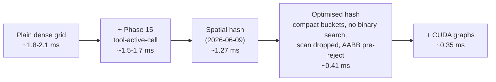

# GPU Collision — Performance & Optimization Report (current state)

**Date:** 2026-06-18
**Hardware:** NVIDIA GeForce GTX 1650 Ti (Turing, sm_75, 16 SMs), WSL2, SOFA 25.12, CUDA 12.0.
**Build:** `SofaGpuCollision/build-profile/libSofaGpuCollision.so` (current `main`).
**Scope:** the single canonical current-state report. All earlier dated reports are
under `reports/archive_pre_20260618/`. Metric definitions:
[README_metrics_explained.md](README_metrics_explained.md).

> **Read me first.** On this laptop GPU, **whole-pipeline FPS is thermally noisy**
> (the clock ramps from ~300 MHz idle and throttles when hot). The **robust metric
> is GPU‑event kernel time** (`avg_narrow_kernel_ms`) and the **Nsight Compute
> numbers**, which are measured on the GPU's own clock. Trust those; treat absolute
> FPS as a fuzzy guide and compare ratios within one session.

---

## 1. Executive summary

- The engine **detects** triangle/point collisions on the GPU; it is detection‑only
  and zero‑copy (reads the simulation's own CUDA buffers, copies nothing per frame).
- Two broad culls feed the main tri‑tri narrow phase: the **dense uniform grid
  (+ Phase‑15 tool‑active‑cell generation)** — the default, best for small‑tool
  surgical scenes — and an opt‑in **spatial‑hash + prefix‑sum** cull that, after this
  session's optimizations, is **~4× faster kernel than the optimised dense grid on a
  large tissue**, with **bit‑identical contacts**.
- The hash broad cull is now so cheap (~0.35 ms total on the large scene) that the
  **`featureBasedProximityKernel` narrow phase is the single dominant GPU cost**
  (~207 µs for the 322,560‑pair → 8018‑contact workload, ~3 ms for the largest scene).
- An attempt to speed that narrow kernel via **occupancy** was **measured as a
  regression and reverted** (see §6); the real remaining lever is **reducing its load
  count** (triangle‑vertex packing), documented in §7.

---

## 2. What's implemented (concept by concept)

**Collision detection = two stages.** Comparing every tool triangle against every
tissue triangle is millions of tests/frame. So:

1. **Broad phase** — *"are the two objects even near?"* A cheap CPU bounding‑box test
   that rejects far object pairs entirely.
2. **Broad cull** (GPU) — *"which triangle pairs might touch?"* A spatial structure
   buckets triangles by location; only triangles sharing a bucket become **candidate
   pairs**. Collapses millions → a few thousand.
3. **Narrow phase** (GPU) — *"do they actually touch, and where?"* One GPU thread per
   candidate pair runs exact geometry and emits a **contact** if within
   `contactDistance`.

**Four narrow‑phase paths** (a scene picks one with flags), all sharing the broad cull:

| Path | Tests per candidate | Used for |
|---|---|---|
| Exact‑contact (legacy, off) | boolean triangle intersection (SAT) | — |
| **Tri‑tri FBP** (main) | 6 vertex‑face + 9 edge‑edge closest‑feature (Ericson) | tool mesh vs tissue mesh |
| Vertex‑triangle, self | a mesh's own vertices vs its own triangles | a soft body folding on itself |
| Vertex‑triangle, cross | point‑cloud points vs mesh triangles | a point‑cloud tool vs tissue |

**FBP = Feature‑Based Proximity.** Instead of a yes/no overlap, it finds the *closest
features* of two triangles and reports where they're closest, how far, the normal, and
a signed distance — everything a constraint solver needs. **VF/FV/EE** classify which
features won: **V**ertex‑**F**ace (a vertex of A nearest a face of B), **F**ace‑**V**ertex
(reverse), **E**dge‑**E**dge (closest points on an edge of each). The three always sum
to the contact total; they are the **correctness fingerprint** (identical geometry must
yield identical VF/FV/EE).

**Output** is a flat `ProximityContact` array kept on the GPU: primitive indices,
feature kind, barycentric weights, the two closest points, the unit normal, and the
signed distance (negative = penetrating).

---

## 3. Current measured results (fresh run, 2026-06-18)

### 3.1 The five canonical scenes (full suite)

| Scene | Elements | Fast FPS | Validation FPS | Validation kernel (ms) | Contacts (VF/FV/EE) | Launches |
|---|---:|---:|---:|---:|---|---:|
| one‑tissue / one‑blade (small tool) | 12,812 | **775** | 359 | 0.96 | **56** (0/0/56) | 7 |
| large tissue / subdiv blade | 79,520 | 132 | 105 | 3.01 | **8018** (5397/880/1741) | 7 |
| v‑t self‑collision (slab) | 900 | **5229** | 1826 | — | **2700** (2700/0/0) | 6 |
| v‑t cross‑model (tissue+cloud) | 3,200 | 1168 | 1266 | — | **254** (254/0/0) | 6 |
| hash scene — dense leg | 14,368 | — | 313 | 1.56 | **2354** (1119/428/807) | 7 |
| hash scene — **hash leg** | 14,368 | — | **535** | **0.35** | **2354** (1119/428/807) | 11 |

Every contact count matches the documented baseline; **overflow = 0** everywhere.
(The small‑scene first leg ran on a cold GPU clock — its FPS understates the warm
number, which is ~720+; this is the documented thermal artifact.)

### 3.2 The mode comparison — optimised hash vs the dense grid (the headline)

Large tissue + large tool (14,368 elements), **same session, warm**, contacts
identical (2354), kernel time (the robust metric):

| Mode | narrow **kernel** (ms) | FPS | launches |
|---|---:|---:|---:|
| Plain dense grid (Phase 15 off) | 1.79 | 288 | 7 |
| **Optimised dense grid (Phase 15)** | **1.48** | 310 | 7 |
| **Optimised hash (all opts + CUDA graphs)** | **0.35** | 556 | 11 |

➡️ **The optimised hash is ~4.2× faster kernel than the optimised dense grid** on this
both‑large scene. Backend parity (no SOFA): `hash_contacts = fbp_contacts = 8018`,
unique pairs 322,560 = dense, occupied slots 16,536, overflow 0.

### 3.3 Where the time goes now — the FBP narrow kernel is the bottleneck

Nsight Compute on `featureBasedProximityKernel` (large workload: 322,560 candidate
pairs → 8018 contacts, launched `<<<1024, 256>>>`):

| Metric | Value | Reading |
|---|---:|---|
| Duration | **~207 µs** | the dominant GPU cost on the large scene |
| Compute (SM) throughput | ~27% | not compute‑bound |
| DRAM throughput | ~9% | low *bandwidth*… |
| Achieved occupancy | ~44% | …limited to 3 blocks/SM by 79 registers/thread |
| Stall: **long_scoreboard** | **2.4** | …but **memory *latency*** dominates (scattered vertex loads) |
| Stall: **lg_throttle** | **1.85** | load/store unit **saturated** |
| Stall: wait | 1.88 | math‑dependency latency |

**Interpretation:** the kernel is **latency‑ and load‑throughput‑bound**, not
bandwidth‑ or compute‑bound. Each pair gathers 6 vertices from scattered triangle
indices; the LSU is saturated and there aren't enough warps to hide the latency.

---

## 4. The optimization progression (large+large scene, kernel time)

Each step keeps contacts **bit‑identical**; the broad cull got progressively cheaper:



| Step | Technique (what & why) |
|---|---|
| **Dense uniform grid** | 64×8×64 = 32,768 fixed cells; triangles bucketed by AABB; pairs from shared cells. Simple, but resets/scans all 32,768 cells every frame. |
| **Phase 15 — tool‑active‑cell generation** | In surgery the tool touches ~30 cells; build that mixed‑cell list *during the tool insert* and generate pairs only over it (no separate scan). 4.3× faster on small‑tool scenes; default ON. |
| **Spatial hash (2026‑06‑09)** | Replace the fixed grid with an open‑addressing hash table so only *occupied* cells take a slot; prefix‑sum work‑expansion → one thread per candidate pair. For the both‑large regime. |
| **Optimised hash (2026‑06‑17)** | (1) clear only *touched* dedup slots, not a full per‑frame memset; (2) **compact** bucket storage (mark→compact→fill; arrays sized to occupancy); (3) generate only **mixed** buckets; (4) **one block per bucket** → no per‑pair binary search; (5) **32‑bit** pair encoding when ids ≤ 65535; (6) **dropped the prefix‑sum scan** (its offsets became unused). 13→11 kernel launches. |
| **AABB pre‑reject** (in the FBP kernel) | Before the 15 closest‑feature tests, a conservative squared box‑gap test skips far same‑cell pairs. Exact ⇒ bit‑identical; helps the dense path too (shared kernel). |
| **CUDA graphs** | Capture the 11‑kernel hash sequence once and replay it each steady‑state frame, cutting per‑launch overhead. ~−7% kernel / +10% FPS, default ON (`SOFA_HASH_CUDA_GRAPH=0` disables). |

---

## 5. Kernel launches & thread allocation (current)

`threadCount = 256` everywhere; the reference scenes use a 64×8×64 = 32,768‑cell grid.

| Path | Launches/frame | Sequence |
|---|---:|---|
| Tri‑tri FBP, dense grid | **7** | reset → insert tissue → insert tool → generate pairs (active cells) → reset counters → FBP narrow |
| Tri‑tri FBP, optimised hash | **11** | clear‑touched → reset → mark cells ×2 → compact buckets → fill ×2 → count pairs → generate (mixed buckets) → reset counters → FBP narrow *(replayed as one CUDA graph)* |
| Vertex‑triangle (self/cross) | **6** | reset → insert triangles → insert points → generate → reset counters → v‑t narrow |

- **One thread per element** (size known on CPU): inserts/resets → `<<<ceil(count/256), 256>>>`.
- **Over‑launched grid‑stride** (size known only on GPU): the narrow kernel and pair
  generators launch a fixed `<<<1024, 256>>>` and each thread strides
  `for (i = tid; i < count; i += gridDim.x*blockDim.x)` — no CPU↔GPU round‑trip to read
  the count. *In‑loop early‑outs must `continue`, never `return`* (a `return` would drop
  a thread's remaining strided work — the Phase‑17 bug).
- Full per‑kernel reference: `tutorial/17_kernels_reference.md`.

---

## 6. Methods tried that DO NOT work (do not retry)

| Attempt | What was tried | Measured result | Why it failed |
|---|---|---|---|
| **FBP occupancy** (2026‑06‑18) | `__launch_bounds__(256,4)` + register‑state reduction (track‑min, reconstruct winner) + `__ldg` read‑only loads | regs 79→64, occupancy 44→**65%**, but kernel **210→225 µs (slower)** | The kernel is **LSU‑throughput‑bound** (`lg_throttle`): more warps just contend harder for the saturated load/store unit. Occupancy is *not* the constraint. The scene‑level FPS "gains" were pure thermal (v‑t scenes, which don't use this kernel, also jumped +55–80% that run). **Reverted.** |
| **`__ldg` read‑only cache** | route the scattered vertex loads through the RO cache | no change (isolated) | Reuse is too low for the RO cache to help; the loads are genuinely scattered. |
| **compactActiveCells** (Phase 9) | a kernel that *scanned all 32,768 cells* to build the active list | regressed | Scanning all cells defeated the point; replaced by Phase 15 (list built *during* the insert, no scan). |
| **batchTriangleInsert** | fuse tissue+tool insertion into one kernel | regressed; incompatible | Breaks the tissue‑before‑tool ordering the active‑cell/mixed‑bucket logic relies on. |
| **Warp‑aggregated / prefix‑sum atomics** (Phase 13) | reduce atomicAdd contention | <2% saving (Nsight‑confirmed) | Atomics are **not** the bottleneck — L2 atomic cycles peak ~0.55% on the dominant kernel. |

**Known perf‑neutral leftover:** `pairsPerBucket` (hash workspace) is now write‑only —
its only consumer (the prefix‑sum scan) was removed; the raw‑pair total comes from
`rawCandidateCount`. Kept to avoid churning the verified CUDA‑graph capture path for
zero perf gain; safe to remove as a trivial follow‑up.

---

## 7. The genuine next lever (validated, not yet done)

The FBP narrow kernel is **load‑throughput‑bound on scattered vertex gathers**, so the
fix is to **reduce the number of loads**, not add warps:

> **Pack each triangle's 3 vertices into a contiguous, 16‑byte‑aligned buffer once per
> frame.** Then the narrow kernel does coalesced 128‑bit loads, reused across a
> triangle's many candidate pairs, instead of scattered index→vertex gathers per pair.
> This directly attacks `long_scoreboard` + `lg_throttle`. It is a structural change
> (a new pack kernel + workspace buffers + CUDA‑graph integration, both paths), so it
> was scoped rather than rushed.

Secondary: route the v‑t paths through the hash cull; auto‑tune the hash table size from
a measured occupancy histogram.

---

## 8. Reproduce

```bash
# Fresh full report run (suite + mode comparison + ncu FBP + backend parity):
scripts/run_report_bench_wsl.sh

# Deep profile of the FBP kernel (stalls, occupancy):
scripts/run_profile_deep_wsl.sh

# Backend parity (no SOFA): prints hash_contacts == fbp_contacts:
SOFA_BACKEND_BENCH_RUN_HASH=1 ./SofaGpuCollisionDenseGridBackendBench
```

Headline fields per leg live in `<leg>/<label>_summary.txt`; each is defined in
[README_metrics_explained.md](README_metrics_explained.md).
