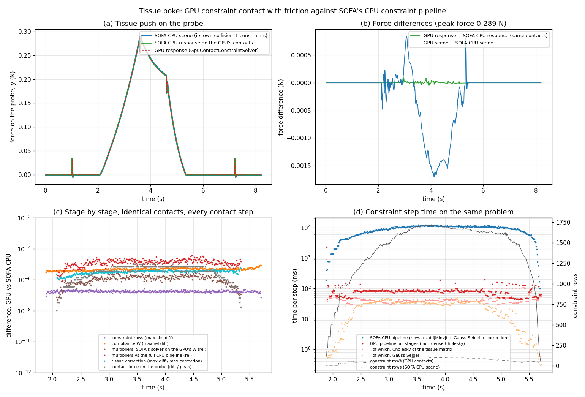

# GPU constraint contact with friction (2026-09-24)

The second GPU contact response is now working: constraint contact, meaning the surfaces
may not overlap, with Coulomb friction, solved with Lagrange multipliers the way SOFA's own
constraint contact is. The whole constraint step runs on the GPU. This report records how
each stage follows SOFA's CPU code, how the two were compared on identical inputs, and the
results. How to use it is in the root `README.md` (sections 7.8 and 9.4).

## 1. What was built

`GpuContactConstraintSolver` takes the place of SOFA's constraint solver in a
`FreeMotionAnimationLoop`, for one deformable body touching one rigid body. The GPU code is
in `SofaGpuCollision/src/SofaGpuCollision/cuda/detail/ContactConstraints.cuh`.

Each stage follows a specific piece of SOFA's CPU code, so that the two can be compared
number for number:

| Stage | Follows, in SOFA v25.12 | On the GPU |
|---|---|---|
| Contact selection | (SOFA's CPU collision finds its own contacts) | One vertex-face contact per vertex, the face closest to it, on either body; no edge-edge contacts. Sorted by their features, so the order never depends on the narrow phase's output order. |
| Rows | `BaseContactLagrangianConstraint::addContact` and `buildConstraintMatrix` (normal, and SOFA's two tangents t, s); then the mappings' `applyJT`: barycentric onto the deformable triangle, `RigidMapping` onto the rigid body ([u ; r × u]); then `MechanicalProjectJacobianMatrixVisitor` (fixed DOFs removed) | One thread per contact. Fixed DOFs are found by applying each projective constraint's `projectResponse` to a vector of ones. |
| Free violation | `BaseContactLagrangianConstraint::getPositionViolation`, line for line, including its tangential interpolation to the moment of impact. Free points as SOFA has them: `FreeMotionAnimationLoop` sets x_free = x + dt·v_free on every state, mapped ones included, so a rigidly mapped point moves by dt·(v + ω × r) | Same thread. |
| Compliance | `LinearSolverConstraintCorrection::addComplianceInConstraintSpace`: W += f·J A⁻¹ Jᵀ with f = `correctionFactor` = dt, where A is the body's own implicit system matrix | The tissue matrix (read from its `SparseLDLSolver` after the free motion) is copied up and factorised as a dense Cholesky (cuSOLVER `potrf`, single precision). One triangular solve (`trsm`) and one product (`gemm`) give the block of A⁻¹ on the touched vertices. The rigid 6×6 is inverted on the CPU. |
| Solve | `BlockGaussSeidelConstraintSolver` (`gaussSeidel_increment`) with `UnilateralConstraintResolutionWithFriction`: the same per-contact update, error measure, tolerance scaling, over-relaxation and stopping rule | One GPU block, contacts in SOFA's order. Single precision with per-contact divisors precomputed; `exactArithmetic` runs SOFA's arithmetic in double. |
| Correction | `LinearSolverConstraintCorrection::applyMotionCorrection`: x = x_free + dt·dv, v = v_free + dv, dv = A⁻¹ Jᵀ λ | Jᵀλ by atomic adds, then `potrs` with the same factor. |

**Why the exact compliance, rebuilt every step.** The tissue is Ogden: it stiffens under
load. A compliance computed once at rest (SOFA's `PrecomputedConstraintCorrection`) would
be wrong exactly where it matters. The CPU scene uses `LinearSolverConstraintCorrection`,
which rebuilds it every step, so the GPU does the same.

## 2. How it was compared

"Identical inputs" means: the same contacts (the points on both bodies, the normal, the
deformable body's triangle vertices and weights), the same body states, and the same
system matrices. The comparison works at three levels:

1. **The numerical parts alone** (`SofaGpuCollisionConstraintChecks`, no scene): the
   Gauss-Seidel against SOFA's `BlockGaussSeidelConstraintSolver` on the same W, violations
   and μ (C1), and the dense Cholesky compliance against a double-precision LDLᵀ (C2).
2. **Stage by stage, inside the poke** (`compareWithCpu`). Every contact step, the contacts
   the GPU found also go through SOFA's own CPU pipeline:
   - rows and violations from SOFA's `UnilateralLagrangianConstraint`, run on two point
     sets that hold the contact points and their free positions (computed in double from
     the bodies' states), then mapped onto the bodies' DOFs;
   - W from each body's own SOFA linear solver (`addJMInvJt` on the free motion's
     factorisation), as `LinearSolverConstraintCorrection` does;
   - the multipliers from SOFA's `BlockGaussSeidelConstraintSolver`, once on SOFA's W and
     once on the GPU's own W and violations (the solver alone);
   - the correction in double precision (an LDLᵀ of the same matrix).
3. **Whole pokes**: a run driven by the GPU response against a run driven by SOFA's CPU
   response on the same GPU-detected contacts (`response="cpu"`), which differ only in who
   computed the contact response; and against SOFA's own CPU scene, which also finds its
   own contacts (`LocalMinDistance` with point, line and triangle models).

## 3. Results

### 3.1 The numerical parts

| Case | Rows | Exact mode: multipliers vs SOFA | Single precision | Sweeps, GPU = SOFA |
|---|---:|---:|---:|:---:|
| frictionless | 60 | 3.8e-16 | 2.9e-7 | ✅ both modes |
| μ = 0.1 | 180 | 3.3e-16 | 2.6e-7 | ✅ |
| μ = 0.8 | 180 | 1.1e-15 | 1.6e-7 | ✅ |
| μ = 0.1, redundant contacts | 270 | 7.9e-16 | 5.4e-7 | ✅ |
| μ = 0.1, 400 contacts | 1,200 | 1.7e-15 | 4.7e-7 | ✅ |
| μ = 0.1, 800 contacts | 2,400 | 5.2e-15 | 7.8e-7 | ✅ |
| μ = 0.1, 1,600 contacts (multipliers in global memory) | 4,800 | 5.3e-15 | 8.1e-7 | ✅ (255 and 95 sweeps) |

Solve times in single precision: 30.6 ms on the GPU against 74 ms for SOFA at 1,200 rows,
84 against 333 ms at 2,400 rows, and 652 against 2,643 ms at 4,800 rows. Below a few
hundred rows SOFA's solver alone is faster (60 rows: 0.2 ms against 2 to 5 ms).

The compliance (C2, 5,400 unknowns, 222 touched DOFs) matches a double-precision LDLᵀ to
9.7e-7.

### 3.2 Stage by stage, over a whole poke

383 contact steps (every step with contacts, from 1.88 s to 5.7 s), with SOFA's CPU
response driving the scene. Maximum over all steps:

| Stage | GPU against SOFA's CPU pipeline |
|---|---|
| Constraint rows | 2.6e-7 (the coefficients are unit-vector components and weights) |
| Free violations | 1.4e-9 m |
| Compliance W | 8.9e-6 relative |
| Multipliers, SOFA's solver on the GPU's W | 3.8e-6 relative |
| Multipliers, full CPU pipeline | 3.8e-5 relative |
| Gauss-Seidel sweeps | equal in 383 of 383 steps (up to 37 sweeps) |
| Lowest violation left after the solve | the same on both sides (down to −5.1 µm, where the tolerance stops the solver) |
| Tissue correction (a position change of up to 3.2 mm) | 40 nm (single-precision noise of the GPU's Cholesky solve: 14 nm against the CPU pipeline's own result, 38 nm against a double-precision solve with the GPU's multipliers) |
| Probe correction | 1 nm |
| Contact force on the probe (J2ᵀλ/dt) | 3 µN out of 0.289 N (0.001%) |

Every difference is at single-precision level. None grows over the run.

### 3.3 Whole pokes

Three runs of the whole poke (820 steps), one after another on 2026-09-24:

- **GPU response**: the GPU scene, `GpuContactConstraintSolver` with `response="gpu"`.
- **SOFA CPU response, same contacts**: the same scene with `response="cpu"`: SOFA's CPU
  pipeline moves the bodies, on the contacts the GPU found.
- **SOFA CPU scene**: `tissue_poke_cpu.py`, SOFA's own collision detection and constraint
  contact, all on the CPU.

| Result | GPU response | SOFA CPU response, same contacts | SOFA CPU scene |
|---|---:|---:|---:|
| Contact starts | 2.090 s | 2.090 s | 2.090 s |
| Peak force (end of the press) | 0.28915 N | 0.28912 N | 0.28969 N |
| Tissue depth at the peak | 7.087 mm | 7.087 mm | 7.087 mm |
| Force at the start → end of the hold | 0.25639 → 0.20638 N | 0.25640 → 0.20638 N | 0.25698 → 0.20786 N |
| Relaxed during the 1 s hold | 19.51% | 19.51% | 19.11% |
| Closest probe-to-tissue gap under the tip | 0.5025 mm | 0.5025 mm | 0.5025 mm |
| Most squashed element (volume / rest volume) | 0.7613 | 0.7616 | 0.7530 |
| Surface at the end, against its settled height | −1.140 mm | −1.140 mm | −1.081 mm |
| Force at the end | 0 | 0 | 0 |
| Largest force difference from the GPU response, over the whole poke | — | 0.10 mN (0.03% of the peak) | 1.7 mN (0.6%) |
| Contacts (constraint rows), median over the contact steps | 533 (1,599) | the same | 23 (69) |
| Wall time per step: average (with contact) | 307 ms (358 ms) | 5,688 ms (11,866 ms) | 332 ms (383 ms) |

- **Like for like** (first two columns): the only difference is who computed the contact
  response, and the two runs agree to 0.03% of the peak force all along, 0.05 µm in the
  probe's position and 11 µm in the tissue surface under the tip.
- **Against SOFA's own CPU scene**: within 0.6% all along. SOFA's collision detection
  (`LocalMinDistance`) keeps far fewer contacts, a median of 23 against the GPU's 533: it
  keeps only contacts that are local distance minima, while the GPU keeps every vertex
  within the alarm distance. Both sets hold the probe out equally well, as the forces show.
- The penalty contact measured earlier the same day was 5 to 7% below the CPU scene
  (`reports/tissue_poke_20260924.md`); the constraint contact closes that gap.

### 3.4 Time

On **the same problems** (the same contact steps; SOFA's CPU times from the like-for-like
run, the GPU times from the GPU run with `measureTimes`, which has no long CPU phases to
slow the GPU down). Medians over the steps with 1,200 rows or more (301 steps; median
1,629 rows from 543 contacts, 23 Gauss-Seidel sweeps on both sides):

| Stage | SOFA CPU pipeline | GPU |
|---|---:|---:|
| Rows and free violations | 0.9 ms | 0.8 ms |
| Compliance W | 10,446 ms (`addJMInvJt` on SOFA's sparse LDLᵀ) | 44.9 ms (Cholesky 39.3 + W 5.6) |
| Gauss-Seidel | 68.3 ms | 33.1 ms |
| Correction | 31.4 ms (the double-precision reference) | 1.8 ms |
| **Total** | **10,532 ms** | **81.6 ms** |

By problem size (medians):

| Constraint rows | Steps | SOFA CPU pipeline | GPU | GPU faster by |
|---|---:|---:|---:|---:|
| under 300 | 8 | 217 ms | 62 ms | 3.5× |
| 300 to 600 | 13 | 1,321 ms | 57 ms | 23× |
| 600 to 900 | 14 | 2,222 ms | 58 ms | 39× |
| 900 to 1,200 | 47 | 4,706 ms | 58 ms | 82× |
| 1,200 and more | 301 | 10,532 ms | 82 ms | 129× |

- SOFA's CPU compliance grows with the number of rows (one sparse triangular solve per
  row); the GPU's is dominated by the Cholesky of the whole tissue matrix (about 40 ms),
  whatever the number of rows.
- The Gauss-Seidel is the GPU's second-largest cost (about 33 ms at 1,600 rows: 2.7 µs per
  contact update, 543 contacts × 23 sweeps, because one block works through the contacts
  one at a time).
- The very first contact step took 2.3 s on the GPU: CUDA compiles the kernels for this GPU
  the first time they run (the build targets `sm_52`), and the buffers are allocated.

**Whole scenes.** The GPU scene averages 307 ms per step and SOFA's CPU scene 332 ms. A step
without contact takes 263 ms in the GPU scene and 286 ms in the CPU scene, mostly the
tissue's free motion (its material and its sparse factorisation, on the CPU in both). The
contact step adds about 95 ms in the GPU scene, for about 1,600 rows, and about 97 ms in
SOFA's CPU scene, for about 70.

## 4. Problems found along the way

- **The comparison first read the bodies after the correction had moved them.** The rows
  differed by 5e-5, exactly one step of probe motion (5 mm/s × 10 ms), because the lever
  arms were taken from the corrected probe position. The comparison now runs before the
  correction is applied; the difference dropped to 2.6e-7.
- **"No CUDA-capable device"** after a WSL restart: the loader picked the
  `libcuda.so.1` of Ubuntu's `libnvidia-compute-535` package over WSL's. Every script now
  puts `/usr/lib/wsl/lib` first in `LD_LIBRARY_PATH`.
- **The first single-precision solver check asked for a tolerance below single precision**
  (1e-9) and ran to the iteration limit. Single precision is now checked at a tolerance it
  can reach (1e-6), and a separate double-precision mode (`exactArithmetic`) reproduces SOFA
  to machine precision.
- **The first Gauss-Seidel kernel was slow**: one thread did double-precision divisions and
  square roots for every contact, 3 to 5 µs per contact update. The single-precision mode
  precomputes each contact's divisors and sizes its block to the problem.
- **The GPU slows down after a long pause.** In the comparison runs, the Cholesky took 200
  to 300 ms instead of 31 ms: SOFA's CPU compliance kept the GPU idle for seconds, and it
  dropped its clocks. `SofaGpuCollisionConstraintChecks --cadence` shows it: 271 ms right
  after a 4.6 s CPU phase, 31 ms with 300 ms pauses. So GPU times are taken from runs
  without the comparison.
- **SOFA details that the comparison code has to work around**:
  `BaseConstraintCorrection::correctionFactor` is protected (so its three lines are
  repeated), and `MatrixLinearSolver::addMInvJt` reads its right-hand side back after the
  solve instead of the solution (so the double-precision correction uses its own LDLᵀ).

## 5. Limits

- One deformable body and one rigid body.
- The tissue matrix is factorised **dense** on the GPU: 117 MB for the poke's 1,800 nodes,
  and the work grows with the cube of the node count; about 10,000 nodes would fill the
  4 GB GPU. The factorisation is also paid on top of SOFA's own CPU factorisation in the
  free motion. Both go away once the free motion runs on the GPU and its factorisation can
  be shared.
- The Gauss-Seidel runs in one GPU block, working through the contacts one at a time.
  Up to about 4,000 rows the multipliers sit in shared memory; bigger problems keep them in
  global memory (checked at 4,800 rows). Below a few hundred rows SOFA's CPU solver on its
  own is faster (C1: 60 rows, 2 to 5 ms on the GPU against 0.2 ms); above about 1,000 rows
  the GPU is faster.
- Single precision by default (differences from SOFA's double precision at the 1e-5
  level, as above).
- Only the `POS_AND_VEL` constraint order (FreeMotionAnimationLoop's default).
- Only fixed and partially fixed DOFs are removed from the rows; another projective
  constraint is reported, and not applied to the rows.
- Only the rigid body's Jᵀλ is stored in SOFA's lambda vector (the tissue's would need a
  full-vector download each step).
- Per contact step it copies the tissue's free positions (21.6 KB) and matrix values
  (0.84 MB) up, and its correction (21.6 KB) down: the tissue still lives on the CPU.

## 6. Next

- The tissue's material and linear solver on the GPU (Tier 3). The free motion then runs
  on the GPU, the matrix copy disappears, and the constraint contact can reuse the free
  motion's factorisation.
- A sparse GPU factorisation, for bigger meshes.
- A faster Gauss-Seidel for big problems (it works through the contacts one at a time),
  more than two bodies, and grasping.
