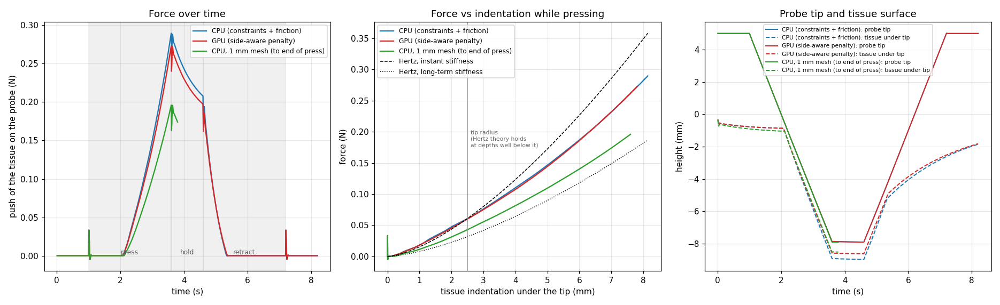

# Tissue poke test (2026-09-24)

A realistic surgical test: a probe pokes a block of liver-like tissue once. There are two
versions: one runs entirely on the CPU, and the other puts collision detection and
contact forces on the GPU wherever GPU components exist. The scenes are in
`testscenes/surgicalsimulationtests/`; the root `README.md` describes them (section 10.3)
and lists the results (section 14.4).
This report records how the test was built, the four problems found along the way, and
the measured results.

## 1. The test

- A 6 × 6 × 3 cm block rests on a table (bottom fixed), under gravity. Mesh: 1,800 nodes,
  8,232 tetrahedra; 2 mm elements in a 12 mm-wide, 6 mm-deep zone under the probe, growing
  by 1.5 times per element to about 10 mm at the edges.
- The material is viscoelastic Ogden: Ogden μ1 = 2 kPa and α1 = 6 (long-term shear modulus
  1 kPa); a relaxing branch G1 = 1 kPa with τ = 0.58 s; bulk modulus 20 kPa; density
  1,060 kg/m³.
- A rigid probe, 5 mm across with a round tip, is pulled along its path by a 2,000 N/m
  spring (a virtual coupling). It moves down at 5 mm/s to 8 mm below the surface, holds
  for 1 s, and pulls back out. The spring's stretch gives the force.
- CPU scene: constraint contact with friction μ = 0.1, direct solvers on both bodies.
- GPU scene: the tissue material on the CPU, and its collision surface, the collision
  detection (way 6) and the side-aware penalty contact on the GPU. One implicit solver with
  a conjugate-gradient linear solver.

## 2. Four problems found and fixed

### 2.1 SofaViscoElastic's stiffness matrix leaves out the relaxing branch

With the plugin's one-piece `SLSOgdenFirstOrder`, the CPU poke blew up 2.5 mm in. Just
before, the most squashed element's volume ratio went 0.90, 0.91, 0.90, 0.90, 0.91, 0.90,
0.89, 0.89, 0.88, 0.89, 0.87 in successive steps (ringing), then 0.76, 0.79, 0.23, −15.1,
and NaN at t = 2.50 s.

Cause: the plugin computes the stress `S = S_Ogden + 2 G1 (E − E_viscous)`, but its
`applyElasticityTensor` (the stiffness the implicit solver uses) contains only the Ogden
part. The relaxing branch's stiffness, `G1 τ/(τ + dt)` per unit of strain, is missing,
which is about half the instant stiffness here. A linearised implicit step with a stiffness
that is too small by a factor r overshoots by (r − 1). At r ≈ 2 the error flips sign every
step without shrinking, and a little more tips it into growth. Every viscoelastic material
in the plugin has the same omission.

Fix (`poke_common.add_tissue_material`): the same stress built from two parts on the same
mesh, so that the stiffness matrix covers both:

- `SLSOgdenFirstOrder` with G1 = 0 (the long-term Ogden spring; its stiffness is a close
  approximation that treats each stretch change as lined up with the current stretch);
- the plugin's `MaxwellFirstOrder` element with [G1, τ, 0] in
  `TetrahedronViscoelasticityFEMForceField`, whose stiffness is its instant stiffness G1.

SOFA's own Ogden (`TetrahedronHyperelasticityFEMForceField`) has an exact stiffness
matrix, but it rebuilds a full 6×6 tensor 18 times per element per step, about 6 s per step
on this mesh, so it was not used.

### 2.2 GPU contact stiffness 200 N/m per contact was far too stiff

The GPU scene blew up at first touch: 204 contacts switched on at once, about 40,000 N/m in
total, against the tissue's own push-back of about 20 N/m. In one step a tetrahedron was
squashed to 21% of its volume; the next step was NaN. With 10 N/m per contact (a few
thousand N/m in total) the poke runs cleanly.

### 2.3 `UncoupledConstraintCorrection` made the CPU force 3 times too large

At the end of the press the CPU scene first read 0.786 N, and the GPU scene 0.25 N, for the
same tissue deformation. `UncoupledConstraintCorrection` on the probe uses the mass alone
as its compliance (dt²/m) and ignores the 2,000 N/m coupling spring. The constraint solver
therefore moves the probe (1 + k·dt²/m) = (1 + 2000 × 0.0001 / 0.1) = 3 times too far for
the force the tissue receives, and the spring reads 3 times the real force. With a direct
solver and `LinearSolverConstraintCorrection` on the probe (its exact compliance, spring
included) the CPU scene reads 0.266 N, and the two scenes agree.

### 2.4 SOFA's CPU penalty contact is not a usable fallback

The GPU scene first fell back to SOFA's CPU penalty contact (`PenalityContactForceField`,
with the per-model stiffness chosen to give the same 10 N/m per contact). The probe went
straight through the tissue at first touch: at t = 3.08 s its tip was 4.5 mm below the
tissue surface, the force was 0, and the tissue had sprung back to rest. That contact
can't tell inside from outside either. The fallback is now the CPU scene's setup,
constraints with friction.

### 2.5 Two more GPU contact fixes

- **Stale contacts.** If the broad phase stopped sending a pair (the bodies' boxes stopped
  overlapping), the force field kept applying that pair's last contacts. Contacts now count
  only in the collision pass that computed them (new Gate 2d).
- **A misleading warning.** Every GPU run warned `GPU contact penalty forces skipped: No
  device contact handle recorded` at start-up, simply because the probe starts away from the
  tissue. That is now treated as the normal no-contact state.

## 3. Results

Whole poke, 820 steps, both scenes run one after the other with
`run_tissue_poke_wsl.sh both`:

| Result | CPU scene (constraints + friction) | GPU scene (side-aware penalty) |
|---|---:|---:|
| Contact starts | 2.09 s | 2.09 s |
| Peak force, at the end of the press | 0.290 N | 0.273 N |
| Force at the start → end of the hold | 0.257 → 0.208 N | 0.240 → 0.197 N |
| Relaxed during the 1 s hold | 19.1% | 17.8% |
| Tissue depth under the tip at the peak | 8.1 mm | 7.8 mm |
| Closest probe-to-tissue gap under the tip | 0.50 mm | 0.46 mm |
| Most squashed element (volume / rest volume) | 0.75 | 0.71 |
| Surface at the end, compared with its settled height | −1.08 mm | −1.05 mm |
| Force at the end | 0 | 0 |
| Wall time per step | 325 ms | 242 ms |

- **The scenes agree**: the GPU force is 5 to 7% lower all along, about what friction and
  no-overlap contact add in the CPU scene.
- **Against theory**: up to about the tip radius (2.5 mm), the force against tissue depth on
  this mesh follows Hertz's formula F = (4/3) E* √R d^1.5 with the instant stiffness
  (E* = 7,314 Pa). Deeper, it grows more slowly and stays between the instant and long-term
  (E* = 3,812 Pa) curves. Section 4 shows that sitting on the instant curve is partly the
  mesh being too stiff: on a 1 mm mesh the force lies between the two curves.
- **Relaxation and recovery**: the force relaxes about 18% during the hold. On the way out
  the tissue can't keep up with the probe: contact ends at about 5.35 s with the tip still
  about 3.5 mm below the settled surface, and at the end the surface is still about 1.1 mm
  low.

## 4. Mesh check

The CPU scene was run again with 1 mm elements under the probe instead of 2 mm
(`SOFA_POKE_FINE_STEP=0.001`: 8,125 nodes, 41,472 tetrahedra) to the start of the hold.
It is the green curve in the plot.

| | 2 mm mesh (default) | 1 mm mesh |
|---|---:|---:|
| Settled surface under gravity | −0.77 mm | −0.90 mm |
| Force at the end of the press (t = 3.51 s) | 0.266 N | 0.180 N |
| Force at 2 mm tissue depth | 0.048 N | 0.031 N |
| Wall time per step | about 0.3 s | 5 to 9 s |

**The 2 mm mesh is about 50% too stiff at full depth.** Linear tetrahedra lock when the
material is nearly incompressible (here the bulk modulus is 20 times the shear modulus), and
locking fades as the mesh gets finer. On the 1 mm mesh the force at small depth lies
between the instant and long-term Hertz curves, which is what a material that partly
relaxes while it is loaded should do. The 2 mm mesh sits on the instant curve, which is
only possible because it is too stiff.

So:

- **The CPU-against-GPU comparison stands.** Both scenes use the same mesh, so any mesh
  error is the same in both, and the contact models agree to 5 to 7%.
- **The absolute force is not mesh-converged.** The default mesh overstates it by about
  half, and the 1 mm mesh has not been shown to be converged either. For absolute forces,
  run a finer mesh, or use a material formulation that doesn't lock.
- The default stays at 2 mm, because at 1 mm a full poke takes about 1.5 hours on the CPU.

## 5. Limits

- The material runs on the CPU in both scenes. The GPU scene copies the tissue positions to
  the GPU and the forces back every frame, and again in every conjugate-gradient iteration.
- Penalty contact has no friction, and its per-contact stiffness has to be chosen for the
  number of contacts.
- Contact distance 0.5 mm: the probe stops about 0.5 mm short of the surface.
- The tissue is still creeping under its own weight when the probe starts (0.09 mm more
  during the approach).
