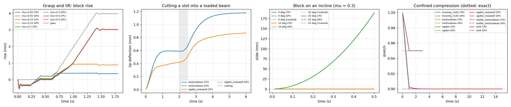

# Validation against SOFA's CPU components, grasping, cutting and scaling (2026-09-25)

The GPU implementation was checked against SOFA's own, widely used CPU components on seven
physics tests with known answers, extended to several rigid tools (grasping) and to
cutting, and timed against SOFA's CPU as the scene grows. Four bugs in SOFA turned up on
the way. The details, settings and full tables are in the root `README.md` (sections 10.4,
14.4 to 14.6, 16); this report keeps the plots and the story of what was found.

## 1. The validation tests

Each test builds the same set-up twice, once from SOFA's CPU components and once from this
plugin's GPU components, and compares the two with each other and with an answer known from
theory (`testscenes/validationtests/`, `scripts/run_validation_suite_wsl.sh`):

| Test | Known answer | Result, both sides |
|---|---|---|
| Material check, 7 materials | — (stage by stage against SOFA) | forces equal to 1e-13, positions to 1.2 nm |
| Confined compression, 10% | exact stretch | CPU exact, GPU 5e-8 (single-precision state) |
| Cantilever beam, 4 meshes | Timoshenko | 31% to 74% of theory (locking), CPU = GPU to 1e-6 |
| Block on an incline | Coulomb | sticks at 0° and 10°, slides 0.18909 m (theory 0.18852 m) at 25° |
| Plate compression, 3 materials | exact force | within 1e-4 % |
| Grasp and lift, 4 frictions | Coulomb (2μN ≥ mg) | slips at μ ≤ 0.25, lifts at μ ≥ 0.3; threshold 0.26 |
| Cutting a slot into a beam | — (CPU against GPU) | tip within 1.3 nm after 48 tetrahedra removed |

*Grasp: the block rises with the jaws only above Coulomb's threshold. Cutting: the slot,
cut between 2.0 and 2.5 s, doubles the beam's deflection. Incline: the 25° slide against
Coulomb's law. Confined compression: every material reaches the exact stretch.*

## 2. What went wrong on the way, and what it taught

- **Every narrow-phase path kept one shared workspace.** With three tools the constraint
  solver read the last pair's contacts through each pair's own triangle list: wrong
  contacts and an illegal memory access. Each colliding pair now has its own workspace.
- **A sharp tool edge on a coarse mesh can't be held by vertex-face contacts**, on SOFA's
  CPU pipeline as on the GPU: the first grasp design (short jaws whose bottom edges
  pressed into the block's side) lost the block on both. The test now keeps tool edges off
  the tissue.
- **A pinched soft block needs a short time step.** With dt = 0.01 s, the Gauss-Seidel
  stopped converging near full squeeze for μ ≥ 0.3 (1,000 sweeps and more) and the block
  blew up, with SOFA's BlockGaussSeidel, NNCG, under-relaxation and regularisation alike,
  and on the GPU. With dt = 0.005 s it converges in about 30 sweeps.
- **Coulomb's balance needs the normal force during the lift**, which is about 15% lower
  than before it: the squeezed block had been pressing on the pedestal through the jaws'
  friction. With it, both sides lift exactly when 2μN ≥ mg; while slipping, the jaw's
  vertical force equals μN to 0.2%.
- **Incremental residuals made the Gauss-Seidel slower**, not faster, on this GPU (0.263 and
  0.446 ms per sweep against 0.178): the sweep is bound by reading W from one SM. Removed.

## 3. Bugs found in SOFA

| Where | What | Effect | Fix |
|---|---|---|---|
| SofaViscoElastic `SLSOgdenFirstOrder` | `SelfAdjointEigenSolver(C, true)`: `true` asks for no eigenvectors | stress wrong once deformed; 42% less peak force in the poke | `Eigen::ComputeEigenvectors` |
| SOFA core `Ogden` (since 17/11/2025) | general `EigenSolver`, then V D Vᵀ | wrong by up to 100% where two stretches coincide (rest, uniaxial, axisymmetric states) | `patches/SOFA-Ogden-orthonormal-eigenvectors.patch` |
| SofaCUDA `RigidMapping` | `applyJT` writes thread 1's forces into the torque | a rigid tool with surface forces turns the wrong way | `patches/SofaCUDA-RigidMapping-applyJT-torque.patch` |
| runSofa (`BaseViewer`) | the camera it makes for a scene without one gets `bwdInit()` but no `init()`, so the default view is never applied | the window looks out from the origin: from inside the poke's tissue, no probe in sight | a camera in the scene (both poke scenes have one) |

The second was found because the GPU's Ogden (symmetric eigen-decomposition) and SOFA's
disagreed by up to 4.6e-4 in confined compression, in a few steps only, while NeoHookean in
the same test agreed to 1e-13. Eigen then showed the cause directly: on
C = diag(1, 0.81, 1) with rounding noise, the general solver's eigenvectors are far from
orthogonal, and V D Vᵀ is off by up to 97%.

## 4. Speed as the scene grows

`scripts/scaling_study_wsl.sh`: wall-clock time per step, SOFA's CPU components against
the GPU, for the tissue alone (a cube, 125 to 4,913 nodes, NeoHookean and Ogden + Maxwell)
and for the whole poke at three mesh sizes (726 to 3,610 nodes).

| | Smallest | Largest |
|---|---|---|
| Tissue alone, NeoHookean | 125 nodes: SOFA 2.5 ms, GPU 6.5 ms (SOFA faster) | 4,913 nodes: SOFA 1,736 ms, GPU 46 ms (38×) |
| Tissue alone, Ogden + Maxwell | 125 nodes: 86 against 2.5 ms (34×) | 4,913 nodes: 7,115 against 48 ms (149×) |
| Whole poke | 726 nodes: 668 against 16.4 ms (41×) | 3,610 nodes: 4,292 against 40.6 ms (106×) |

The GPU's step has a floor of a few milliseconds (launches and a few waits), so a tiny mesh
with a cheap material is faster on SOFA's CPU. From about a thousand nodes the GPU's lead
grows with the mesh: SOFA's sparse factorisation of a 3D mesh grows faster than the GPU's
band factorisation (37 ms at 14,739 DOFs, half-bandwidth 869). SOFA's core Ogden is slow on
the CPU at any size (its stiffness rebuilds a 6×6 tensor 18 times per tetrahedron), which
is why Ogden gains 34 to 149 times.
