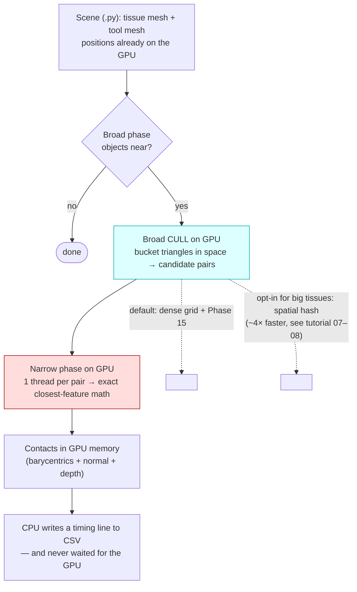

# 00 — The high-level flow (start here)

This is the **easy, big-picture** explanation of what this project does. No code,
no CUDA jargon you haven't met yet — just the story of what happens, in order,
when the simulation runs. If you read only one file, read this one. Everything
else in the tutorial zooms into a box on the map you're about to see.

---

## The problem in one breath

A surgical simulation has a **tool** (a scalpel, a blade) moving through soft
**tissue**. Many times per second the simulator must answer:

> *"Is the tool touching the tissue right now — and if so, exactly where, and
> how deep?"*

Both the tool and the tissue are **meshes**: surfaces made of thousands of tiny
triangles. So the real question is *"which triangles of the tool are touching
which triangles of the tissue?"* The honest brute-force way is to compare every
tool triangle against every tissue triangle — but that's millions of comparisons
per frame, far too slow on a CPU. This project does those comparisons on the
**GPU** (graphics card), where thousands of tiny processors check triangles
**all at once** instead of one at a time.

---

## The map: one frame, top to bottom

Every "frame" is one tick of simulated time (5 milliseconds in our scenes). Here
is the whole journey of a single frame:

```text
  ┌──────────────────────────────────────────────────────────────────┐
  │ 1. THE SCENE                                                       │
  │    A Python file describes: a tissue mesh, a tool mesh, and the    │
  │    instruction "detect collisions on the GPU."                     │
  └───────────────────────────────┬──────────────────────────────────┘
                                  ▼
  ┌──────────────────────────────────────────────────────────────────┐
  │ 2. BROAD PHASE  —  "which objects are even near each other?"       │
  │    Cheap, rough. Throws out obviously-far pairs. (One CPU check.)  │
  └───────────────────────────────┬──────────────────────────────────┘
                                  ▼
  ┌──────────────────────────────────────────────────────────────────┐
  │ 3. BROAD CULL (on the GPU)  —  "which TRIANGLES might touch?"      │
  │    Drop a grid of boxes over space. Put each triangle in the boxes │
  │    it covers. Only triangles sharing a box can possibly touch, so  │
  │    we emit just those "candidate pairs." Millions → a few thousand.│
  └───────────────────────────────┬──────────────────────────────────┘
                                  ▼
  ┌──────────────────────────────────────────────────────────────────┐
  │ 4. NARROW PHASE (on the GPU)  —  "do they ACTUALLY touch, where?"  │
  │    One GPU thread per candidate pair does exact geometry: finds    │
  │    the closest points, the distance, the direction, the depth.     │
  │    Produces a "contact" for every pair that's close enough.        │
  └───────────────────────────────┬──────────────────────────────────┘
                                  ▼
  ┌──────────────────────────────────────────────────────────────────┐
  │ 5. THE RESULT                                                      │
  │    A list of contacts, left sitting in GPU memory. A stopwatch     │
  │    reading is written to a CSV file. The CPU never waits for the   │
  │    GPU — that's the speed secret.                                  │
  └──────────────────────────────────────────────────────────────────┘
```

That's the entire system. The rest is detail.

---

## Each step, in plain words

### 1. The scene
A small Python file (e.g. `testscenes/one_tissue_one_blade.py`)
lists the two meshes and switches on the GPU collision components. Think of it as
the "level file." Tour of one such file:
[02_the_scene.md](02_the_scene.md).

### 2. Broad phase — near objects
Before looking at triangles, SOFA asks a coarser question: do the two *objects'*
bounding boxes even overlap? If the tool is across the room from the tissue,
stop here. This is the classic "broad phase."
Details: [04_broad_phase.md](04_broad_phase.md).

### 3. Broad cull — candidate triangle pairs
Here's the clever part. Imagine laying an egg-carton **grid** of boxes over the
space the meshes occupy. Every triangle gets dropped into the box(es) it sits in.
Now, two triangles can only touch if they share a box. So instead of comparing
*every* tool triangle to *every* tissue triangle, we only emit the pairs that
**share a box** — the "candidate pairs." This collapses millions of potential
comparisons down to a few thousand real ones.

- The grid is the **dense uniform grid**:
  [06_the_dense_grid.md](06_the_dense_grid.md).
- A neat optimization (Phase 15): in surgery the tool is small and only touches
  ~30 boxes, so we only bother generating pairs from *those* boxes — a 4×
  speedup. Same file.
- An **alternative** grid for when *both* meshes are big — a spatial **hash**
  that materialises only occupied cells — lives behind an off-by-default switch.
  The idea *and exactly what kind of hashing it uses* is
  [07_the_hash_broad_cull.md](07_the_hash_broad_cull.md); the six tricks + CUDA
  graphs that make it ~4× faster are [08_optimising_the_hash.md](08_optimising_the_hash.md).

### 4. Narrow phase — exact contacts
Now the GPU does the real geometry. It launches one **thread** (tiny worker) per
candidate pair. Each thread figures out the closest features between its two
triangles — vertex-to-face, or edge-to-edge — and the exact distance and
direction. If they're within the contact distance, the thread writes a
**contact**: where they touch, the surface normal, and how deep. Thousands of
pairs are resolved simultaneously.

- The geometry math (closest points, barycentric weights):
  [10_the_math.md](10_the_math.md).
- The kernels that do it, with pictures: [09_the_kernels.md](09_the_kernels.md).
- A second flavor handles **points vs triangles** (self-collision and
  point-cloud tools): [11_vertex_triangle.md](11_vertex_triangle.md).

### 5. The result, and the speed secret
The contacts are left **in GPU memory** — they are *not* copied back to the CPU
in the benchmark (a real solver would consume them on the GPU too). Crucially,
the CPU **issues** all this GPU work and then **moves on without waiting** for it
to finish. The GPU computes the frame's collisions while the CPU is already
setting up the next frame. Avoiding that wait is what makes the benchmark hit
hundreds-to-thousands of frames per second.
Why and how: [12_sync_and_output.md](12_sync_and_output.md).

---

## The four "narrow phase" flavors (one picture)

The narrow phase isn't one thing — there are four, and a scene picks one with
flags. They **all share steps 2–3 above** (the same broad cull); only the final
geometry differs:

| Flavor | When it's used | What each thread tests |
|---|---|---|
| **Exact contact** (legacy) | off by default | do two triangles boolean-intersect? |
| **Tri-tri proximity** (the main one) | tool mesh vs tissue mesh | closest feature of two triangles (6 vertex-face + 9 edge-edge tests) |
| **Vertex-triangle, self** | a soft body folding onto itself | a mesh's own vertices vs its own triangles |
| **Vertex-triangle, cross** | a point-cloud tool vs a tissue mesh | cloud points vs mesh triangles |

Full breakdown with kernels, inputs, outputs, and thread counts:
[17_kernels_reference.md](17_kernels_reference.md).

---

## What "fast" means here (so the numbers make sense)

The benchmark writes a CSV of timings every frame. Two numbers matter most:

- **FPS** — frames per second for the *whole* pipeline. Higher is better, but on
  a laptop GPU it's noisy (it includes everything around the collision work, and
  the GPU's clock speed wanders with temperature).
- **narrow-phase kernel time** — how long the *actual collision math* took on the
  GPU. This is the clean, robust signal. It's measured with GPU stopwatches
  ("CUDA events") and barely moves between runs.

When you compare two approaches, trust the **kernel time** first and treat
absolute FPS as a fuzzy guide. Every number in the CSV is defined in
[14_benchmark_metrics.md](14_benchmark_metrics.md) and in the reports' companion file
[reports/README_metrics_explained.md](../reports/README_metrics_explained.md).

---

## The same picture as a flow diagram



The **blue** box (broad cull) is where most of this project's optimization effort
went — so successfully that the **red** box (narrow phase) is now the slowest part.
The whole story of how each box got fast (and the things we tried that *didn't*
work) is in **[16_optimizations_and_dead_ends.md](16_optimizations_and_dead_ends.md)**; how we *find* the
bottleneck is in **[15_profiling_and_tuning.md](15_profiling_and_tuning.md)**.

## Where to go next

- New and want the *why-it's-built-this-way* lesson, in order? Start at
  [01_foundations.md](01_foundations.md) and read through.
- Want **every optimization** explained (easy + hard, including the failed ones)?
  [16_optimizations_and_dead_ends.md](16_optimizations_and_dead_ends.md).
- Want the *exact* kernels, data structures, and thread counts?
  [17_kernels_reference.md](17_kernels_reference.md).
- Want to know how to **profile and tune** a kernel yourself?
  [15_profiling_and_tuning.md](15_profiling_and_tuning.md).
- Want the canonical engineering reference (not a tutorial)? See
  `guide/architecture.md`; current measured numbers are in
  `reports/performance_five_ways_20260703.md`.

> **One sentence to remember:** *lay a grid over space, keep only triangle pairs
> that share a box, then let thousands of GPU threads each resolve one pair —
> and never make the CPU wait for the answer.*
