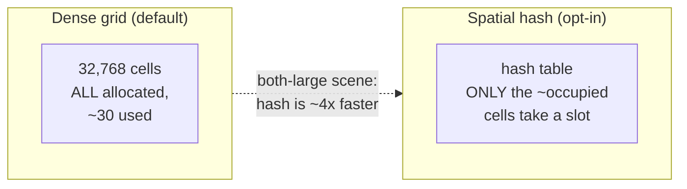
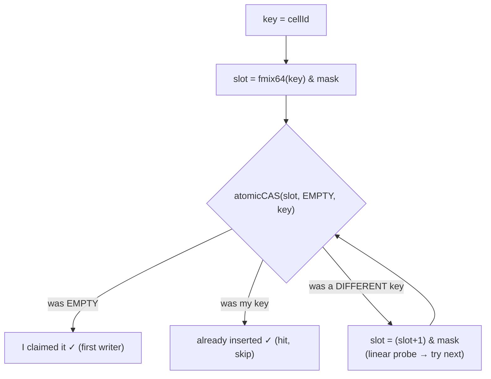

# 07 — The spatial-hash broad cull (and how the hashing actually works)

The dense grid ([06_the_dense_grid.md](06_the_dense_grid.md)) reserves memory for
**all 32,768 cells** every frame, even when only ~30 of them contain anything. When
*both* meshes are large (a ~1,500-triangle tool against a large tissue), that waste
hurts. The **spatial-hash broad cull** is the alternative: it stores **only the cells
that are actually occupied**, and on the both-large scene it ends up **~4× faster than
the optimised dense grid** — with **bit-identical contacts** (it feeds the same narrow
kernel).

It's opt-in: `useHashPrefixSumGeneration=True` (the dense grid is still the default for
small-tool surgical scenes — see [08_optimising_the_hash.md](08_optimising_the_hash.md)
for "which wins when").

This chapter is in two halves:
- **Part 1** — the idea (easy): a hash table of occupied cells.
- **Part 2** — the hashing, *in full detail* (open addressing, the hash function,
  `atomicCAS`, linear probing) — because "what kind of hashing is this?" deserves a
  real answer.

---

## Part 1 — The idea, in plain words

A dense grid is like a hotel that builds **every** room whether or not a guest shows
up. A hash table is like a hotel that **only builds a room when a guest arrives** —
and uses a clever formula to decide which room number each guest gets.

Here, the "guests" are **occupied grid cells**. We still chop space into the same
64×8×64 conceptual cells — but instead of a 32,768-slot array, we keep a **hash table**
where only the cells that actually contain a triangle take a slot.



The payoff: every per-frame cost (clearing the structure, scanning it, generating
pairs) now scales with **how much geometry there is**, not with a fixed 32,768.



---

## Part 2 — The hashing, in full detail

> **The one-line answer:** it's a **self-implemented GPU open-addressing hash table**
> with **linear probing** and **lock-free `atomicCAS` insertion**, using the
> **MurmurHash3 64-bit finalizer (`fmix64`)** as the hash function. **No library** —
> not `std::unordered_map`, not cuCollections, nothing. (The only library that ever
> touched this path was CUB, for a *prefix-sum scan* that has since been removed.)

There are actually **two** hash tables in the system, both built the same way:

| Table | Key → value | Job |
|---|---|---|
| **Spatial hash** (`cellKeys`) | a grid-cell id → a slot/bucket | "which cells are occupied" |
| **Pair-dedup hash** (`pairHashKeys`) | a candidate pair `(tissueId, toolId)` → present? | emit each pair once even if several cells produced it |

### 2.1 The hash *function* — MurmurHash3 `fmix64` (hand-written)

A hash function takes a key (a number) and scrambles its bits so that *similar* keys
land in *very different* slots (otherwise neighbouring cells would pile into adjacent
slots and collide constantly). This one is the well-known **MurmurHash3 finalizer**
(`GpuCollisionBackend.cu`):

```cpp
__device__ std::uint64_t mixCandidatePairHash(std::uint64_t value) {
    value ^= value >> 33u;
    value *= 0xff51afd7ed558ccdull;   // ← the two MurmurHash3 fmix64
    value ^= value >> 33u;            //    "avalanche" constants
    value *= 0xc4ceb9fe1a85ec53ull;
    value ^= value >> 33u;
    return value;
}
```

**Easy:** it's a ~6-instruction bit-blender. Flip one bit of the input and about half
the output bits change ("avalanche"). No memory access, no library call.

> **Hard:** the two magic multipliers are the published MurmurHash3 `fmix64` constants.
> The shift-xor-multiply pattern is a *finalizer* (the part of MurmurHash that mixes the
> accumulated state). We use it standalone as a strong integer hash. The cell hash just
> feeds the cell id through it: `hashCellSlot(cellId) = fmix64(cellId + 1) & mask`. The
> `& mask` is the next step ↓.

### 2.2 The table layout — open addressing + power-of-two + bitmask

The table is **one flat array** of slots (no linked lists). The home slot for a key is:

```text
slot = fmix64(key) & mask        where mask = tableSize - 1
```

**Easy:** `tableSize` is always a power of two, so `& (tableSize-1)` is the same as
`% tableSize` (take-the-remainder) but as a single fast AND instruction instead of a
slow divide.

> **Hard:** sizes come from `nextPowerOfTwo(...)`. The cell table is sized to about
> `nextPow2((tissueTris + toolTris) × 4)` — ~4 slots per input triangle — so the
> **load factor** (fraction of slots used) stays low and collisions stay rare. The
> pair-dedup table is `nextPow2(maxCandidatePairs × 2)` (≤ 0.5 load).

### 2.3 Insertion — lock-free `atomicCAS` + linear probing

Thousands of GPU threads insert at the same time, so insertion must be **lock-free**.
The trick is `atomicCAS` (atomic compare-and-swap): "if this slot is EMPTY, put my key
in it — atomically, and tell me what was there before."

```cpp
std::uint32_t slot = hashCellSlot(cellId, mask);              // home slot
for (probe = 0; probe < maxProbe; ++probe) {
    uint prev = atomicCAS(&cellKeys[slot], EMPTY, cellId);    // try to claim it
    if (prev == EMPTY)  { /* I claimed it — I'm the first writer */ break; }
    if (prev == cellId) { /* someone already inserted this key — a HIT */ break; }
    slot = (slot + 1u) & mask;                                // collision: linear probe
}
if (!placed) atomicAdd(probeOverflowCount, 1u);              // gave up after maxProbe
```





Three outcomes per `atomicCAS`:
1. **The slot was EMPTY** → I just claimed it. I'm the first thread to insert this key.
2. **The slot already held *my* key** → another thread inserted it first; it's a hit,
   not a duplicate — stop.
3. **The slot held a *different* key** (a collision) → move to the next slot
   (`slot = (slot+1) & mask`, **linear probing**) and try again.

**Why these choices, specifically for a GPU:**

| Choice | Why (GPU reason) |
|---|---|
| **Open addressing** (flat array) | Chaining needs linked lists + per-node allocation — impossible/terrible on a GPU. A flat array is cache-friendly and needs no allocation. |
| **Linear probing** (`+1`) | On a collision, the next slot is the very next memory address → cache/coalescing friendly, and cheap at low load factor. |
| **`atomicCAS` claim** | Lets thousands of threads insert concurrently with **no locks** — the hardware serializes just the one 4-byte slot, first writer wins. |
| **Power-of-two + `& mask`** | Replaces an expensive `%` with one AND instruction. |
| **`EMPTY` sentinel** (`0xffffffff`) | A reserved value that can't be a real key, marking an unused slot. |
| **Bounded probing** (`maxProbe`, default 64) | Never loops forever; gives up and counts `probeOverflow` (which is **0** in practice because the table is sized generously). |

### 2.4 The pair-dedup hash (same machinery, different key)

A triangle straddling several cells gets inserted into each, so the **same** candidate
pair can be generated from multiple shared cells. We want it **once**. The pair is
bit-packed and run through the *same* open-addressing table:

```cpp
encodeCandidatePair = (tissueId << 32) | toolId;   // 64-bit key
// (or 16+16 → 32-bit when both meshes have ≤ 65,535 triangles — half the bandwidth)
slot = fmix64(pair) & mask;   // then atomicCAS-claim, exactly as above
```

The first thread to claim a pair's slot adds it to the output array; later threads that
hash to the same pair see `prev == pair` and silently skip. **Result on the large hash
scene: 322,560 raw candidate pairs deduped to the exact unique set the dense grid would
produce** — that's why the contacts are bit-identical.

A "tracked" variant of this insert also records each slot it claims into
`touchedPairHashSlots`. That's what lets the next frame **clear only the slots it
touched** instead of wiping the whole multi-million-slot table — one of the
optimizations in [08_optimising_the_hash.md](08_optimising_the_hash.md).

---

## What you now know

- The hash cull stores **only occupied cells**, so per-frame cost scales with occupancy.
- The hashing is a **self-written open-addressing table**: MurmurHash3 `fmix64` →
  `& mask` → `atomicCAS` claim → linear probe on collision. No library.
- Two tables use it: one for **occupied cells**, one for **deduplicating candidate pairs**.
- It produces the **same candidate set** as the dense grid → **bit-identical contacts**.

Next: the six engineering optimizations that make this hash cull actually fast (compact
buckets, no binary search, touched-slot clear, 32-bit pairs, dropped scan) plus CUDA
graphs → [08_optimising_the_hash.md](08_optimising_the_hash.md).
