# 08 — Optimising the hash broad cull (six tricks, CUDA graphs, and the simpler 4th way)

[07_the_hash_broad_cull.md](07_the_hash_broad_cull.md) explained the *idea* (a hash
table of occupied cells) and the *hashing* (open addressing, MurmurHash `fmix64`,
`atomicCAS`, linear probing). A naïve version of that idea is correct but not fast.
This chapter is the engineering that made it **~4× faster kernel than the optimised
dense grid** on the both-large scene — six structural tricks plus CUDA graphs, each
**bit-identical** (they change *how* candidate pairs are found, never *which*).

---

## The pipeline you're optimising (11 kernels)

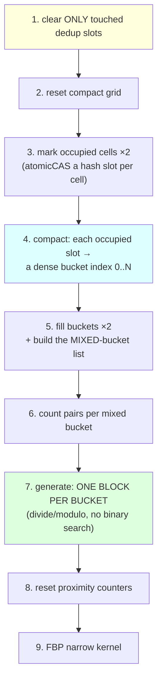

All 11 kernels are **replayed as a single CUDA graph** each steady-state frame (the
last trick). Let's take them one at a time.

---

## Trick 1 — Compact bucket storage (mark → compact → fill)

**Easy:** A dense grid keeps a `count` for all 32,768 cells. The hash keeps per-cell
data only for the cells that exist — but to do that it needs to give each occupied
cell a small, dense index (bucket 0, 1, 2, …) instead of its big sparse cell id.

> **Hard:** a **two-pass build**. `markCompactHashGridCellsKernel` (×2, tissue + tool)
> just claims a hash slot per occupied cell (atomicCAS) — it doesn't store triangles
> yet, only "this cell exists." Then `compactHashGridSlotsKernel` walks the table and
> gives each claimed slot a dense **bucket index** via `atomicAdd(occupiedBucketCount)`.
> Finally `fillCompactHashGridTrianglesKernel` (×2) inserts the triangle ids into those
> compact buckets. Per-bucket arrays (`tissueCount`, `toolCount`, `tissueIds`,
> `toolIds`) are sized to **occupancy**, not `tableSize`.



## Trick 2 — Generate only *mixed* buckets

**Easy:** A bucket with only tissue (or only tool) can't produce a contact — skip it.
Only buckets with **both** matter.

> **Hard:** during the fill, the moment a bucket first holds both a tissue and a tool
> triangle it's appended to `mixedBucketIds`. Counting and generation iterate **only
> that list**. (It's the hash analogue of the dense grid's Phase-15 tool-active-cell
> trick from [06_the_dense_grid.md](06_the_dense_grid.md) §6.8.)

## Trick 3 — One block per bucket → no binary search *(the elegant one)*

**Easy:** The first hash design launched one thread per candidate pair and made each
thread **binary-search** a table to discover which bucket it belonged to. The new
design hands **one whole thread-block to each mixed bucket**, and the block's 256
threads just split that bucket's `tissue × tool` pairs by plain division. No search.

> **Hard:** `generateMixedHashCandidatePairs{32,64}Kernel`:
> ```cpp
> for (mixedIdx = blockIdx.x; mixedIdx < mixedCount; mixedIdx += gridDim.x) {
>     b = mixedBucketIds[mixedIdx];
>     t = tissueCount[b]; u = toolCount[b];
>     for (lp = threadIdx.x; lp < t*u; lp += blockDim.x) {
>         tissueLocal = lp / u;   toolLocal = lp % u;   // recover the pair, no search
>         ... emit (tissueIds[b][tissueLocal], toolIds[b][toolLocal]) ...
>     }
> }
> ```
> Removes a `log(buckets)` binary search **per candidate pair** and gives clean
> per-block memory locality.


## Trick 4 — Clear only the dedup slots you *touched*

**Easy:** The duplicate-pair table has millions of slots; only a few thousand are used
per frame. Wiping the whole thing every frame is wasted bandwidth. So remember which
slots you used and wipe **only those** next time.

> **Hard:** the "tracked" insert ([07 §2.4](07_the_hash_broad_cull.md)) records each
> claimed slot into `touchedPairHashSlots`. Next frame
> `clearTouchedPairHash{32,64}Kernel` resets only those (grid-strided). The very first
> frame (and any table resize) does one full `cudaMemset`, guarded by
> `*PairHashKeysInitialized`.

### The pair-dedup table and "touched" slots, in detail

This is the part people ask about most, so here it is in full.

**What the table is for.** A triangle can straddle several grid cells, so the *same*
candidate pair `(tissueId, toolId)` is generated from every cell the two triangles
share. We want it emitted exactly **once**. The fix is a second open-addressing hash
table, `pairHashKeys`, keyed by the packed pair: the first thread to claim a pair's slot
writes it to the output array; later threads that hash to the same pair find their key
already present (`prev == pair`) and silently skip.


**What "touched" means.** That dedup table is huge — sized to `nextPow2(maxPairs × 2)`,
i.e. millions of slots — but only a few thousand are claimed in any one frame. Wiping all
of it every frame is wasted bandwidth. So the *tracked* insert does one extra thing: each
time it claims a slot it appends that slot's **index** to a small list,
`touchedPairHashSlots` (with a counter `touchedPairHashCount`). A "touched" slot is simply
**a slot this frame wrote to** — nothing more.

Next frame, `clearTouchedPairHash{32,64}Kernel` walks only that little list and resets
just those slots back to `EMPTY`, instead of a multi-million-slot `cudaMemset`. Every
other slot is left untouched because it was never written. (The very first frame, and any
table resize, still does one full `cudaMemset`, guarded by `*PairHashKeysInitialized`.)


## Trick 5 — 32-bit compact pair encoding

**Easy:** If both meshes have fewer than 65,536 triangles, a pair `(tissueId, toolId)`
fits in **32 bits** instead of 64 — half the memory traffic for the candidate array and
the dedup table.

> **Hard:** `useCompactCandidatePairs = (firstTris ≤ 65535 && secondTris ≤ 65535)`
> selects `encodeCompactCandidatePair` (16+16 → 32) and the `…32Kernel` variants;
> otherwise it falls back to 64-bit cleanly.


## Trick 6 — Dropping the prefix-sum scan *(a cleanup that became a speedup)*

**Easy:** The original hash design ran a "prefix-sum scan" (from the CUB library) to lay
out the work. After Trick 3 (one block per bucket), the scan's output was **never read
again** — pure wasted work. We deleted it. That also removed the *only* library
dependency from the file.

> **Hard:** the block-per-bucket generator needs no global pair offsets, and the raw
> pair total is already accumulated into `rawCandidateCount`. Removed
> `cub::DeviceScan::ExclusiveSum` + `setCompactHashRawTotalKernel` + its temp storage.
> **13 → 11 kernel launches**, and `#include <cub/cub.cuh>` is gone.

---

## CUDA graphs — replay the whole sequence

**Easy:** The pipeline is now **11 tiny kernels**. Each launch has a fixed CPU cost
(telling the driver "do this next"). When kernels are this small, that overhead is a big
slice of the total. A **CUDA graph** records the whole 11-kernel sequence **once** and
replays it as one unit — the driver runs them back-to-back with almost no per-launch
overhead.

> **Hard:** a `launchAll(stream, fullClear)` helper records the sequence; it's captured
> once into a `cudaGraphExec` and replayed each steady-state frame. The **first frame**
> (and any workspace resize) runs directly + re-captures; a *signature* (table size,
> triangle counts, etc.) guards re-capture; the graph is **launched on stream 0** so the
> optional counter readback stays correctly ordered after it; any capture/launch failure
> **falls back** to direct launch. Default **ON** (`SOFA_HASH_CUDA_GRAPH=0` disables;
> auto-off under detailed profiling, which needs per-stage timers). Measured **~−7%
> kernel / +10% FPS**, bit-identical.

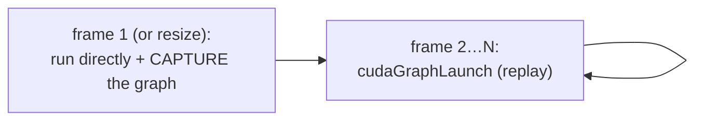


---

## A full worked trace — every variable, step by step

To make the build concrete, here is a tiny scene traced through the pipeline with the
actual workspace arrays shown at each step. The scene: two tissue triangles (`T0`, `T1`)
and two tool triangles (`U0`, `U1`), where `T0` and `U0` each straddle **two** cells —
which is exactly what creates a duplicate pair for the dedup table to catch.

**Step 0 — the input.**


**Step 1 — after `mark`.** Each occupied cell (2, 5, 9) `atomicCAS`-claims a slot in
`cellKeys`; every other slot stays `EMPTY`.


**Step 2 — after `compact`.** `atomicAdd` gives each claimed slot a dense bucket index, so
the three cells become buckets `b0`, `b1`, `b2` and `occupiedBucketCount = 3`.


**Step 3 — after `fill`.** Triangle ids drop into their buckets. `b0` and `b1` each hold
both a tissue and a tool triangle, so they join `mixedBucketIds`; `b2` (tool only) is
skipped.


**Step 4 — `generate` + dedup.** The two mixed buckets emit three raw pairs. `(T0,U0)` is
produced from both `b0` and `b1`; the second copy hits an already-claimed `pairHashKeys`
slot and is skipped. Two unique pairs survive, and the two claimed slots are recorded in
`touchedPairHashSlots` (so the next frame can clear exactly them).


The narrow FBP kernel then consumes `candidatePairs` exactly as it would from the dense
grid — which is why the contacts come out **bit-identical**.

---

## The 4th way — a simpler direct-bucket hash

The optimised hash above is fast, but look at how much *machinery* it took: `mark` →
`compact` → `fill` is a **three-pass build** just to give each occupied cell a dense bucket
index before any triangle is stored. A fair question: **is all that compaction actually
where the speed comes from?** The "simple hash" (the project's `useSimpleHashGeneration`
path) answers it by **throwing the compaction away** and storing triangles *directly*.

**Easy:** instead of building dense buckets first, let **each hash slot be its own bucket**.
One pass over the triangles: for every cell a triangle touches, hash the cell to a slot,
claim it (`atomicCAS` + linear probe), and **append the triangle id right there**. No mark
pass, no compact pass, no pairs-per-bucket count. Then the *same* mixed-bucket generator and
the *same* FBP kernel finish the job.

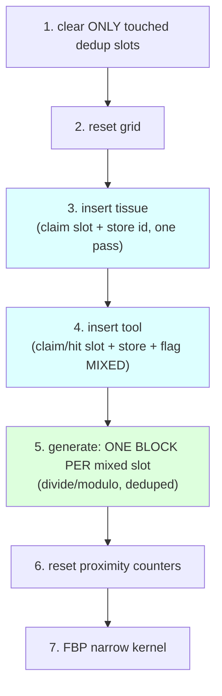

That's **7 kernels**, versus the optimised hash's 11 — the `mark`, `compact` and
`pairs-per-bucket` passes are all gone. The whole sequence is replayed as its own **CUDA
graph** (`SOFA_SIMPLE_HASH_CUDA_GRAPH`, default on), exactly like the optimised hash.

> **Hard:** there is exactly **one new kernel** — `insertSimpleHashTrianglesKernel`. Because
> `bucketCapacity == tableSize`, a slot *is* a bucket, so `tissueIds[slot * maxPerCell +
> local]` is indexed by slot directly and `generateMixedHashCandidatePairs{32,64}Kernel`
> works unchanged. The single-pass insert is correct under concurrency because `atomicCAS`
> makes the slot claim **idempotent**: the first thread for a cell claims the slot, every
> later thread for the *same* cell follows the same deterministic probe sequence and finds
> `key == cellId` (a hit) before any empty slot, so all of a cell's triangles converge on one
> slot. Tissue is inserted before tool (separate launches), so the "this slot just became
> mixed" test (`first tool triangle && tissueCount[slot] > 0`) fires exactly once per slot.

**Best-effort, by choice.** A cell holding more than `maxTissue/maxToolTrianglesPerCell`
triangles drops the surplus (counted in `overflowCount`) instead of falling back. But those
per-cell caps are *identical* to the dense grid and the optimised hash, so on every test
scene the overflow is **0** and the candidate set — and therefore the contacts — is exactly
the same.

### Does it actually keep up? (yes)

Measured on the 14,368-element scene, validation mode, all four ways back-to-back on the
same GPU (so the comparison is thermally fair):


| Broad cull | narrow **kernel** | contacts (VF/FV/EE) | overflow | kernels |
|---|---:|:--|:--:|:--:|
| baseline dense grid | 2.07 ms | 2354 (1119/428/807) | 0 | 7 |
| optimised dense (Phase 15) | 1.86 ms | 2354 (1119/428/807) | 0 | 7 |
| optimised hash | **0.37 ms** | 2354 (1119/428/807) | 0 | 11 |
| **simple hash (4th way)** | **0.38 ms** | 2354 (1119/428/807) | 0 | **7** |

**The simple hash ties the optimised hash** (0.37 vs 0.38 ms — within thermal noise) and is
~5× faster than the optimised dense grid, **with 7 kernels instead of 11 and bit-identical
contacts**. So the honest answer to the question above is: **the compaction passes are *not*
where the speedup lives.** The win comes from (a) storing only *occupied* cells and (b)
generating over *mixed* buckets only — and the simple hash does both, more directly. The
elaborate mark/compact/fill build buys almost nothing here; it trades a little bucket memory
(`tableSize` buckets instead of occupancy-many) for two fewer passes.

(Full numbers and the correctness cross-checks are in
[reports/archive_pre_20260703/four_way_broadcull_comparison_20260626.md](../reports/archive_pre_20260703/four_way_broadcull_comparison_20260626.md).)

---

## Which broad cull wins, and when?

Both produce identical contacts — the choice is pure speed, and it depends on the scene:

| Scene | Winner | Why |
|---|---|---|
| **Small tool, local footprint** (the surgical default) | **dense grid + Phase 15** | the tool touches ~30 cells; Phase-15 generation is already ~8 µs — the hash's fixed build stages aren't worth it |
| **Large tissue and/or large tool** | **optimised hash *or* simple hash (tied)** | only occupied cells are materialized; both ~5× faster kernel than dense — the simple hash matches the optimised one with fewer kernels |
| **self-collision / point-cloud-vs-mesh** | **dense (v-t path)** | both hash culls are wired only for the tri-tri FBP path |

So both hash paths ship **opt-in, default-off** (`useHashPrefixSumGeneration` and
`useSimpleHashGeneration`, mutually exclusive — the optimised hash wins the tie-break if both
are set) — turning either on costs the default surgical scene nothing.

---

## The scoreboard for this chapter

Large tissue + large tool (14,368 elements), narrow **kernel** time, bit-identical:

| Broad cull | kernel | vs optimised dense |
|---|---:|---|
| Optimised dense grid (Phase 15) | ~1.48 ms | 1.0× |
| Spatial hash (2026-06-09, pre-opt) | ~1.27 ms | 1.2× |
| + compact buckets / mixed-only / no-binary-search / scan-drop | ~0.41 ms | ~3.6× |
| **+ CUDA graphs (current)** | **~0.35 ms** | **~4.2×** |


This scoreboard is the *optimised hash's* own progression. The **simple 4th way** above lands
at the same ~0.35–0.38 ms with a **7-kernel** pipeline — the clearest evidence that the
compaction passes weren't the source of the speedup; storing only occupied cells and
generating over mixed buckets were.

Next: the **narrow phase** — the geometry that turns a candidate pair into a contact →
[09_the_kernels.md](09_the_kernels.md) and [10_the_math.md](10_the_math.md). The full
optimization scoreboard *including the ones that failed* is
[16_optimizations_and_dead_ends.md](16_optimizations_and_dead_ends.md).
