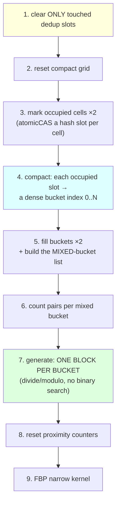
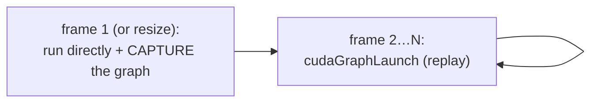

# 08 — Optimising the hash broad cull (the six tricks + CUDA graphs)

[07_the_hash_broad_cull.md](07_the_hash_broad_cull.md) explained the *idea* (a hash
table of occupied cells) and the *hashing* (open addressing, MurmurHash `fmix64`,
`atomicCAS`, linear probing). A naïve version of that idea is correct but not fast.
This chapter is the engineering that made it **~4× faster kernel than the optimised
dense grid** on the both-large scene — six structural tricks plus CUDA graphs, each
**bit-identical** (they change *how* candidate pairs are found, never *which*).

---

## The pipeline you're optimising (11 kernels)



All 11 kernels are **replayed as a single CUDA graph** each steady-state frame (the
last trick). Let's take them one at a time.

---

## Trick 1 — Compact bucket storage (mark → compact → fill)

**Easy:** A dense grid keeps a `count` for all 32,768 cells. The hash keeps per-cell
data only for the cells that exist — but to do that it needs to give each occupied
cell a small, dense index (bucket 0, 1, 2, …) instead of its big sparse cell id.

> **Hard:** a **two-pass build**. `markCompactHashGridCellsKernel` (×2, tissue + tool)
> just claims a hash slot per occupied cell (atomicCAS) — it doesn't store triangles
> yet, only "this cell exists." Then `compactHashGridSlotsKernel` walks the table and
> gives each claimed slot a dense **bucket index** via `atomicAdd(occupiedBucketCount)`.
> Finally `fillCompactHashGridTrianglesKernel` (×2) inserts the triangle ids into those
> compact buckets. Per-bucket arrays (`tissueCount`, `toolCount`, `tissueIds`,
> `toolIds`) are sized to **occupancy**, not `tableSize`.


## Trick 2 — Generate only *mixed* buckets

**Easy:** A bucket with only tissue (or only tool) can't produce a contact — skip it.
Only buckets with **both** matter.

> **Hard:** during the fill, the moment a bucket first holds both a tissue and a tool
> triangle it's appended to `mixedBucketIds`. Counting and generation iterate **only
> that list**. (It's the hash analogue of the dense grid's Phase-15 tool-active-cell
> trick from [06_the_dense_grid.md](06_the_dense_grid.md) §6.8.)

## Trick 3 — One block per bucket → no binary search *(the elegant one)*

**Easy:** The first hash design launched one thread per candidate pair and made each
thread **binary-search** a table to discover which bucket it belonged to. The new
design hands **one whole thread-block to each mixed bucket**, and the block's 256
threads just split that bucket's `tissue × tool` pairs by plain division. No search.

> **Hard:** `generateMixedHashCandidatePairs{32,64}Kernel`:
> ```cpp
> for (mixedIdx = blockIdx.x; mixedIdx < mixedCount; mixedIdx += gridDim.x) {
>     b = mixedBucketIds[mixedIdx];
>     t = tissueCount[b]; u = toolCount[b];
>     for (lp = threadIdx.x; lp < t*u; lp += blockDim.x) {
>         tissueLocal = lp / u;   toolLocal = lp % u;   // recover the pair, no search
>         ... emit (tissueIds[b][tissueLocal], toolIds[b][toolLocal]) ...
>     }
> }
> ```
> Removes a `log(buckets)` binary search **per candidate pair** and gives clean
> per-block memory locality.

## Trick 4 — Clear only the dedup slots you *touched*

**Easy:** The duplicate-pair table has millions of slots; only a few thousand are used
per frame. Wiping the whole thing every frame is wasted bandwidth. So remember which
slots you used and wipe **only those** next time.

> **Hard:** the "tracked" insert ([07 §2.4](07_the_hash_broad_cull.md)) records each
> claimed slot into `touchedPairHashSlots`. Next frame
> `clearTouchedPairHash{32,64}Kernel` resets only those (grid-strided). The very first
> frame (and any table resize) does one full `cudaMemset`, guarded by
> `*PairHashKeysInitialized`.

## Trick 5 — 32-bit compact pair encoding

**Easy:** If both meshes have fewer than 65,536 triangles, a pair `(tissueId, toolId)`
fits in **32 bits** instead of 64 — half the memory traffic for the candidate array and
the dedup table.

> **Hard:** `useCompactCandidatePairs = (firstTris ≤ 65535 && secondTris ≤ 65535)`
> selects `encodeCompactCandidatePair` (16+16 → 32) and the `…32Kernel` variants;
> otherwise it falls back to 64-bit cleanly.

## Trick 6 — Dropping the prefix-sum scan *(a cleanup that became a speedup)*

**Easy:** The original hash design ran a "prefix-sum scan" (from the CUB library) to lay
out the work. After Trick 3 (one block per bucket), the scan's output was **never read
again** — pure wasted work. We deleted it. That also removed the *only* library
dependency from the file.

> **Hard:** the block-per-bucket generator needs no global pair offsets, and the raw
> pair total is already accumulated into `rawCandidateCount`. Removed
> `cub::DeviceScan::ExclusiveSum` + `setCompactHashRawTotalKernel` + its temp storage.
> **13 → 11 kernel launches**, and `#include <cub/cub.cuh>` is gone.

---

## CUDA graphs — replay the whole sequence

**Easy:** The pipeline is now **11 tiny kernels**. Each launch has a fixed CPU cost
(telling the driver "do this next"). When kernels are this small, that overhead is a big
slice of the total. A **CUDA graph** records the whole 11-kernel sequence **once** and
replays it as one unit — the driver runs them back-to-back with almost no per-launch
overhead.

> **Hard:** a `launchAll(stream, fullClear)` helper records the sequence; it's captured
> once into a `cudaGraphExec` and replayed each steady-state frame. The **first frame**
> (and any workspace resize) runs directly + re-captures; a *signature* (table size,
> triangle counts, etc.) guards re-capture; the graph is **launched on stream 0** so the
> optional counter readback stays correctly ordered after it; any capture/launch failure
> **falls back** to direct launch. Default **ON** (`SOFA_HASH_CUDA_GRAPH=0` disables;
> auto-off under detailed profiling, which needs per-stage timers). Measured **~−7%
> kernel / +10% FPS**, bit-identical.



---

## Which broad cull wins, and when?

Both produce identical contacts — the choice is pure speed, and it depends on the scene:

| Scene | Winner | Why |
|---|---|---|
| **Small tool, local footprint** (the surgical default) | **dense grid + Phase 15** | the tool touches ~30 cells; Phase-15 generation is already ~8 µs — the hash's fixed build stages aren't worth it |
| **Large tissue and/or large tool** | **optimised hash** | only occupied cells are materialized; ~4× faster kernel |
| **self-collision / point-cloud-vs-mesh** | **dense (v-t path)** | the hash cull is wired only for the tri-tri FBP path |

So the hash ships **opt-in, default-off** (`useHashPrefixSumGeneration`) — turning it on
costs the default surgical scene nothing.

---

## The scoreboard for this chapter

Large tissue + large tool (14,368 elements), narrow **kernel** time, bit-identical:

| Broad cull | kernel | vs optimised dense |
|---|---:|---|
| Optimised dense grid (Phase 15) | ~1.48 ms | 1.0× |
| Spatial hash (2026-06-09, pre-opt) | ~1.27 ms | 1.2× |
| + compact buckets / mixed-only / no-binary-search / scan-drop | ~0.41 ms | ~3.6× |
| **+ CUDA graphs (current)** | **~0.35 ms** | **~4.2×** |

Next: the **narrow phase** — the geometry that turns a candidate pair into a contact →
[09_the_kernels.md](09_the_kernels.md) and [10_the_math.md](10_the_math.md). The full
optimization scoreboard *including the ones that failed* is
[16_optimizations_and_dead_ends.md](16_optimizations_and_dead_ends.md).
