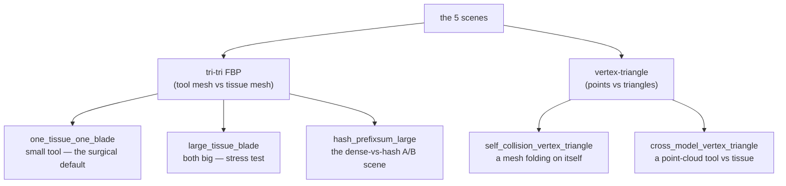
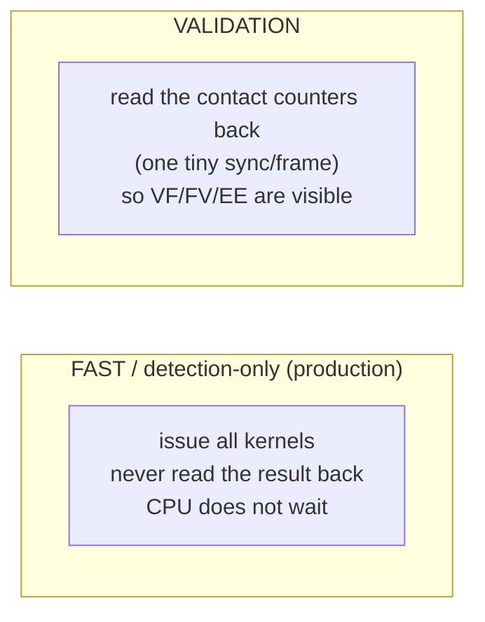

# 13 — Every scene and every kind of run, explained

You've seen the pipeline. This chapter is the **catalogue**: the five test scenes, what
each one is *for*, the two ways every scene can be run, the A/B comparison runs, and how
to read what each produces. All numbers are the fresh 2026-06-18 measurements on the
GTX 1650 Ti (full table in `reports/performance_and_optimizations_20260618.md`).

---

## The five scenes (in `testscenes/`)

Each scene builds two meshes and switches on **one** narrow-phase path. They all import
shared geometry helpers from `testscenes/dense_collision_benchmark_common.py`.



| Scene | Elements | Tests | Validation contacts (VF/FV/EE) |
|---|---:|---|---|
| `one_tissue_one_blade.py` | 12,812 | tri-tri FBP, **small tool** (surgical default; Phase-15 sweet spot) | **56** (0/0/56) |
| `large_tissue_blade.py` | 79,520 | tri-tri FBP, **large mesh** (stress test) | **8018** (5397/880/1741) |
| `self_collision_vertex_triangle.py` | 900 | **v-t self** (a 2-layer slab; each top vertex hovers 0.05 above a bottom triangle) | **2700** (2700/0/0) |
| `cross_model_vertex_triangle.py` | 3,200 | **v-t cross** (tissue mesh + a point-cloud tool 0.04 above it) | **254** (254/0/0) |
| `hash_prefixsum_large.py` | 14,368 | tri-tri FBP, **large tissue + large tool**, with the **dense↔hash toggle** | **2354** (1119/428/807) |

The two small v-t scenes (900, 3,200) are deliberately tiny and set up so the contact
count is *predictable* — they're **correctness tests** (does the code emit exactly the
contacts the geometry guarantees?), not speed benchmarks. The tri-tri scenes are the
performance scenes.

---

## The two run *modes* (every scene can do both)



| Mode | What it does | Why |
|---|---|---|
| **Fast / detection-only** | kernels issued, **nothing read back**, CPU never waits | the real production path — highest FPS; contact counts show as "—" |
| **Validation** | reads the contact counters back each frame (`SOFA_PROXIMITY_READ_CONTACT_COUNTER=1`) | makes VF/FV/EE visible so correctness can be checked; slightly slower |

The fast path is how you'd actually run a simulation. The validation path is how we
**prove** an optimization is bit-identical (the VF/FV/EE counts must not move).

---

## Current measured numbers (fresh, 2026-06-18, GTX 1650 Ti)

| Scene | Elements | Fast FPS | Validation FPS | Validation **kernel** (ms) | Launches |
|---|---:|---:|---:|---:|---:|
| one-tissue / one-blade | 12,812 | ~775 (warm) | 359 | 0.96 | 7 |
| large tissue / blade | 79,520 | 132 | 105 | 3.01 | 7 |
| v-t self-collision | 900 | 5229 | 1826 | — | 6 |
| v-t cross-model | 3,200 | 1168 | 1266 | — | 6 |
| hash scene — **dense** leg | 14,368 | — | 313 | 1.56 | 7 |
| hash scene — **hash** leg | 14,368 | — | 535 | **0.35** | 11 |

> **Reading the launches column:** dense paths launch **7** kernels, the optimised hash
> launches **11** (more, but each tiny — see [08](08_optimising_the_hash.md)), the v-t
> paths **6**. The hash leg has the lowest kernel time despite the most launches because
> CUDA graphs hide the launch overhead.

> **Why FPS looks noisy:** absolute FPS depends on the GPU's clock, which wanders with
> temperature. The robust metric is **kernel time**. See
> [15_profiling_and_tuning.md](15_profiling_and_tuning.md) ("why FPS lies").

---

## The A/B comparison runs (dense vs hash)

The `hash_prefixsum_large.py` scene can run with **either** broad cull by flipping
`SOFA_USE_HASH_PREFIXSUM_GENERATION`, on identical geometry — so you can measure them
head-to-head. There are three geometry sizes used to show the **regime split**:

| A/B run | Geometry | Result | Lesson |
|---|---|---|---|
| **Tiny** | small tissue + small tool | dense ≈ or > hash | hash's fixed build stages aren't worth it when there's little geometry |
| **Mixed** | large tissue + small tool | **hash wins** | once the tissue is large, the dense grid's 32,768-cell overhead dominates |
| **Large** | large tissue + large tool | **hash wins (~4×)** | the both-large regime the hash was built for |

**The deciding factor is tissue/occupancy size, not tool size:** hash wins when a large
fraction of the work comes from a large mesh; dense + Phase 15 wins on genuinely small
scenes. (Both always produce **identical contacts**.)

---

## The standalone backend bench (no SOFA at all)

`SofaGpuCollisionDenseGridBackendBench` runs the kernels directly on generated geometry,
with **no SOFA scene** — fastest to iterate and the cleanest correctness check. With
`SOFA_BACKEND_BENCH_RUN_HASH=1` it runs the hash path too and asserts
**`hash_contacts == fbp_contacts`** (currently 8018 = 8018, overflow 0) — the proof that
the hash broad cull and the dense grid feed the same narrow kernel the same pairs.

---

## How to run each (from WSL)

```bash
# The whole suite (all 5 scenes, fast + validation) → one summary per leg:
scripts/run_full_benchmark_suite_wsl.sh

# Single paths:
scripts/run_fbp_smoke_test_wsl.sh          # one_tissue_one_blade (tri-tri FBP)
scripts/run_fbp_large_tissue_wsl.sh        # large_tissue_blade
scripts/run_vertex_triangle_smoke_wsl.sh   # self-collision
scripts/run_cross_model_vt_smoke_wsl.sh    # cross-model

# Dense vs hash A/B (same scene, both broad culls):
scripts/run_hash_prefixsum_large_ab_wsl.sh # large tissue + large tool
scripts/run_mode_comparison_ab_wsl.sh      # plain dense | Phase-15 dense | optimised hash
scripts/run_tiny_ab_wsl.sh                 # the tiny regime (where dense wins)

# Backend parity (no SOFA): prints hash_contacts == fbp_contacts:
SOFA_BACKEND_BENCH_RUN_HASH=1 ./SofaGpuCollisionDenseGridBackendBench

# One comprehensive report run (suite + mode comparison + ncu + parity):
scripts/run_report_bench_wsl.sh
```

Every number these print is defined in
[reports/README_metrics_explained.md](../reports/README_metrics_explained.md); the
current consolidated results are in
`reports/performance_and_optimizations_20260618.md`.

Next: how those timing numbers are produced and what each CSV column means →
[14_benchmark_metrics.md](14_benchmark_metrics.md).
