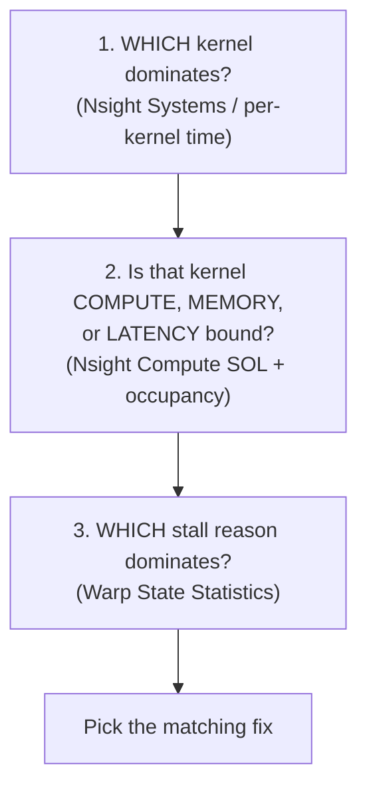
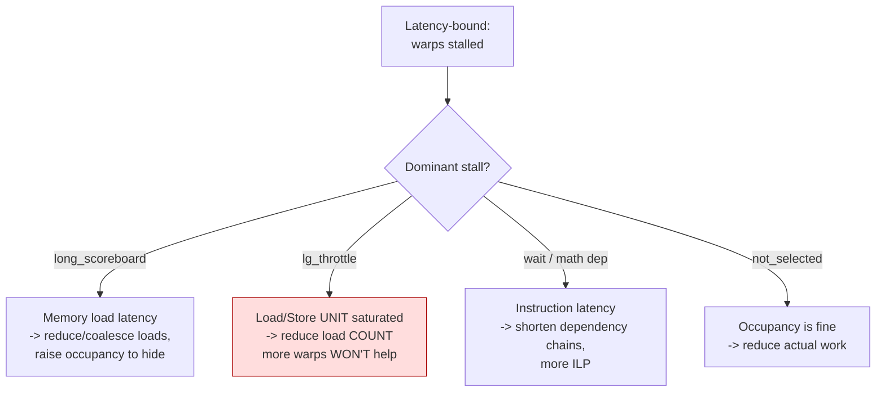

# 15 — Profiling & tuning: how we decide what to optimize

[14_benchmark_metrics.md](14_benchmark_metrics.md) explains the per-frame **benchmark CSV** (FPS,
kernel time, contact counts). This file goes one level deeper: **how to find the
real bottleneck inside a kernel** with Nsight, and how to read it so you optimize
the right thing — the exact process that produced the wins *and* the dead ends in
[16_optimizations_and_dead_ends.md](16_optimizations_and_dead_ends.md).

---

## The three questions, in order



Skipping a step wastes effort. We learned this the hard way: we *assumed* the
narrow kernel was occupancy-bound, "fixed" the occupancy, and it got **slower** —
because step 3 (the stalls) would have shown it was load-throughput-bound, not
occupancy-bound. **Always reach step 3 before you write code.**

---

## Step 1 — Which kernel dominates?

**Easy:** Find the kernel that eats the most total GPU time. Everything else is a
rounding error until that one is fixed.

**How:** `scripts/run_profile_deep_wsl.sh` runs Nsight Systems for a per-kernel
time summary, and the per-stage timers in the benchmark summary
(`avg_narrow_hash_*_ms`) break the broad cull down. **Current answer:** the broad
cull is ~0.1 ms total; `featureBasedProximityKernel` (the narrow phase) is
~0.2–3 ms depending on scene — it **is** the bottleneck.

---

## Step 2 — Compute, memory, or latency bound?

**Easy:** A kernel can be slow for three different reasons, and each has a
*different* fix. Confusing them is how you waste a day.

| If Nsight shows… | the kernel is… | the fix family is… |
|---|---|---|
| **Compute SOL** high (>70%) | **compute-bound** | do less math, cheaper math |
| **DRAM throughput** high (>70%) | **bandwidth-bound** | move less data, better layout (SoA, vectorize) |
| **both low**, occupancy low | **latency-bound** | hide latency (more warps) *or* reduce the latency itself |

> **Hard:** "SOL" = Speed Of Light = % of the hardware's theoretical peak. The
> `ncu` metrics are `sm__throughput.avg.pct_of_peak_sustained_elapsed` (compute)
> and `gpu__dram_throughput.avg.pct_of_peak_sustained_elapsed` (memory). Occupancy
> is `sm__warps_active.avg.pct_of_peak_sustained_active`. Run:
> `scripts/run_ncu_fbp_metrics_wsl.sh`.

**Current FBP kernel:** compute 27%, DRAM 9%, occupancy 44% → **latency-bound.**
Neither pipe is saturated, yet 71% of cycles have no warp ready to issue.

---

## Step 3 — Which stall reason? (the step everyone skips)

A latency-bound kernel is stalled — but stalled *on what*? This decides whether
"more warps" even helps.



> **Hard:** the metrics are `smsp__average_warps_issue_stalled_<reason>_per_issue_active.ratio`.
> They sum to ~the "warp cycles per issued instruction." The biggest is the
> dominant stall.

**Current FBP kernel stalls:** `long_scoreboard 2.4` + **`lg_throttle 1.85`** +
`wait 1.88`. The `lg_throttle` (red box) is the killer insight: the **load/store
unit is saturated**, so adding warps makes contention *worse*. That's exactly why
the occupancy "optimization" regressed ([14 §F1](16_optimizations_and_dead_ends.md)). The fix
the data points to is **fewer loads** (pack triangles), not more warps.

---

## Why FPS lies (and kernel time doesn't)

**Easy:** On a laptop GPU the clock speed wanders with temperature — a hot GPU
runs slower, a freshly-clocked one faster. So the *same code* can read 386 FPS one
run and 535 FPS the next. FPS is a mood ring.

**The trap we fell into:** an "optimization" showed +50% FPS… but the v-t scenes
(which don't even use the changed kernel) *also* jumped +50–80% that run. That's
the GPU being warmer, not the code being better. **Cross-check:** if unrelated
scenes also moved, it's thermal.

> **Hard:** Trust `avg_narrow_kernel_ms` (GPU CUDA-event time) and the Nsight
> `gpu__time_duration` — both measured on the GPU clock and nearly constant
> run-to-run. For an A/B, run both legs **back-to-back in one warm session** and
> compare *kernel time*, not FPS.

---

## A worked example: the optimization that *worked* (CUDA graphs)

1. **Step 1:** broad cull = 11 sub-10 µs kernels → launch overhead is a big slice.
2. **Step 2/3:** not a single-kernel issue — it's *per-launch CPU overhead* across many kernels (visible as gaps in the Nsight Systems timeline).
3. **Fix:** capture+replay the sequence as a CUDA graph.
4. **Verify:** contacts bit-identical (2354), kernel time −7%, FPS +10% **measured back-to-back warm**.

## A worked example: the optimization that *failed* (occupancy)

1. **Step 1:** narrow kernel dominates. ✓
2. **Step 2:** latency-bound (44% occupancy). ✓ — but we **stopped here** and assumed "raise occupancy."
3. **Skipped Step 3.** Had we looked: `lg_throttle` dominant → LSU saturated → more warps won't help.
4. **Result:** occupancy 44→65%, kernel **slower**. Reverted. **Lesson: do step 3.**

---

## The toolbox (commands)

```bash
# Per-frame CSV + summary (FPS, kernel time, contacts) — the everyday metric:
scripts/run_full_benchmark_suite_wsl.sh

# Per-kernel time + deep ncu (SOL, occupancy, stalls) on the FBP kernel:
scripts/run_profile_deep_wsl.sh
scripts/run_ncu_fbp_metrics_wsl.sh

# One comprehensive report run (suite + mode comparison + ncu + parity):
scripts/run_report_bench_wsl.sh
```

Metric definitions: [reports/README_metrics_explained.md](../reports/README_metrics_explained.md).
The current numbers + the full bottleneck analysis:
`reports/performance_five_ways_20260703.md`.

Next: armed with how to *find* a bottleneck, here is the catalogue of every optimization
we actually applied — and the ones that were tried and **failed**, so you don't retry
them. Go to [16_optimizations_and_dead_ends.md](16_optimizations_and_dead_ends.md).
