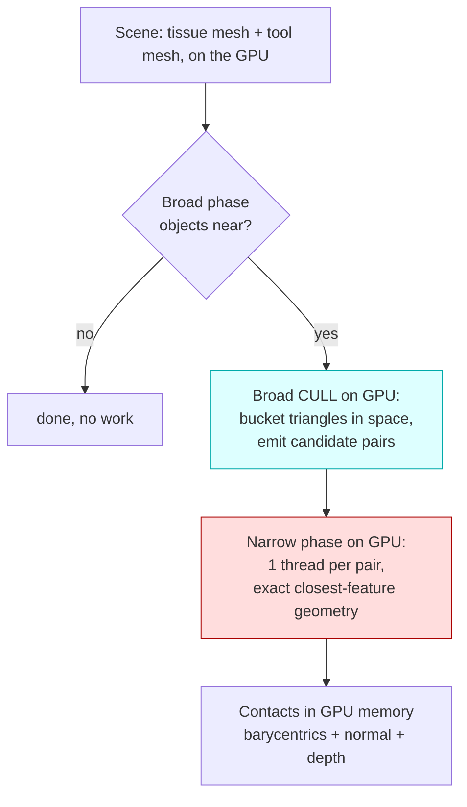
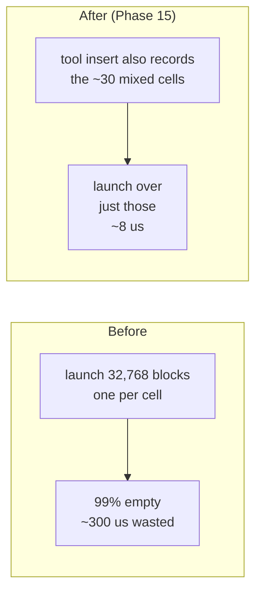
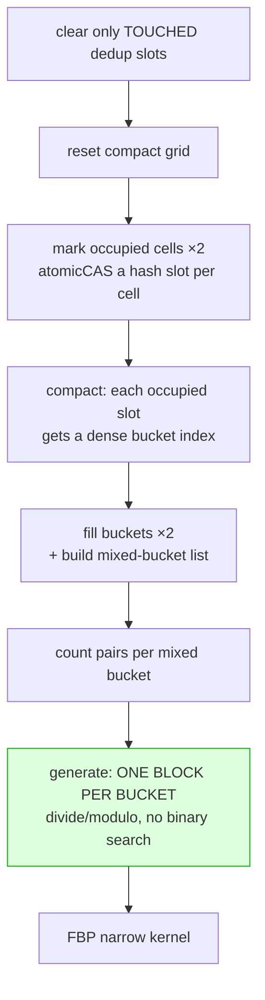

# 16 — Every optimization, explained (the ones that worked *and* the ones that didn't)

This is the exhaustive tour of **how this project got fast**, and just as
importantly, **what we tried that did NOT work** — so nobody burns a day
re-discovering a dead end.

Each optimization is explained twice: an **easy version** (the idea, in plain
words, with an everyday analogy) and a **hard version** (the actual mechanism,
the kernels, the numbers). Read the easy lines top to bottom for the story; dip
into the hard boxes when you want the real thing.

> **Golden rule of this project:** *measure on the target GPU before believing a
> "win."* A GTX 1650 Ti has only **16 SMs** — optimizations that win on a big
> data-centre GPU regularly **regress** here. Every default in this codebase was
> A/B-measured. Several "obvious" ideas in §F were measured and **rejected**.

---

## The shape of the whole problem (so the optimizations make sense)



Two cost centres: the **broad cull** (blue) and the **narrow phase** (red).
Most of this document is the long campaign to shrink the **broad cull** — which
succeeded so well that the **narrow phase** (red) is now the bottleneck (§E, §F).

---

## A. The foundations (what makes it fast at all)

### A1 — Detection-only + the synchronization bypass
**Easy:** The CPU tells the GPU "go do the collision math," and then — instead of
standing there waiting for the answer — it immediately walks off to set up the
next frame. The GPU finishes in the background. Never waiting is the single
biggest reason the benchmark hits hundreds-to-thousands of FPS.

> **Hard:** The production path issues all kernels non-blocking and does **not**
> call `cudaDeviceSynchronize` or read back the contact count. The CPU
> `narrow_wall` measures only *orchestration* (kernel launches), not GPU
> completion; GPU compute overlaps the next frame. Readback is opt-in
> (`proximityReadContactCounter`, ~one sync/frame) only for validation. See
> [12_sync_and_output.md](12_sync_and_output.md).

### A2 — Zero-copy (read the simulation's own GPU memory)
**Easy:** The tissue's vertex positions already live on the GPU (SOFA put them
there). Instead of copying them into our own buffer every frame, we just point
our kernels at SOFA's buffer. **Zero bytes copied per frame.**

> **Hard:** `TriangleIndexedSurface.devicePositions` points straight at the
> `CudaVec3f` `deviceRead()` pointer. Triangle *indices* (topology) are uploaded
> once and cached, keyed by `(surfaceId, topologyVersion)` — positions change
> every frame, topology rarely does. Measured `avg_host_to_device_bytes = 0`.

### A3 — Over-launch + grid-stride (avoid a CPU↔GPU round-trip)
**Easy:** The number of candidate pairs is computed *on the GPU*. To launch the
narrow kernel with exactly that many threads, the CPU would have to ask the GPU
"how many?" — a slow round-trip. Instead we launch a **fixed, generous** number
of threads, and each thread loops over its share. No asking required.

> **Hard:** Narrow/generator kernels launch `<<<1024, 256>>>` and grid-stride
> `for (i = tid; i < *count; i += gridDim.x*blockDim.x)`. ⚠️ **In-loop early-outs
> must `continue`, not `return`** — a `return` abandons a thread's *remaining*
> strided items. That exact bug (Phase 17) silently dropped ~80% of pairs on the
> large scene (showed as 3700 contacts instead of 8018) until fixed.

---

## B. The dense uniform grid (the default broad cull)

### B1 — The grid itself
**Easy:** Drop an egg-carton of boxes (a 3-D grid, 64×8×64 = 32,768 cells) over
the space. Put each triangle into the box(es) it covers. Two triangles can only
touch if they share a box — so we only emit pairs that **share a box**. Millions
of possible comparisons collapse to a few thousand.

> **Hard:** Per-cell `DeviceCellBucket {tissueCount, toolCount}` + separate id
> arrays; triangles inserted with an atomic bump-allocator; candidate pairs are
> the cross-product `tissue × tool` of each shared cell, deduplicated by a GPU
> open-addressing hash. Worked example: [06_the_dense_grid.md](06_the_dense_grid.md).

### B2 — Phase 15: generate over *occupied* cells only
**Easy:** In surgery the tool is small — it only touches ~30 of the 32,768 boxes.
The old code launched one block per box (32,768 blocks!), 99% of them empty and
doing nothing but wasting the scheduler. The fix: while inserting the tool, jot
down the list of boxes it actually touched, then only generate pairs from *those*.

> **Hard:** The mixed-cell list is built *during the tool insert* (no separate
> scan): `if (firstToolInThisCell && cell.tissueCount>0) activeCellIds[atomicAdd]=cell`.
> Generation then launches `min(cellCount,1024)` blocks that block-stride the
> active list. **Generation 300 µs → 7.9 µs; one-tissue scene 221 → 943 FPS
> (4.3×), bit-identical.** Default ON (`useToolActiveCellGeneration`).



---

## C. The spatial-hash broad cull (the big win for large tissues)

When **both** sides are large (a ~1,500-triangle tool against a large tissue),
Phase 15's small-tool assumption weakens and the fixed 32,768-cell grid wastes
work. The hash cull scales with **occupancy** instead of a fixed cell count. It
is opt-in (`useHashPrefixSumGeneration`); contacts are **bit-identical** to the
dense grid because both feed the same narrow kernel.



### C1 — Compact bucket storage *(easy / hard)*
**Easy:** A dense grid reserves a slot for all 32,768 cells even if 30 are used.
The hash table only materializes the cells that actually contain something.

> **Hard:** Two-pass `markCompactHashGridCellsKernel` (atomicCAS-claim a slot per
> occupied cell) → `compactHashGridSlotsKernel` (give each occupied slot a dense
> index `0..occupiedBuckets`). Per-bucket arrays are sized to occupancy, not
> `tableSize`. Only **occupied** cells consume memory and work.

### C2 — Mixed-bucket-only generation
**Easy:** A box with only tissue (or only tool) produces zero contacts. Skip it.

> **Hard:** `fillCompactHashGridTrianglesKernel` appends a bucket to
> `mixedBucketIds` the instant it holds **both** tissue and tool; counting and
> generation iterate only that list. (The hash analogue of Phase 15.)

### C3 — No per-pair binary search *(the elegant one)*
**Easy:** The first hash design launched one thread per candidate pair and made
each thread **binary-search** a table to figure out which bucket it belonged to.
The new design gives **one whole block to each bucket**, and the block's threads
just split that bucket's `tissue × tool` pairs by simple division. No searching.

> **Hard:** `generateMixedHashCandidatePairs{32,64}Kernel`:
> `for (mixedIdx = blockIdx.x; ...) { t=tissue[b]; u=tool[b];
> for (lp = threadIdx.x; lp < t*u; lp += blockDim.x) { tissueLocal=lp/u;
> toolLocal=lp%u; ... } }`. Removes a `log(buckets)` search per pair and gives
> clean per-block locality.

### C4 — Clear only *touched* dedup slots
**Easy:** The duplicate-pair table has millions of slots, but only a few thousand
get used per frame. Instead of wiping the whole table every frame, we remember
which slots we touched and wipe only those next time.

> **Hard:** The generator records each claimed slot into `touchedPairHashSlots`;
> next frame `clearTouchedPairHash{32,64}Kernel` resets only those (grid-strided),
> with a first-frame full `cudaMemset` guarded by `*PairHashKeysInitialized`.

### C5 — 32-bit compact pair encoding
**Easy:** If both meshes have fewer than 65,536 triangles, a pair fits in 32 bits
instead of 64 — half the memory traffic for the candidate array and dedup table.

> **Hard:** `useCompactCandidatePairs = (firstTris ≤ 65535 && secondTris ≤ 65535)`
> selects `encodeCompactCandidatePair` + the `…32Kernel` variants.

### C6 — Dropping the prefix-sum scan *(a cleanup that became a speedup)*
**Easy:** The original hash design ran a "prefix-sum scan" to lay out work. After
the block-per-bucket rewrite (C3), that scan's output was never read again — it
was doing work for nothing. We deleted it.

> **Hard:** The block-per-bucket generator needs no global offsets, and the raw
> pair total is already accumulated into `rawCandidateCount`. Removed the
> `cub::DeviceScan::ExclusiveSum` + `setCompactHashRawTotalKernel` + temp alloc.
> **13 → 11 kernel launches.**

### C7 — Result of A→C on the broad cull
**~1.27 ms (2026-06-09 hash) → ~0.41 ms (compact/no-search/scan-drop) →
~0.35 ms (with CUDA graphs).** On the both-large scene this is **~4× faster
kernel than the optimised dense grid**, bit-identical.

---

## D. CUDA Graphs (replay the whole sequence)

**Easy:** The hash cull is now **11 tiny kernels**. Launching each one has a fixed
CPU cost (telling the driver "run this next"). When the kernels are this small,
that launch overhead is a big slice of the total. A **CUDA graph** records the
whole 11-kernel sequence once and replays it as a single unit — the driver
schedules them back-to-back with almost no per-launch overhead.

> **Hard:** `launchAll(stream, fullClear)` records the sequence; it's captured
> once into a `cudaGraphExec` and replayed each steady-state frame. First frame
> and any workspace resize run directly + re-capture; a signature guards
> re-capture; the graph is **launched on stream 0** so the optional counter
> readback stays correctly ordered after it; any failure falls back to direct
> launch. Default ON (`SOFA_HASH_CUDA_GRAPH=0` to disable). **~−7% kernel /
> +10% FPS, bit-identical.**

---

## E. The narrow phase — small wins, and the wall we hit

### E1 — The cheap AABB pre-reject *(works, bit-identical)*
**Easy:** Two triangles can share a grid box and still be far apart (a box is ~4×
the contact distance). Before running the 15 expensive closest-feature tests, do
one cheap box-vs-box distance check and skip the pair if the boxes are too far.

> **Hard:** In `featureBasedProximityKernel`, after loading the two triangles,
> compute their AABBs and the squared axis gaps; `if (gx²+gy²+gz² >
> contactDistance²) continue;`. **Conservative** (boxes contain the triangles)
> ⇒ never drops a real contact ⇒ bit-identical. Helps the dense path too (shared
> kernel).

### E2 — Why the narrow kernel is now the bottleneck
Once the broad cull dropped to ~0.1 ms, the **`featureBasedProximityKernel`**
(~207 µs for 322,560 pairs → 8018 contacts; ~3 ms on the largest scene) became
the single dominant GPU cost. Nsight Compute says:

```text
duration ~207 us | compute 27% | DRAM 9% | occupancy 44% (79 reg/thread -> 3 blocks/SM)
top stalls:  long_scoreboard 2.4  (memory load LATENCY)
             lg_throttle     1.85 (load/store unit SATURATED)
             wait            1.88 (math dependency latency)
```

**Read it as:** not compute-bound, not bandwidth-bound — it is **latency-bound on
scattered vertex loads** and the load/store unit is **saturated**. Each pair
gathers 6 vertices from random triangle indices. See §F for what this means for
*which* optimizations help.

---

## F. Things we tried that DID NOT work (do not retry these)

This section exists so you don't repeat measured dead ends. Every row was built,
run, and measured on the GTX 1650 Ti.

### F1 — Raising FBP occupancy ❌ (measured a regression, reverted)
**Easy:** The narrow kernel only keeps ~44% of the GPU's thread slots busy
(limited by how many registers it uses). The obvious idea: use fewer registers so
more threads run, hiding the memory waits. We did it — occupancy jumped 44% →
**65%** — and the kernel got **slower** (~210 → 225 µs).

> **Hard:** `__launch_bounds__(256,4)` + register-state reduction (track only the
> winner's index in the loop, reconstruct its points/barys once — bit-identical) +
> `__ldg` loads. Registers 79→64. **Why it failed:** the kernel is
> *LSU-throughput-bound* (the `lg_throttle` stall) — adding warps just piles more
> load instructions onto an already-saturated load/store unit. Occupancy is **not**
> the binding constraint. (The scene-level FPS "gains" we first saw were pure
> thermal: the v-t scenes, which don't use this kernel, also jumped +55–80% that
> run.) **Reverted.** `__ldg` made no difference (reuse too low for the read-only
> cache).

### F2 — Other rejected ideas
| Idea | Why it's dead |
|---|---|
| **`compactActiveCells`** (Phase 9) | It scanned *all* 32,768 cells to build the active list → regressed (one-tissue 1.18 → 5.09 ms). Superseded by Phase 15, which builds the list *during* the insert with no scan. |
| **`batchTriangleInsert`** | Fuses tissue+tool insertion, breaking the tissue-before-tool ordering that the active-cell / mixed-bucket logic depends on. Regressed; left off. |
| **Warp-aggregated / prefix-sum atomics** (Phase 13) | Atomics are **not** the bottleneck — Nsight showed L2 atomic cycles peak ~0.55% on the dominant kernel. A rewrite would save <2%. |
| **SoA / `float4` vertex layout, shared-mem caching** (without reordering) | The kernel's DRAM *bandwidth* is only 9% — pure layout changes don't help when the problem is load *latency/throughput* on scattered gathers, not bandwidth. |

### F3 — Known perf-neutral leftover
`pairsPerBucket` (hash workspace) is now **write-only** — its only consumer (the
removed prefix-sum scan) is gone; the raw total comes from `rawCandidateCount`.
Kept to avoid churning the verified CUDA-graph capture path for zero perf gain.
Safe to delete as a trivial follow-up.

---

## G. The genuine next lever (validated, not yet done)

Because the narrow kernel is **load-throughput-bound on scattered gathers**, the
fix is to **reduce the number of loads**, not add warps:

> **Pack each triangle's 3 vertices into a contiguous, 16-byte-aligned buffer once
> per frame.** Then the narrow kernel reads a triangle as coalesced 128-bit loads,
> *reused across that triangle's many candidate pairs*, instead of scattered
> index→vertex gathers per pair. This directly attacks `long_scoreboard` +
> `lg_throttle`. It's a structural change (a pre-pass pack kernel + workspace
> buffers + CUDA-graph integration), so it's scoped, not yet built.

---

## H. The scoreboard (current, GTX 1650 Ti)

| Mode (large tissue + large tool, 14,368 elements) | narrow kernel | vs optimised dense |
|---|---:|---|
| Plain dense grid | ~1.79 ms | — |
| Optimised dense grid (Phase 15) | ~1.48 ms | 1.0× |
| Earlier hash (2026-06-09) | ~1.27 ms | 1.2× |
| **Optimised hash (compact + no-search + scan-drop + pre-reject + graphs)** | **~0.35 ms** | **~4.2×** |

Full current numbers + every scene: `reports/performance_five_ways_20260703.md`.
The kernel/data-structure reference (launch shapes, thread allocation):
[17_kernels_reference.md](17_kernels_reference.md).
